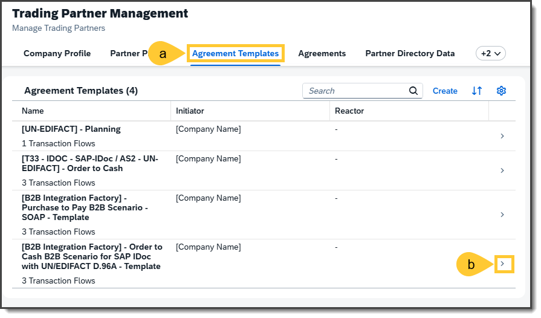
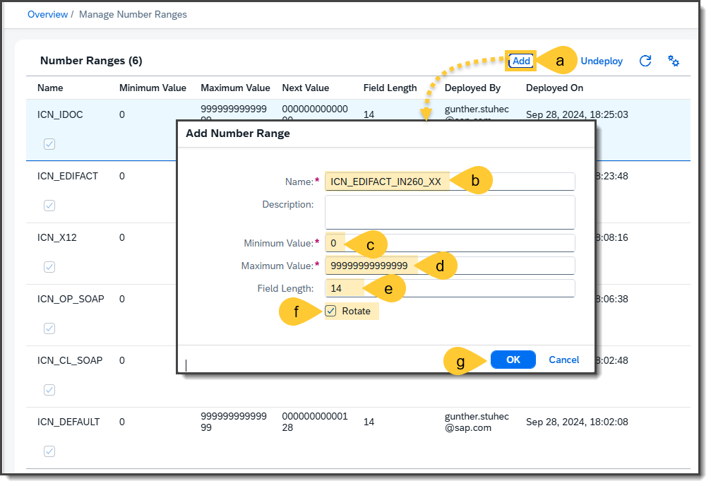
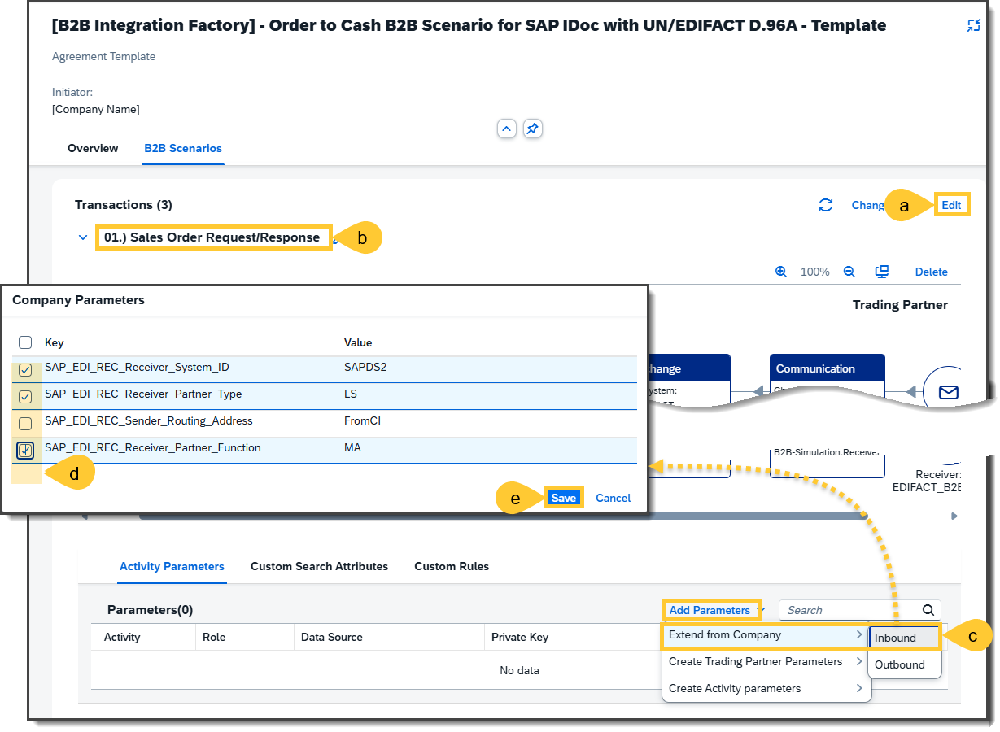
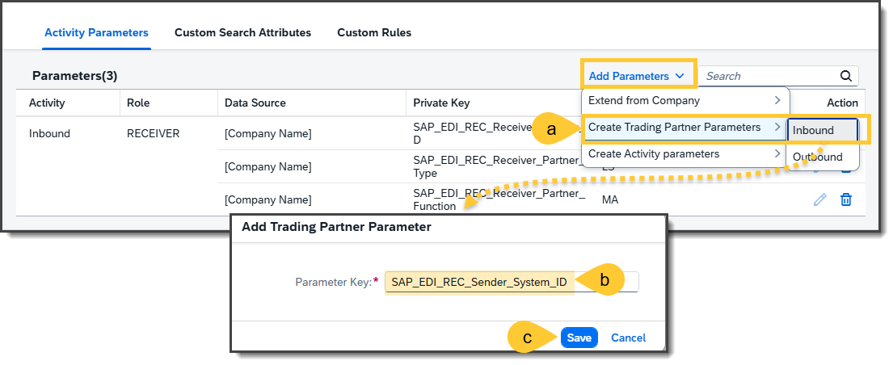
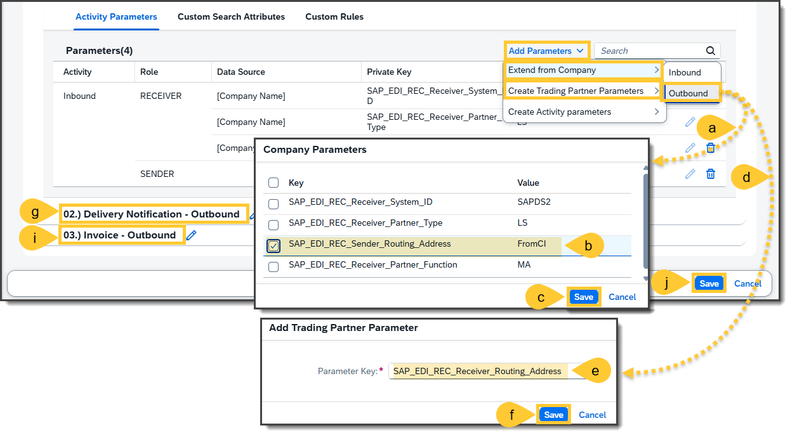
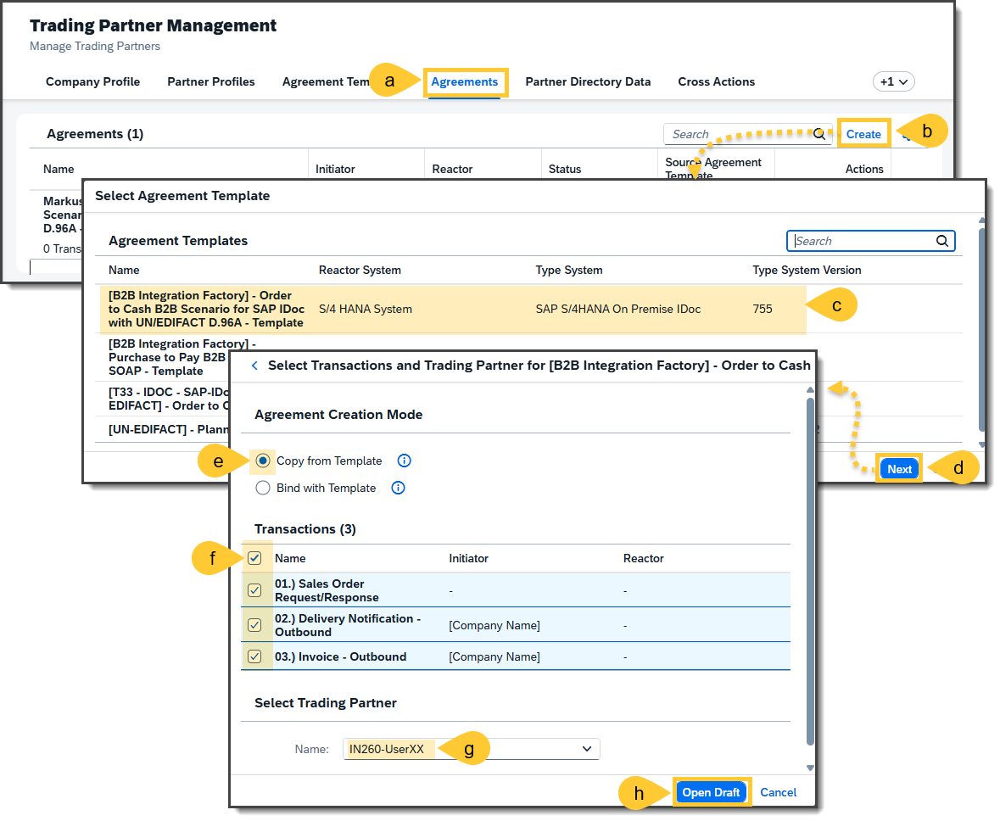
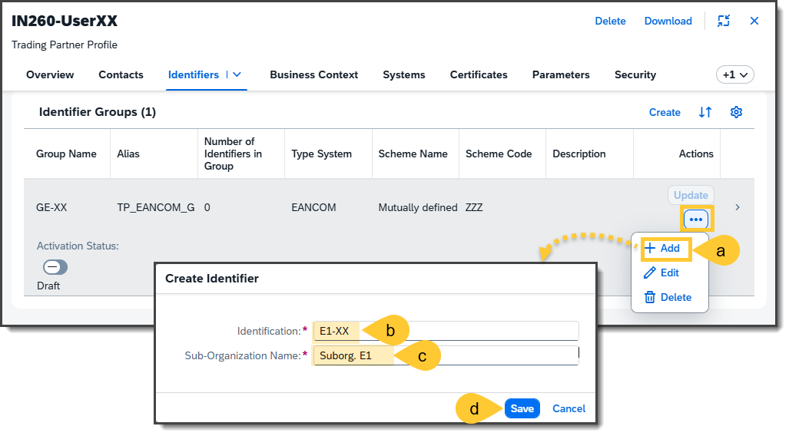

 # Exercise 2: Creating a Trading Partner Agreement (TPA) from a Template

This exercise will teach you to create a Trading Partner Agreement (TPA) using a predefined template within the Trading Partner Management system. You will be guided through verifying and updating activity parameters, adding company and trading partner-specific parameters, and finalizing the agreement setup. By this exercise's end, you can confidently configure and activate a TPA tailored to your trading partner's requirements.

## Step 1 - Open the TPA Template
First, check if all required (activity) parameters are correctly set in the uploaded Trading Partner Agreement Template (TPA-Template) and make any necessary changes. For this reason:
- (a) Go to the Trading Partner Management system to the tab **Agreement Templates**
- (b) And open the template **[B2B Integration Factory] - Order to Cash B2B Scenario for SAP IDoc with UN/EDIFACT D.96A – Template**

## Step 2 - Check, review, and update the TPA-Template
You should review the required (activity) parameters for each business transaction. Add the necessary (activity) parameters described in step 3 if these are unavailable. You should check if the following (activity) parameters are set via the following steps:
- (a) Go to tab **B2B Scenarios**.
- (b) Expand Business Transaction: **01.) Sales Order Request/Response**
- (c) Go to tab **Activity Parameters**, and
- (d) Check if the following Activity Parameters are available:
  
| Activity | Role | Data Source | Private Key | Private Value |
| --- | --- | --- | --- | --- |
| Inbound | RECEIVER | [Company Name] | SAP_EDI_REC_Receiver_System_ID | SAPDS2 |
| Inbound | RECEIVER | [Company Name] | SAP_EDI_REC_Receiver_Partner_Type | LS |
| Inbound | RECEIVER | [Company Name] | SAP_EDI_REC_Receiver_Partner_Function | MA |
| Inbound | SENDER | | SAP_EDI_REC_Sender_System_ID | *Derived from TPP* |
| Inbound | SENDER | | SAP_EDI_REC_Sender_Partner_Function | *Derived from TPP* |
| Inbound | SENDER | | SAP_EDI_REC_Sender_Partner_Type | *Derived from TPP* |
| Outbound | RECEIVER | |  SAP_EDI_REC_Receiver_Routing_Address | *Derived from TPP* |
| Outbound | SENDER | [Company Name] | SAP_EDI_REC_Sender_Routing_Address | FromCI |

- (e) Expand the Business Transaction: **02.) Delivery Notification – Outbound** and check if the following Activity Parameters are set:
  
| Activity | Role | Data Source | Private Key | Private Value |
| --- | --- | --- | --- | --- |
| Outbound | RECEIVER | | SAP_EDI_REC_Receiver_Routing_Address | *Derived from TPP* |
| Outbound | SENDER | [Company Name] | SAP_EDI_REC_Sender_Routing_Address | FromCI |

- (f) Finally, expand Business Transaction: **03.) Invoice - Outbound** and review these Activity Parameters. The following should be set:
  
| Activity | Role | Data Source | Private Key | Private Value |
| --- | --- | --- | --- | --- |
| Outbound | RECEIVER | | SAP_EDI_REC_Receiver_Routing_Address | *Derived from TPP* |
| Outbound | SENDER | [Company Name] | SAP_EDI_REC_Sender_Routing_Address | FromCI |

## Step 3 - Add Company Inbound Parameters in TPA Template
You review and do not see any activity parameters due to the import of the TPA templates by another participant; these parameters have been overwritten because they did not set "Select Parameters" and "Select Activity Parameters" to Skip before the import (see Exercise 1, Step 8). If this is the case, then these (activity) parameters should be entered afterwards in the tab "B2B Scenarios" using the following steps:
- (a) Stay in tab **B2B Scenarios** and click on the **Edit** button.
- (b) If you are in edit mode, go to the first business transaction **01.) Sales Order Request/Response**
- (c) In  **Activity Parameters** select **Add Parameters --> Extend from Company --> Inbound** and a new pop-up window will be opened
- (e) In this pop-up window, you can now select the required **Company Parameters**, which are in this case:
  - `SAP_EDI_REC_Receiver_System_ID`
  - `SAP_EDI_REC_Receiver_Partner_Type`
  - `SAP_EDI_REC_Receiver_Partner_Function`
- (f) Click the **Save** button.

## Step 4 -  Add Trading Partner Inbound Parameters in TPA Template
You must proceed with the following steps to add the trading partner-related parameters in the inbound direction. These trading partner-related parameters are in the template and will be automatically filled once a TPA is created from this TPA template via "Copy" or "Bind".
- (a) Select in the menu **Add Parameters --> Create Trading Partner Parameters --> Inbound** and a new pop-up window will be displayed.
- (b) Enter in **Parameter Key** the value `SAP_EDI_REC_Sender_System_ID`
- (c) Click the **Save** button.

## Step 5 - Add Outbound Parameters in TPA Template
You must do the same for the Business Transaction Activities in the outbound direction. This can be realized by following the steps:
- (a) Stay in tab **B2B Scenarios**, go to **Edit** mode, and select in tab **Activity Parameters** in menu **Add Parameters --> Extend from Company --> Outbound** so that you will see a pop-up window **Company Parameters**.
- (b) In this pop-up window, select the parameter `SAP_EDI_REC_Sender_Routing_Address`.
- (c) Click the **Save** button.
- (d) Select in the menu **Add Parameters --> Create Trading Partner Parameters --> Outbound** so that you'll see the pop-up window **Add Trading Partner Parameter**
- (e) In this pop-up window, enter the value in **Parameter Key**: `SAP_EDI_REC_Receiver_Routing_Address`.
- (f) Click the **Save** button.
- (g) Repeat the steps (5.a) to (5.f) in the Business Transaction: **02.) Delivery Notification – Outbound**
- (h) Repeat the steps (a) to (f) in the Business Transaction: **03.) Invoice - Outbound** 
- (i) Finally, all activity parameters should be set, as shown in step 2. If this is the case, click the **Save** button after adding activity parameters to each business transaction.

## Step 6 - Create a TPA via Copy of a TPA Template
To create a new TPA (Trading Partner Agreement) in the Trading Partner Management via the copy from a TPA template function, do the following steps:
- (a) Open the tab “Agreements”
- (a) Click the **Create** button to open a new pop-up window
- (c) Select the TPA template `[B2B Integration Factory] - Order to Cash B2B Scenario for SAP IDoc with UN/EDIFACT D.96A - Template`
- (d) Click the **Next** button
- (e) Enable the radio button **Copy from Template**
- (f) Make sure to select all business transactions
- (g) Select your Trading Partner **INT260-XX** from the drop-down list. The XX should represent your user ID.
- (h) Click the **Open Draft** button

***General Note:*** Selecting all transactions is not always necessary. This depends on the trading partner. Choose only the transactions that are relevant for your trading partner.

## Step 7 - Finalize the Overview of the TPA
A new Trading Partner Agreement (TPA) for your trading partner will be created. You'll see as default the **Overview** tab of your TPA, where you should update and finalize the overview accordingly:
- (a) Change your agreement's name and description where you substitute the term `[IN260]` with `INT260-XX`. Make sure to replace XX with your UserID and Trading Partner Name. 
- (b) Ìn the **Trading Partner Details**, set the **Type System** value to `UN/EDIFACT`
- (c) Select in the same details the **Type System Version**: `D.96A S3`
- (d) Click on **Identifier in Company Type System** on the value help to display a pop-up window.
- (e) In this pop-up window, go to the tab **Identifier Groups**
- (f) Select the identifier group with the **Group Name**: GE-XX (as you know, the XX is a placeholder for your user ID).
- (g) In the **My Company Details** select in **Identifier in Trading Partner Type System** the value: `COMP_E_D`.
- (h) Click the **Save** button.

## Step 8 - Review, update and activate the TPA
For finalization and activation of the TPA,  stay in your newly created TPA and 
- (a) switch to the **B2B scenarios** tab.
- (b) Check if all the activity parameters defined in step 2 are set and filled. Filling means that the trading partner-related activity partners should have values derived from the corresponding parameters described in the Trading Partner Profile. Repeat this review with the other two business transactions.
  - 02.) Delivery Notification - Outbound
  - 03.) Invoice - Outbound
- (b) Check if the empty values in the agreement template are filled with your Trading Partner parameters.
- (c) If everything is fine, you can activate this TPA by clicking on the **Activate** button.
- (d) After a short while, you should see the **Activation Status**: **Active**
- (e) And the **Activate** button should be substituted with **Deactivate**

## Step 9 - Feasibility Check
You can now use the Bruno Test API Tool to determine whether the activated TPA works. The following steps are required for this:
- (a) Open the Bruno API Testing Tool, open the folder **IN 260 - Order to Cash - SAP IDoc with UN-EDIFACT** and open the GET request **01.a) Sales Order Request - Inbound**.
- (b) Click on the **-->** button for processing the GET request.
- (c) After a short while, you should see a XML based IDOC message as a result.
- (d) Repeat the procedure with the GET request **01.b) Sales Order Response - Outbound**
- (e) So that you can see an UN/EDIFACT interchange payload with a ORDRSP message as response.
- (f) Repeat the procedure with the GET request **02.) Delivery Notification - Outbound**
- (g) So that you can see an UN/EDIFACT interchange payload with a DESADV message as response.
- (h) Repeat the procedure with the GET request **03.) Invoice - Outbound - Buyer**
- (i) So that you can see an UN/EDIFACT interchange payload with a INVOIC message as response.

***Remark:*** Don't worry about the content you've received. In any case, these are not yet correct. They are correspondingly finalized in the next excercises 03 to 07.

***Remark:*** If you receive a result for all four GET requests, this task is completed and you can proceed with the next excercise 02.