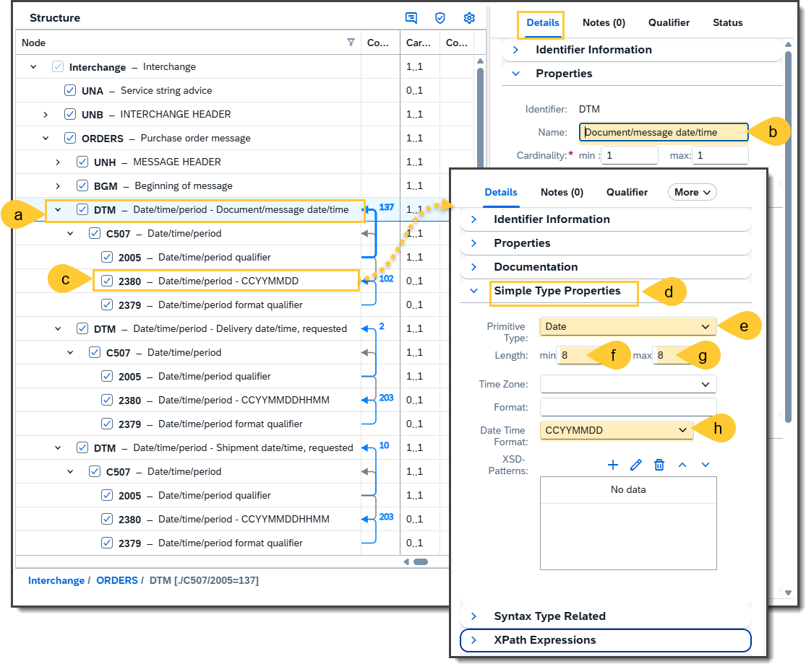
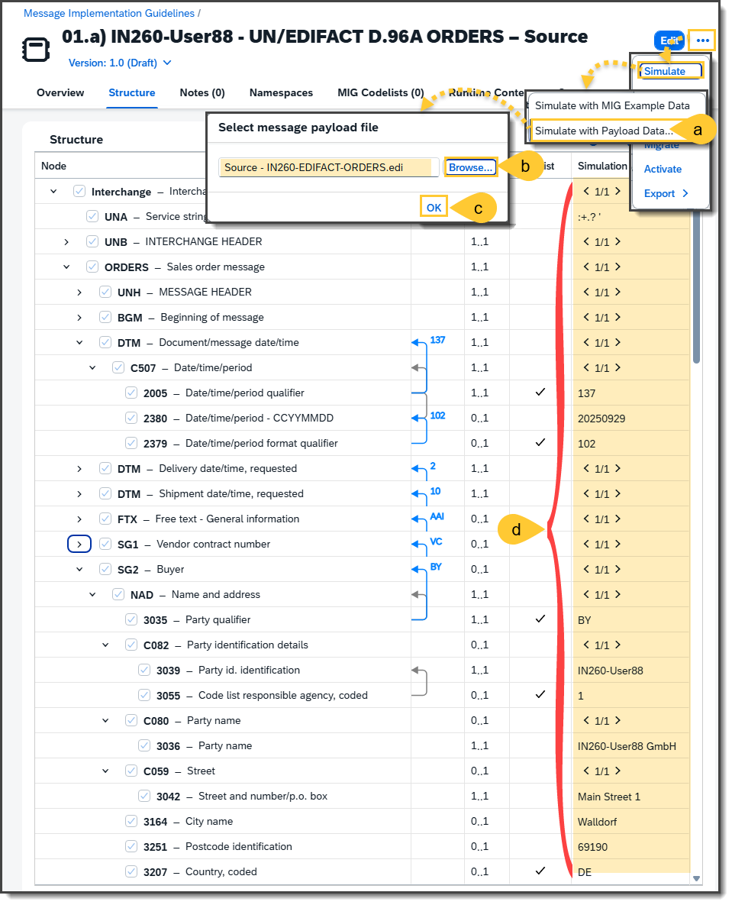
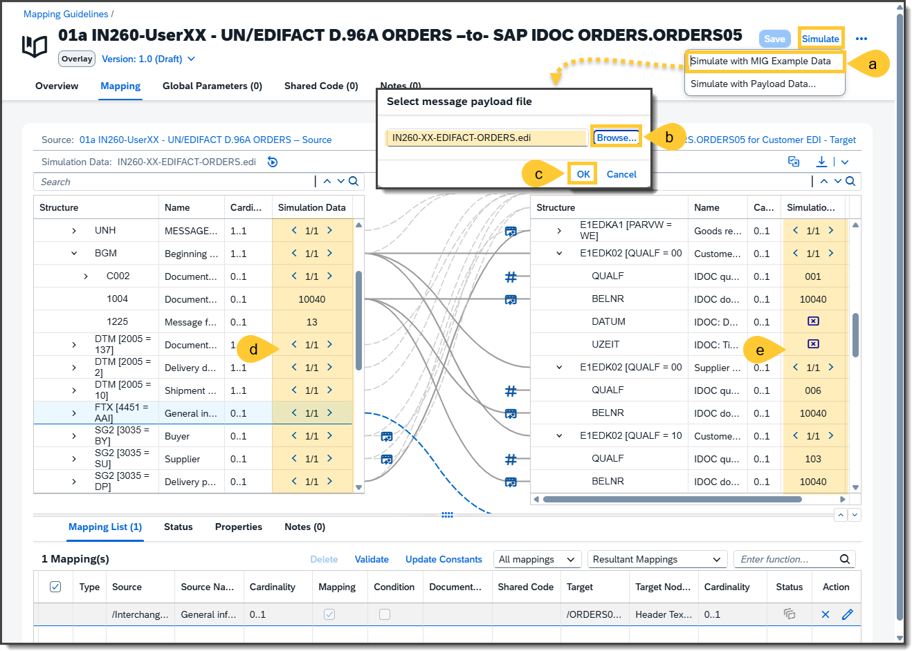
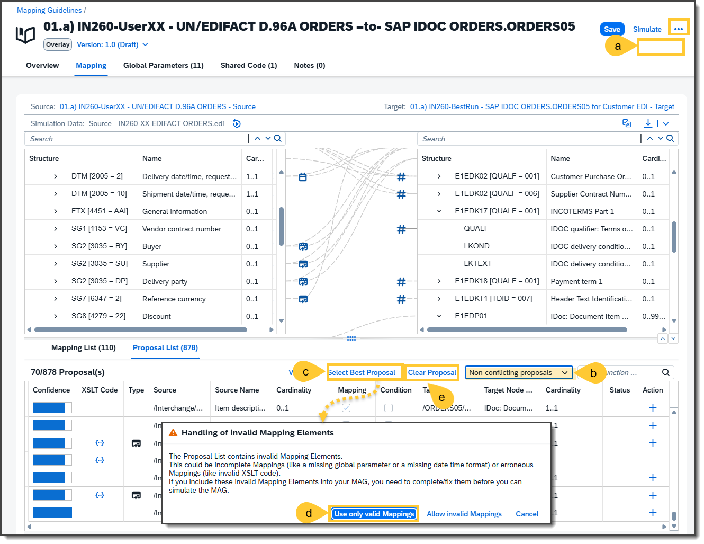
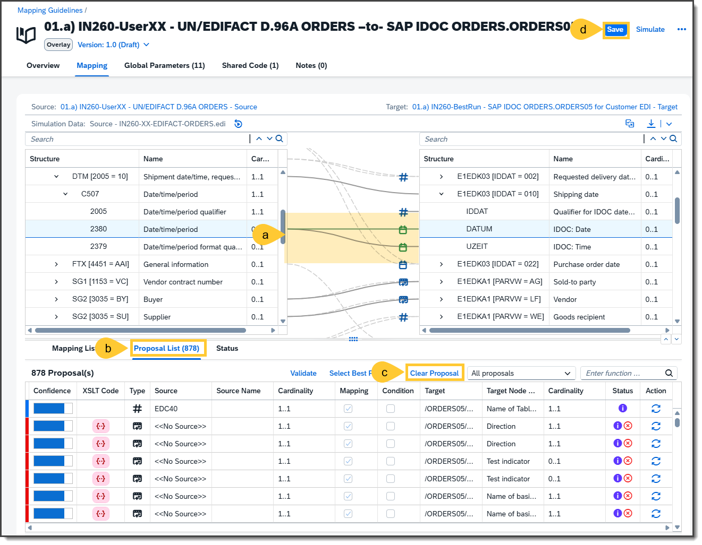
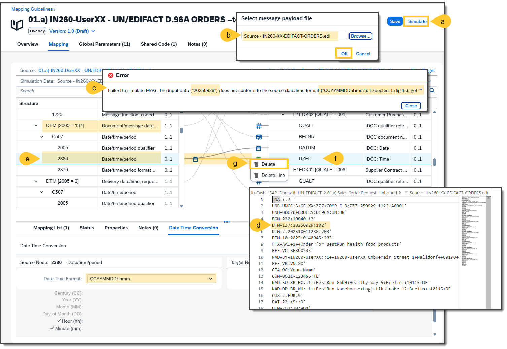
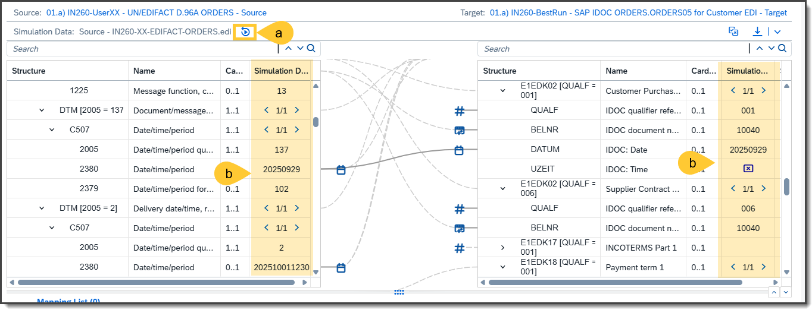
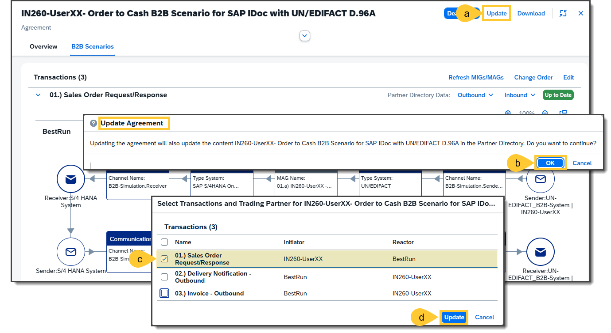
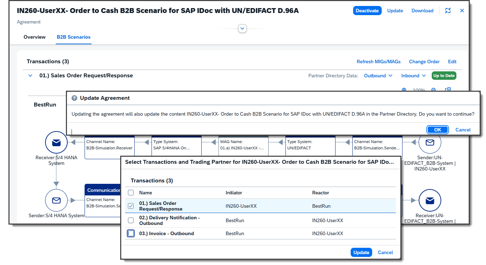
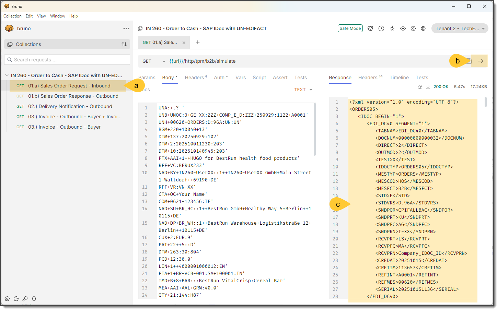

# Excercise 3: -Creating a TPA based on the TPA template
## Step 1 - Open the TPA Template
First, check if all required (activity) parameters are correctly set in the uploaded Trading Partner Agreement Template (TPA-Template) and make any necessary changes, if required. For this reason:
- (a) Go in the Trading Partner Management system to the tab **Agreement Templates**
- (b) And open the template **[B2B Integration Factory] - Order to Cash B2B Scenario for SAP IDoc with UN/EDIFACT D.96A – Template**

## Step 2 - Check and may update the TPA-Template
Now, you should review the required (activity) parameters in each Business Transaction. If these are not available, add the required (activity) parameters as described in step 3. You should check if the following (activity) parameters are set:
- (a) in tab **B2B Scenarios**
- (b) In Business Transaction: **01.) Sales Order Request/Response**
  
| Activity | Role | Data Source | Private Key | Private Value |
| --- | --- | --- | --- | --- |
| Inbound | RECEIVER | [Company Name] | SAP_EDI_REC_Receiver_System_ID | SAPDS2 |
| Inbound | RECEIVER | [Company Name] | SAP_EDI_REC_Receiver_Partner_Type | LS |
| Inbound | RECEIVER | [Company Name] | SAP_EDI_REC_Receiver_Partner_Function | MA |
| Inbound | SENDER | | SAP_EDI_REC_Sender_System_ID | *Derived from TPP* |
| Inbound | SENDER | | SAP_EDI_REC_Sender_Partner_Function | *Derived from TPP* |
| Inbound | SENDER | | SAP_EDI_REC_Sender_Partner_Type | *Derived from TPP* |
| Outbound | RECEIVER | SAP_EDI_REC_Receiver_Routing_Address | *Derived from TPP* |
| Outbound | SENDER | [Company Name] | SAP_EDI_REC_Sender_Routing_Address | FromCI |

- (c) In Business Transaction: **02.) Delivery Notification – Outbound**
  
| Activity | Role | Data Source | Private Key | Private Value |
| --- | --- | --- | --- | --- |
| Outbound | RECEIVER | | SAP_EDI_REC_Receiver_Routing_Address | *Derived from TPP* |
| Outbound | SENDER | [Company Name] | SAP_EDI_REC_Sender_Routing_Address | FromCI |

- (d) In Business Transaction: **03.) Invoice - Outbound**
  
| Activity | Role | Data Source | Private Key | Private Value |
| --- | --- | --- | --- | --- |
| Outbound | RECEIVER | | SAP_EDI_REC_Receiver_Routing_Address | *Derived from TPP* |
| Outbound | SENDER | [Company Name] | SAP_EDI_REC_Sender_Routing_Address | FromCI |

- (e)
- (f)
- (g)
- (h)
- (i)
- (j)

## Step 3 - Add (Activity) Parameters in TPA Template
- (a)
- (b)
- (c)
- (d)
- (e)
- (f)
- (g)
- (h)
- (i)
- (j)

## Step 4 - Create a TPA via Copy of a TPA Template
In order to create in the Trading Partner Management a new TPA (Trading Partner Agreement) via the copy from a TPA template function, do the following steps:
- (a) Open the tab “Agreements”
- (a) Click on the button “Create”, a new popup will open
- (c) Select the TPA template
- (d) Choose “Next”
- (e)Select “Copy from Template”
- (f) Make sure to select the transactions all transactions
- (g) Select your Trading Partner from the drop-down list
- (h) Click on “Open Draft”

***General Note:*** It is not always necessary to select all transactions. This depends on the trading partner. Choose only the transactions that are relevant for your trading partner.

## Step 5 - Check and update the Overview of the TPA
You are in the overview screen of your agreement
- (a) Change the name and the description of your agreement. Make sure to replace XX with your UserID and Trading Partner Name. Scroll down to the section “Trading Partner Details”
- (b) Copy the response and enter it in the “Description” field.
- (c) Check if the same aliases are defined in your Trading Partner Profile. 
- (d) Click on the “Save” button

## Step 6 - Check, if all set in TPA
Stay in your newly created agreement and switch to the “B2B scenarios” tab.
- (a) Check if the same aliases are used in your Trading Partner system.
- (b) Check if the values that have been empty in the agreement template are filled with your Trading Partner parameters.
- (c)
- (d)
- (e)
- (f)
- (g)
- (h)
- (i)
- (j)

## Step 7 - Activate the TPA
- (a)
- (b)
- (c)
- (d)
- (e)
- (f)
- (g)
- (h)
- (i)
- (j)

## Step 8 - Prepare the source files
- (a)
- (b)
- (c)
- (d)
- (e)
- (f)
- (g)
- (h)
- (i)
- (j)
  

## Step 9 - 
- (a)
- (b)
- (c)
- (d)
- (e)
- (f)
- (g)
- (h)
- (i)
- (j)

## Step 10 - 
- (a)
- (b)
- (c)
- (d)
- (e)
- (f)
- (g)
- (h)
- (i)
- (j)

## Step 11 - 
- (a)
- (b)
- (c)
- (d)
- (e)
- (f)
- (g)
- (h)
- (i)
- (j)

## Step 12 - 
- (a)
- (b)
- (c)
- (d)
- (e)
- (f)
- (g)
- (h)
- (i)
- (j)

## Step 13 - 
- (a)
- (b)
- (c)
- (d)
- (e)
- (f)
- (g)
- (h)
- (i)
- (j)

## Step 14 - 
- (a)
- (b)
- (c)
- (d)
- (e)
- (f)
- (g)
- (h)
- (i)
- (j)

## Step 15 - 
- (a)
- (b)
- (c)
- (d)
- (e)
- (f)
- (g)
- (h)
- (i)
- (j)

## Step 16 - 
- (a)
- (b)
- (c)
- (d)
- (e)
- (f)
- (g)
- (h)
- (i)
- (j)

## Step 17 - 
- (a)
- (b)
- (c)
- (d)
- (e)
- (f)
- (g)
- (h)
- (i)
- (j)

## Step 18 - 
- (a)
- (b)
- (c)
- (d)
- (e)
- (f)
- (g)
- (h)
- (i)
- (j)

## Step 19 - 
- (a)
- (b)
- (c)
- (d)
- (e)
- (f)
- (g)
- (h)
- (i)
- (j)

## Step 20 - 
- (a)
- (b)
- (c)
- (d)
- (e)
- (f)
- (g)
- (h)
- (i)
- (j)

