# Excercise 05: Finalize the Business Transaction Activity: **01. b) Sales Order Response - Outbound**

- Code Value Mapping
- Compound Code Value

Steps: Explain how to get Overlay MIG and initial Overlay MAG similar like in Excercise 04 - Step 4 to Step 12. Either can do this, if they have time, if not than they to copy the prepared Overlay MIG and MAG. No use of proposal
Explain the insertion of additional code lists
Explain how to create a simple code value mapping and complex code value mapping in the Overlay MAG

## Step 01 - Create global custom code list
Before you start with the creation of the B2B integration content for the sales order response processing, you should create the required customized custom code lists that are based on standard code lists can can be used across MIGs and MAGs. For this purpose, you should:
- (a) Open in the navigation pane the **Design** part.
- (d) Select the section **Custom Type Systems**.
- (c) Select **Custom Codelists**, which is the collection of all the reusable customized codelists in your tenant.
- (d) Click on **Add** button for creating a new custom codelist.
- (e) In the new pop-up window, enter in **ID**: `CL_UserXX_6411_MEA_Units`.
- (f) Give a name, which code be: `Measure Unit Code List`.
- (g) This codelist represents a specific types of measure units, but it is mainly a subset of the UN/CEFACT Recommendation 20 codelist, therefore enable **Copy code values from Codelist**.
- (h) Select the **Type System**: `GS1 EANCOM`.
- (i) Select the **Codelist**: `Rec_20`.
- (j) Select the latest **Version**, which is `2016`.
- (k) Search for the code values listed in the table below and (l) select them.
- (m) Once youre finished with the selection, click on **Create** button.

| Code Value | Name | Definition |
| --- | --- | --- |
| **GRM** | gram |  | 
| **KGM** | kilogram | A unit of mass equal to one thousand grams. |
| **LTR** | litre | |
| **MLT** | millilitre | |
 
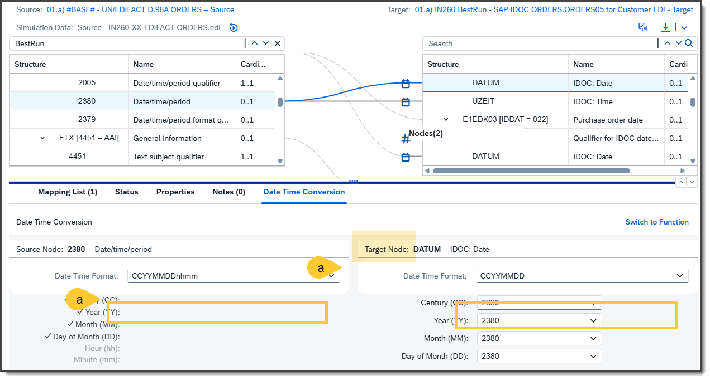

## Step 02 - Listing custom codelists and add another codelist
Same kind codelists can be shaped for different purposes. This is especially required for the trading partner MIG for the Sales Order Response. Therefore, do the same procedure like following:
- (a) Before you start with creation, you can see your alread created codelists, if you expand it (`CL_UserXX_6411_MEA_Units`) and click on the version `1.0`.
- (b) Click for creation of the second unit code list on **Add** button and follow the steps (01.d) to (01.k) button with the following parameters and code values:
  - **ID**: `CL_UserXX_6411_QTY_Units`.
  - **Name**: `Measure Unit Code List`.
  - Enable **Copy code values from Codelist**.
  - **Type System**: `UN/CEFACT`.
  - **Codelist**: `6411`.
  - **Version**: `1997_S3_Edition_2001`.
  - Code Values, see table below.

| Code Value | Name | Definition |
| --- | --- | --- |
| **NAR** | number of articles |  |
| **NRL** | number of rolls |  |
| **PA** | packet |  |
| **PCE** | Piece (EAN Code) |   |
| **PTN** | Portion (EAN Code) | The identification of the number of  portions (doses in medical terms)  into which a complete product may be broken into for serving purposes,  e.g.  a pie with 6 portions,  a liquid medicine with 20 doses. |

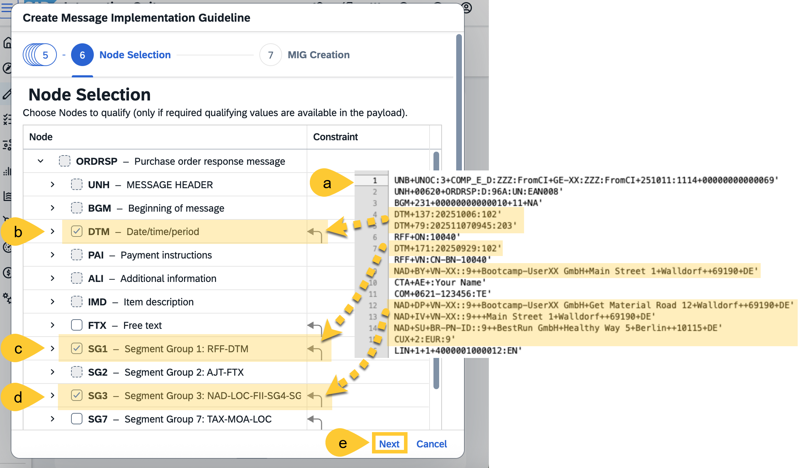

## Step 03 - Create Trading Partner MIG for Sales Order Response
Because of time reasons, you can now do a copy of an already prepared Trading Partner MIG in where you can refine the remainíng parts which are relevant for the codelists tasks. For this purpose, do the following steps:
- (a) Go in the navigation pane to **Design --> MIGs**.
- (b) Search for the prepared **Trading Partner MIG**: ``01.b) #IN260-OVERLAY# - UN/EDIFACT D.96A ORDRSP - Target`
***Caution:*** !!! Please never delete or change this prepared trading partner MIG !!!
- (c) Click on the choice of **Actions**
- (d) Select **Copy**
- (e) In the new window of the copied trading partner MIG, click on tab **Overview**.
- (f) Enter your name of the MIG, which is `01.b) IN260-UserXX - UN/EDIFACT D.96A ORDRSP - Target`
- (g) Click on **Save** button.

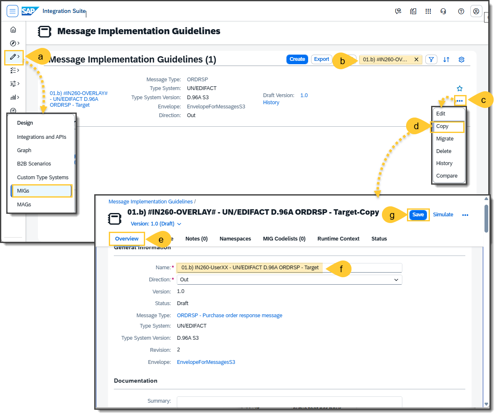

## Step 04 - Add a local code list.
You can also add code lists in this trading partner MIG, which are than valid and usable for this MIG, only. For this reason, do the following steps, if the trading partner MIG in in **Edit** mode:
- (a) Go to tab **MIG Codelists**.
- (b) Click on **Create** button.
- (c) Enter in the new entry for the new code list the **Identifier:** `CL_UserXX_7065_PackageType`.
- (d) Enter the **Name:** `Package Type Code List`.
- (e) Click in the area where the label **CodeValues** is.
- (f) A new details panel will be shown at the bottom in where you should go to tab **Code Values**.
- (g) Navigate to **Upload --> Add from CSV File** and (h) upload the CSV file `CL_UserXX_7065_PackageType.csv` from the agreed folder.
- (i) After a successful upload, you should see all the values in the code list.

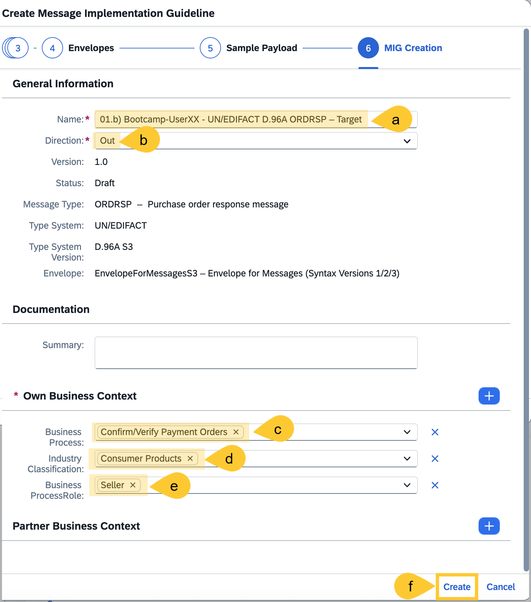

## Step 05 - Refine assigned codelists in trading partner MIG
You can now start with the assignment and refinement of codelists within your trading partner MIG. Codelists should be assigned and refined for four purposes:
- Documentatory reasons to know which kind of codes are supported and what is the meaning behind it.
- To provide the supported source or target code values in the code value mapping of a MAG.
- To automaticallly propvide just the supported code values in the validation rules, which will be considered once the payload validation is enabled.
- Set the qualifier values for qualifying groups and qualifying peers, but this will happen automatically.

Following steps are required for it:
- (a) Go in your trading partner MIG to the tab **Structure**.
- (b) May filter unnecessary the columns in the structure view so that you see at lease the codelist column and filter so that you will see just the leaf **Nodes with codelist**.
- (c) Click on the first required leaf node with a code list **1001 - Document/message name, coded**.
- (d) You should see now the details panel of this node in where you should go to the tab **Codelist : 1001**.
- (e) Within the section **Code Values** you should now deselect the option **Use all code values of the codelist**, because just a view code values are supported.
- (f) Search for the code values in **ID** such as `230` and (g) select this code value. Do the same with the code value `231`.
- (h) Do the same procedure for the leaf node **1225 - Message function, coded** in where you also don't need (i) all code values. Following code values should be selected:

| Code Value | Name | Definition |
| --- | --- | --- |
| **1** | Cancellation | Message cancelling a previous transmission for a given transaction. |
| **11** | Response | Message responding to a previous message or document. |
| **13** | Request | Self explanatory. |
| **3** | Deletion | Message containing items (e.g. line items, goods items, Customs items, equipment items) to be deleted from a previously sent message. |
| **4** | Change | Message containing items (e.g. line items, goods items, Customs items, equipment items) to be changed in a previously sent message. |
| **6** | Confirmation | Message confirming the details of a previous transmission where such confirmation is required or recommended under the terms of a trading partner agreement. |

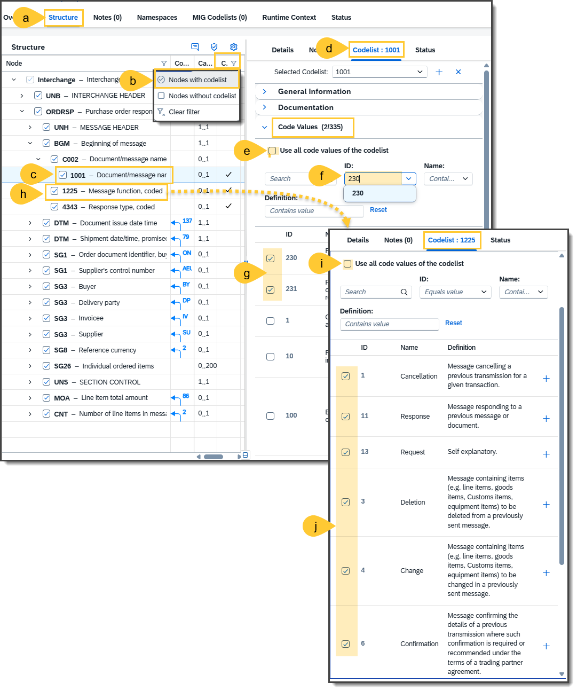

## Step 06 - Create compund code value mapping 
- (a) **:** ``
- (b) **:** ``
- (c) **:** ``
- (d) **:** ``
- (e) **:** ``
- (f) **:** ``
- (g) **:** ``
- (h) **:** ``
- (i) **:** ``
- (j) **:** ``

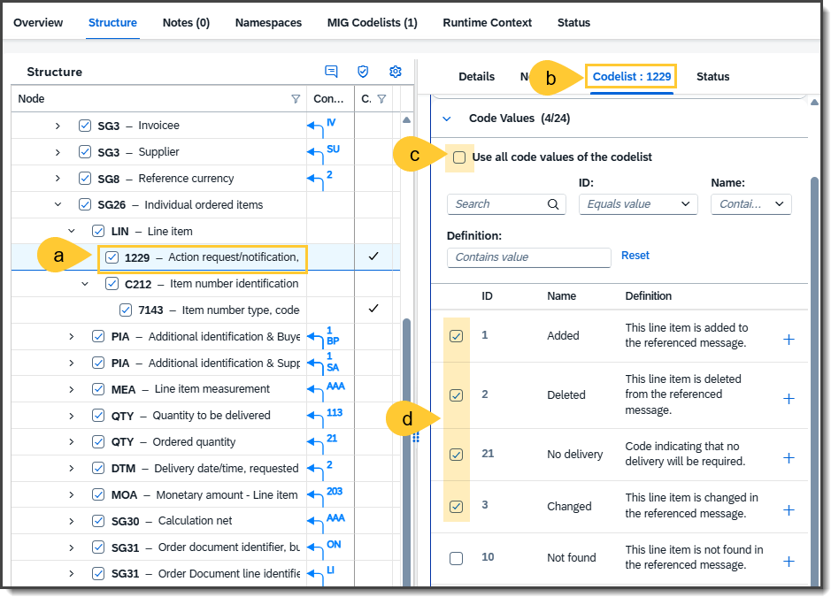

## Step 07 - Check and save the updated Overlay MAG
- (a) **:** ``
- (b) **:** ``
- (c) **:** ``
- (d) **:** ``
- (e) **:** ``
- (f) **:** ``
- (g) **:** ``
- (h) **:** ``
- (i) **:** ``
- (j) **:** ``

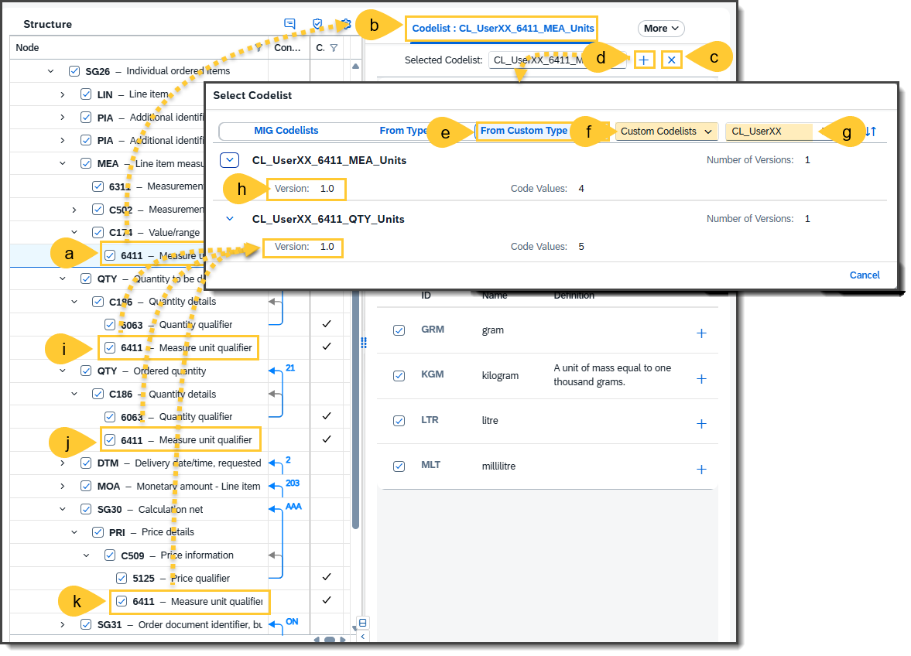

## Step 08 - Change to the Overlay MAG in the TPA
- (a) **:** ``
- (b) **:** ``
- (c) **:** ``
- (d) **:** ``
- (e) **:** ``
- (f) **:** ``
- (g) **:** ``
- (h) **:** ``
- (i) **:** ``
- (j) **:** ``

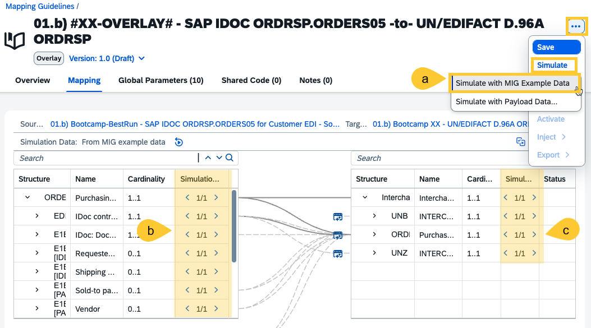

## Step 09 - Activate the TPA
- (a) **:** ``
- (b) **:** ``
- (c) **:** ``
- (d) **:** ``
- (e) **:** ``
- (f) **:** ``
- (g) **:** ``
- (h) **:** ``
- (i) **:** ``
- (j) **:** ``

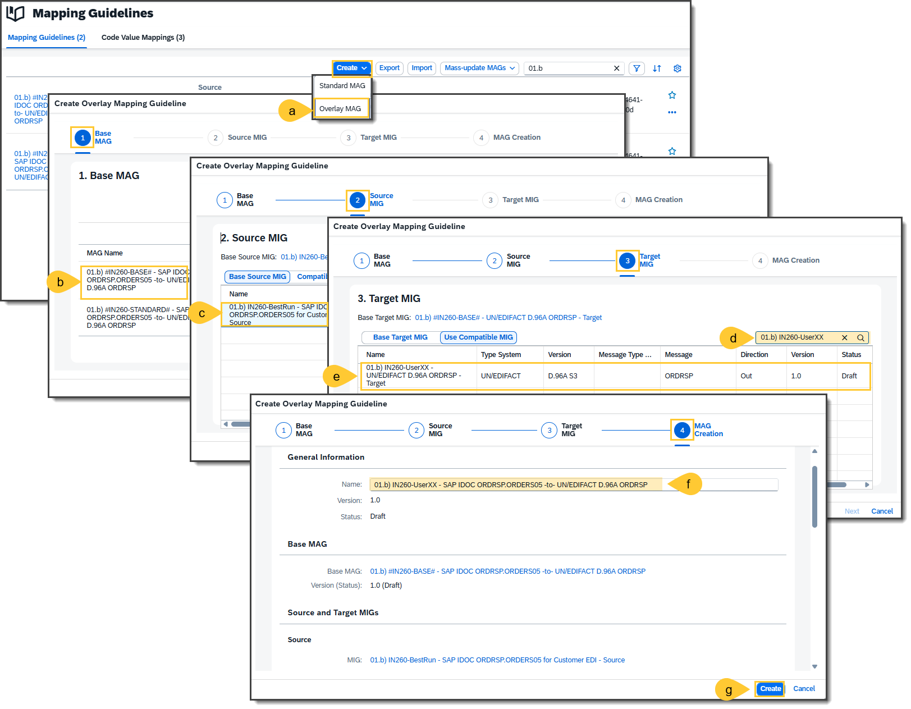

## Step 10 - Activate the TPA
- (a) **:** ``
- (b) **:** ``
- (c) **:** ``
- (d) **:** ``
- (e) **:** ``
- (f) **:** ``
- (g) **:** ``
- (h) **:** ``
- (i) **:** ``
- (j) **:** ``

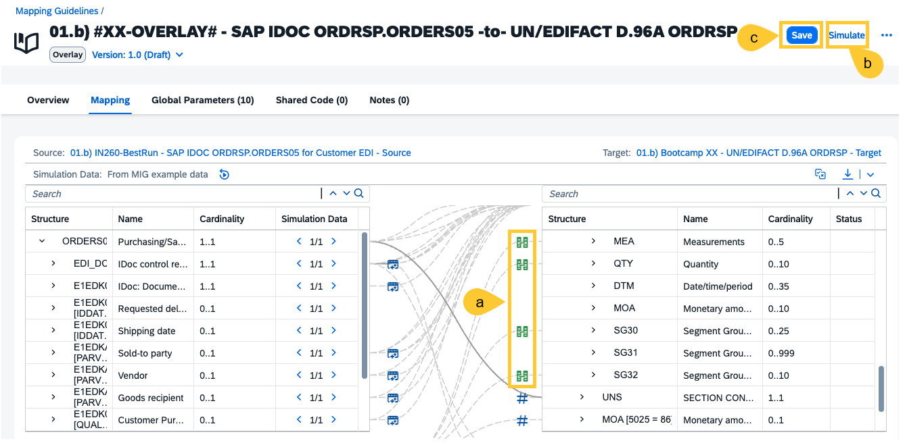

## Step 11 - Activate the TPA
- (a) **:** ``
- (b) **:** ``
- (c) **:** ``
- (d) **:** ``
- (e) **:** ``
- (f) **:** ``
- (g) **:** ``
- (h) **:** ``
- (i) **:** ``
- (j) **:** ``

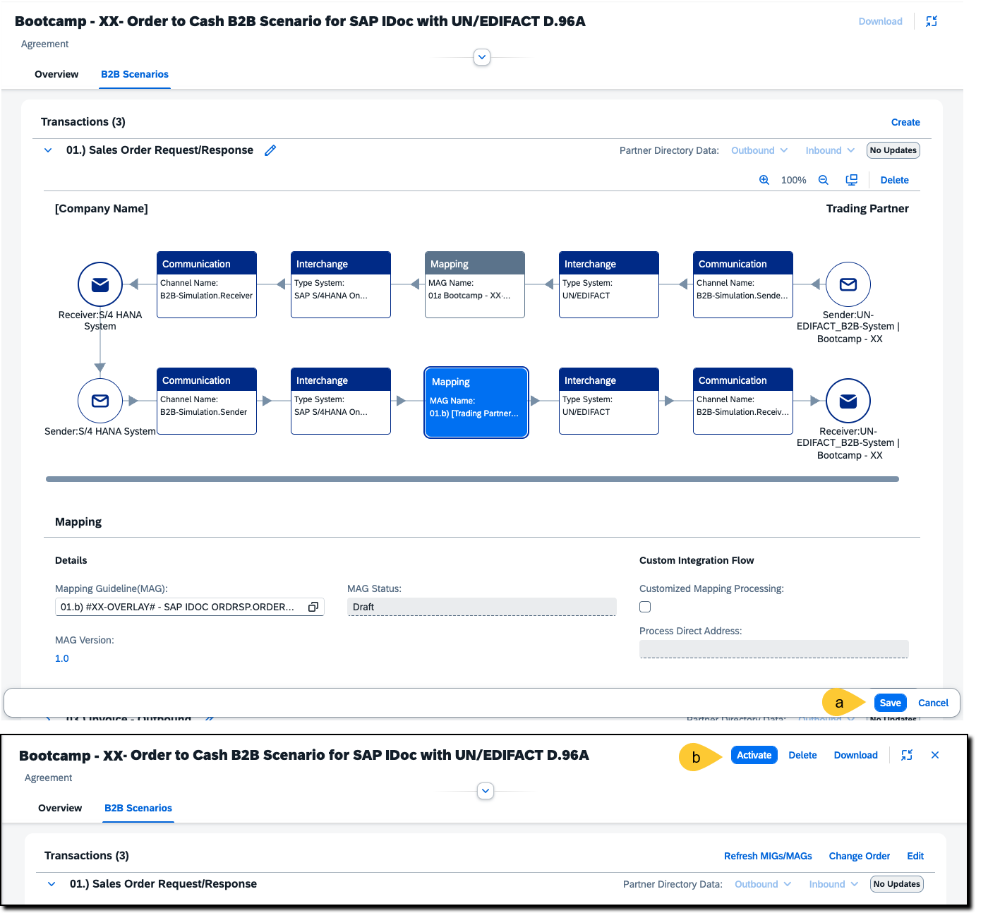

## Step 12 - Activate the TPA
- (a) **:** ``
- (b) **:** ``
- (c) **:** ``
- (d) **:** ``
- (e) **:** ``
- (f) **:** ``
- (g) **:** ``
- (h) **:** ``
- (i) **:** ``
- (j) **:** ``

## Step 13 - Activate the TPA
- (a) **:** ``
- (b) **:** ``
- (c) **:** ``
- (d) **:** ``
- (e) **:** ``
- (f) **:** ``
- (g) **:** ``
- (h) **:** ``
- (i) **:** ``
- (j) **:** ``

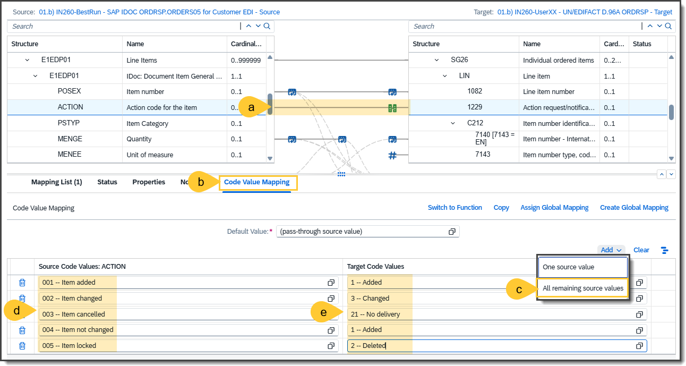

## Step 14 - Activate the TPA
- (a) **:** ``
- (b) **:** ``
- (c) **:** ``
- (d) **:** ``
- (e) **:** ``
- (f) **:** ``
- (g) **:** ``
- (h) **:** ``
- (i) **:** ``
- (j) **:** ``

## Step 15 - Activate the TPA
- (a) **:** ``
- (b) **:** ``
- (c) **:** ``
- (d) **:** ``
- (e) **:** ``
- (f) **:** ``
- (g) **:** ``
- (h) **:** ``
- (i) **:** ``
- (j) **:** ``

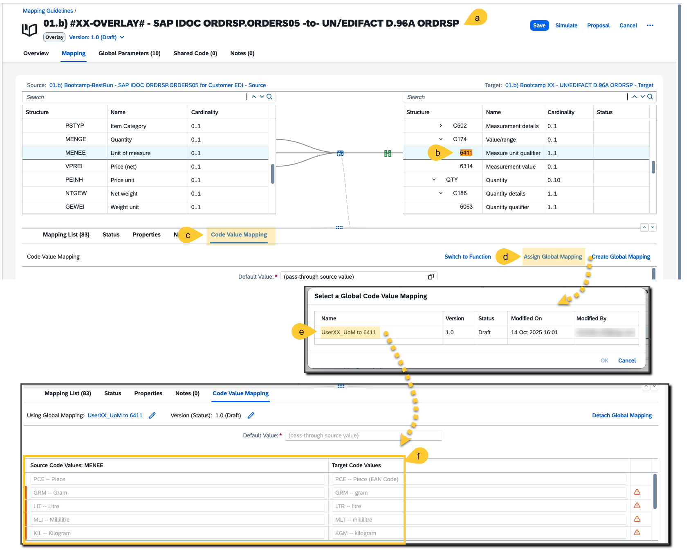

## Step 16 - Activate the TPA
- (a) **:** ``
- (b) **:** ``
- (c) **:** ``
- (d) **:** ``
- (e) **:** ``
- (f) **:** ``
- (g) **:** ``
- (h) **:** ``
- (i) **:** ``
- (j) **:** ``

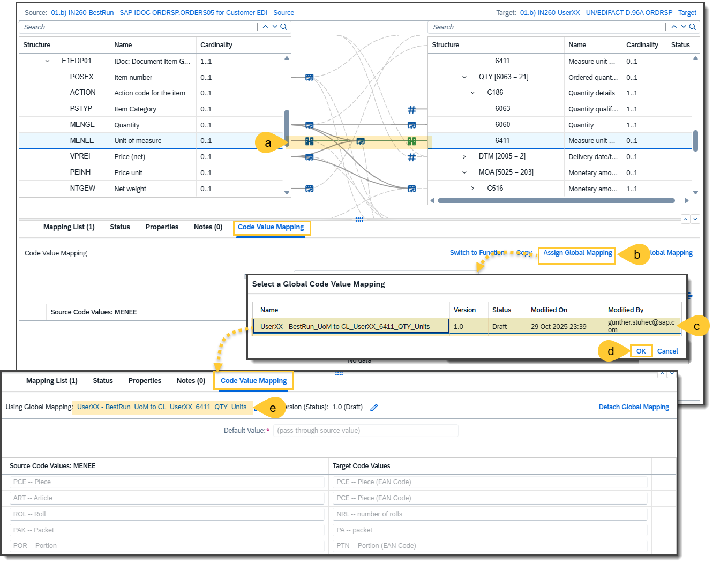

## Step 17 - Activate the TPA
- (a) **:** ``
- (b) **:** ``
- (c) **:** ``
- (d) **:** ``
- (e) **:** ``
- (f) **:** ``
- (g) **:** ``
- (h) **:** ``
- (i) **:** ``
- (j) **:** ``

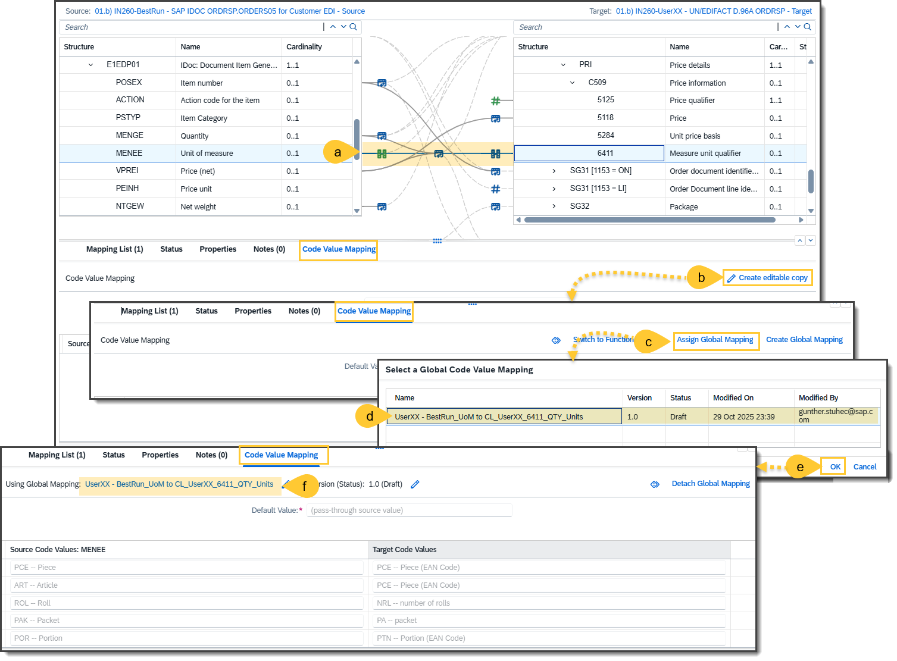

## Step 18 - Activate the TPA
- (a) **:** ``
- (b) **:** ``
- (c) **:** ``
- (d) **:** ``
- (e) **:** ``
- (f) **:** ``
- (g) **:** ``
- (h) **:** ``
- (i) **:** ``
- (j) **:** ``

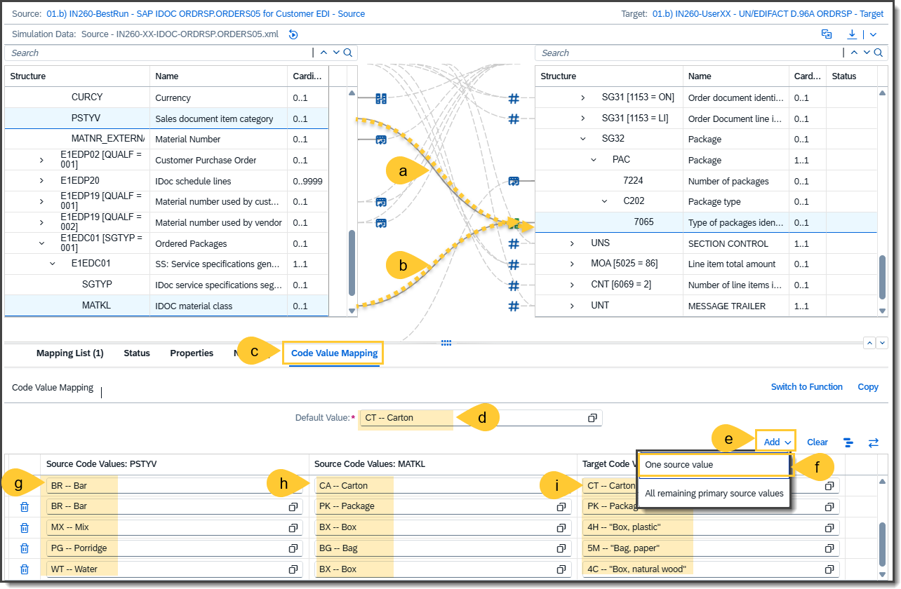

## Step 19 - Activate the TPA
- (a) **:** ``
- (b) **:** ``
- (c) **:** ``
- (d) **:** ``
- (e) **:** ``
- (f) **:** ``
- (g) **:** ``
- (h) **:** ``
- (i) **:** ``
- (j) **:** ``

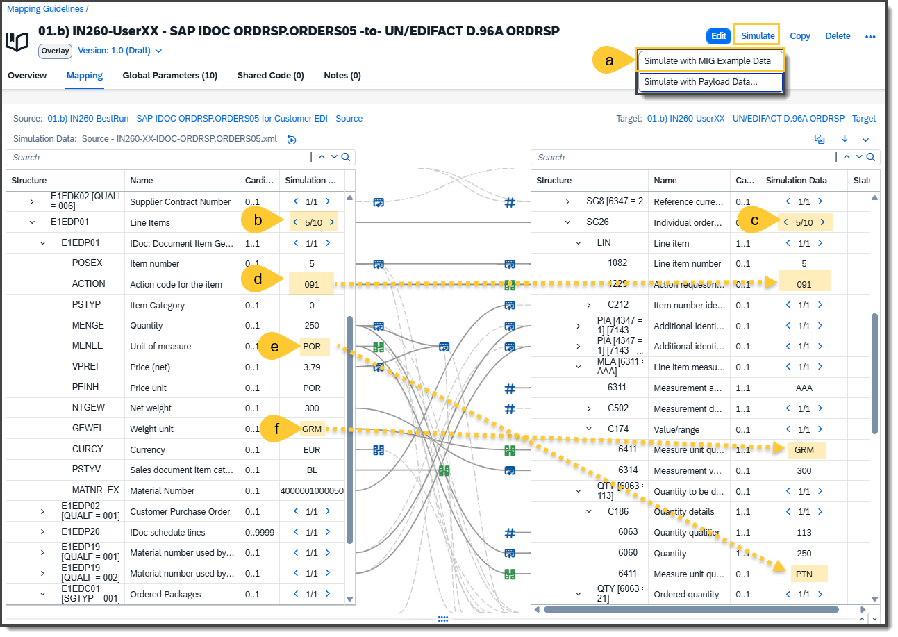

## Step 20 - Activate the TPA
- (a) **:** ``
- (b) **:** ``
- (c) **:** ``
- (d) **:** ``
- (e) **:** ``
- (f) **:** ``
- (g) **:** ``
- (h) **:** ``
- (i) **:** ``
- (j) **:** ``

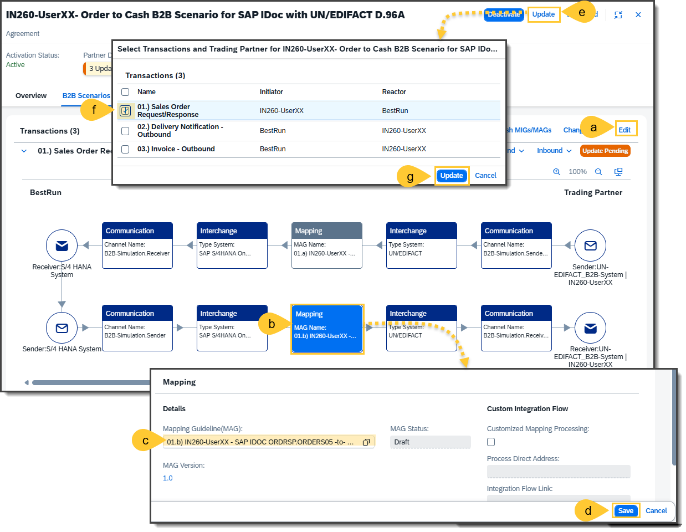

