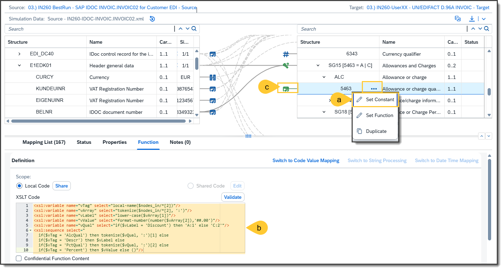
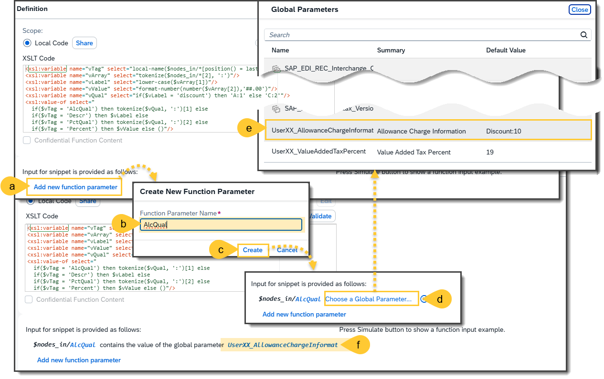
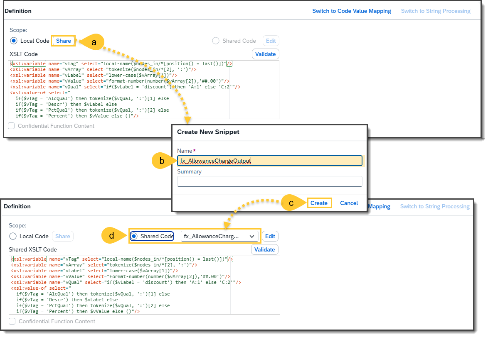
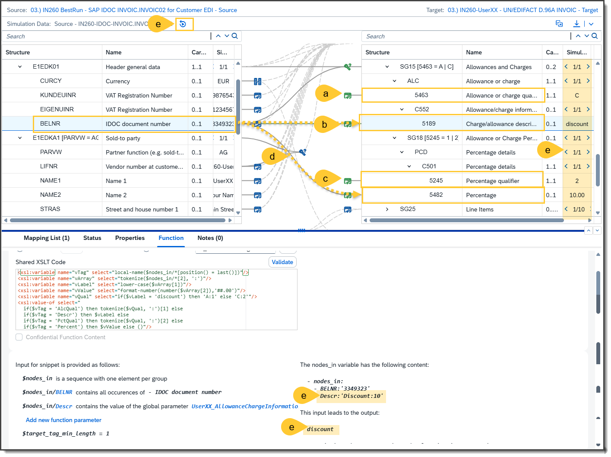
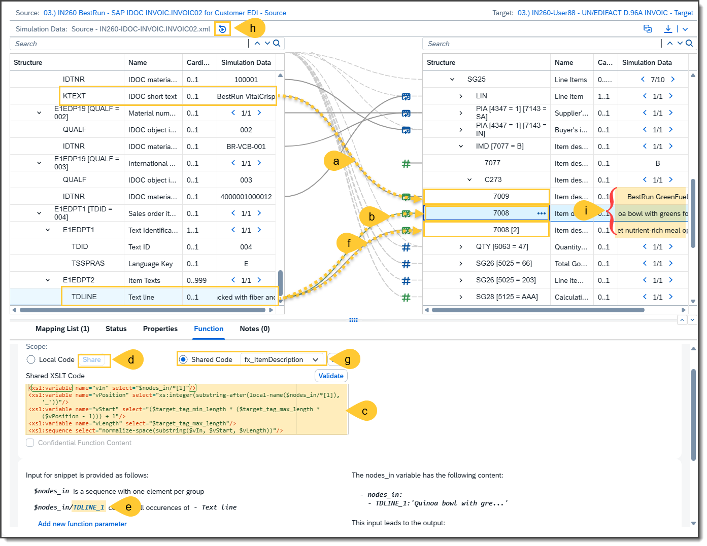
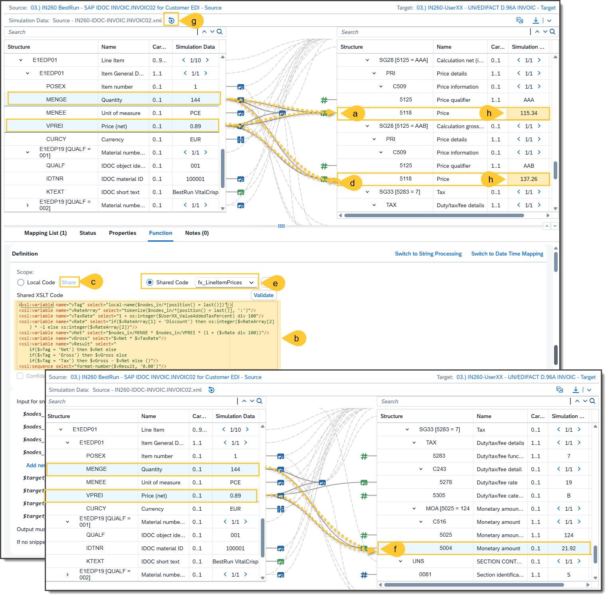
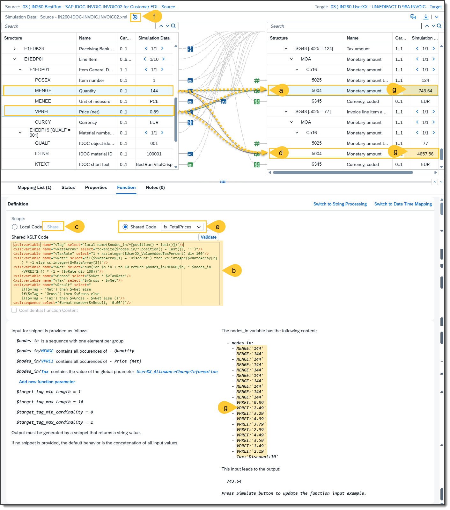
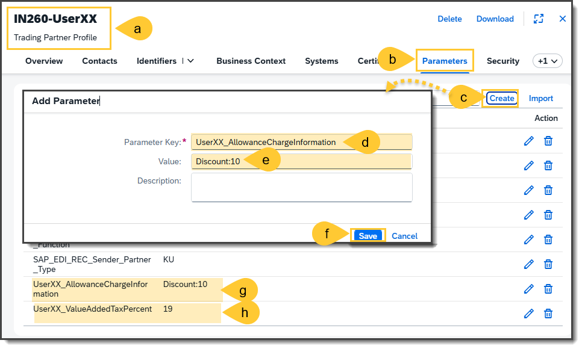
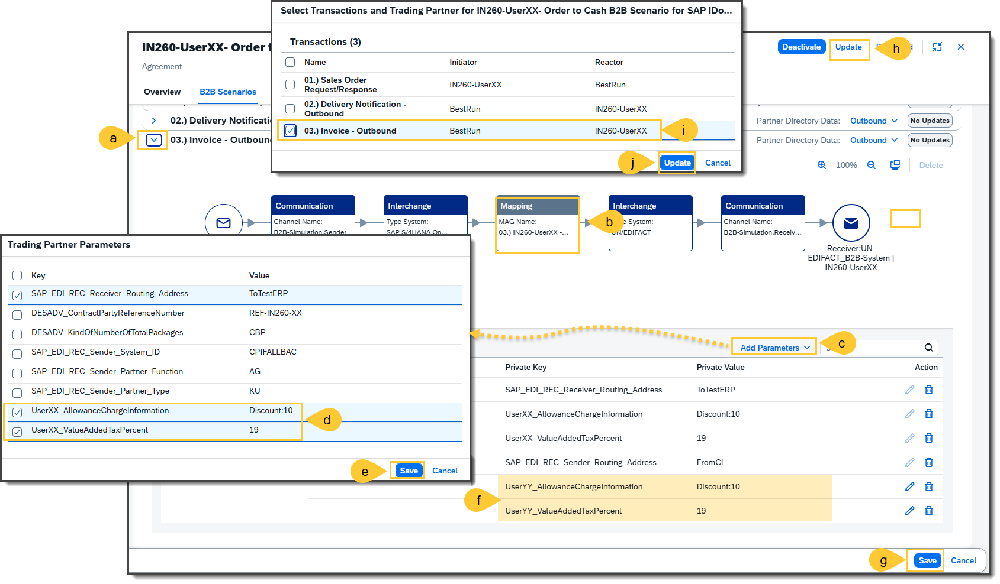
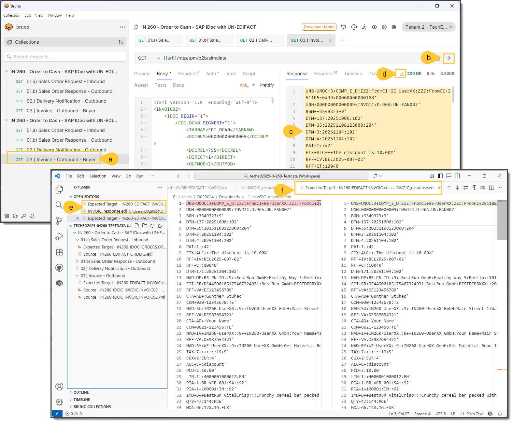

# Excercise 7: 
## Step 1 - 
- (a)
- (b)
- (c)
- (d)
- (e)
- (f)
- (g)
- (h)
- (i)
- (j)

## Step 2 - 
- (a)
- (b)
- (c)
- (d)
- (e)
- (f)
- (g)
- (h)
- (i)
- (j)

## Step 3 - 
- (a)
- (b)
- (c)
- (d)
- (e)
- (f)
- (g)
- (h)
- (i)
- (j)

## Step 4 - 
- (a)
- (b)
- (c)
- (d)
- (e)
- (f)
- (g)
- (h)
- (i)
- (j)

## Step 5 - 
- (a)
- (b)
- (c)
- (d)
- (e)
- (f)
- (g)
- (h)
- (i)
- (j)

## Step 6 - 
- (a)
- (b)
- (c)
- (d)
- (e)
- (f)
- (g)
- (h)
- (i)
- (j)

## Step 7 - 
- (a)
- (b)
- (c)
- (d)
- (e)
- (f)
- (g)
- (h)
- (i)
- (j)

## Step 8 - 
- (a)
- (b)
- (c)
- (d)
- (e)
- (f)
- (g)
- (h)
- (i)
- (j)
  

## Step 9 - 
- (a)
- (b)
- (c)
- (d)
- (e)
- (f)
- (g)
- (h)
- (i)
- (j)

## Step 10 - 
- (a)
- (b)
- (c)
- (d)
- (e)
- (f)
- (g)
- (h)
- (i)
- (j)

## Step 11 - 
- (a)
- (b)
- (c)
- (d)
- (e)
- (f)
- (g)
- (h)
- (i)
- (j)

## Step 12 - 
- (a)
- (b)
- (c)
- (d)
- (e)
- (f)
- (g)
- (h)
- (i)
- (j)

## Step 13 - 
- (a)
- (b)
- (c)
- (d)
- (e)
- (f)
- (g)
- (h)
- (i)
- (j)

## Step 14 - 
- (a)
- (b)
- (c)
- (d)
- (e)
- (f)
- (g)
- (h)
- (i)
- (j)

## Step 15 - 
- (a)
- (b)
- (c)
- (d)
- (e)
- (f)
- (g)
- (h)
- (i)
- (j)

## Step 16 - 
- (a)
- (b)
- (c)
- (d)
- (e)
- (f)
- (g)
- (h)
- (i)
- (j)

## Step 17 - 
- (a)
- (b)
- (c)
- (d)
- (e)
- (f)
- (g)
- (h)
- (i)
- (j)

## Step 18 - 
- (a)
- (b)
- (c)
- (d)
- (e)
- (f)
- (g)
- (h)
- (i)
- (j)

## Step 19 - 
- (a)
- (b)
- (c)
- (d)
- (e)
- (f)
- (g)
- (h)
- (i)
- (j)

## Step 20 - 
- (a)
- (b)
- (c)
- (d)
- (e)
- (f)
- (g)
- (h)
- (i)
- (j)

