# Exercise 1: Create the necessary Trading Partner Profile
In this exercise, you will learn how to set up a complete Trading Partner Profile for EDI processing within a B2B integration scenario. The steps guide you through:
- Creating a unique Interchange Control Number (ICN) using number ranges.
- Setting up a Trading Partner Profile, including company details and identifiers for UN/EDIFACT and IDOC payloads.
- Configuring Identifier Groups to manage multiple sender identifiers.
- Defining Trading Partner System Details, including type systems and communication channels.
- Creating Trading Partner Parameters to support dynamic data injection into mappings and headers.
- Assigning Number Ranges to ensure proper tracking of EDI transactions.

By completing this exercise, you will gain hands-on experience in configuring the foundational elements required for secure and structured electronic data interchange between business partners.

## Step  1 - Go to the Number Range objects
A unique interchange number should be added while sending out documents for EDI processing. To add, e.g., an interchange number, you can use Number Ranges. Every IN260 participant should create their his own interchange number. For this purpose
- (a) Click on **Integrations and APIs** inside the Monitor section
- (b) Select the box **Number Ranges**

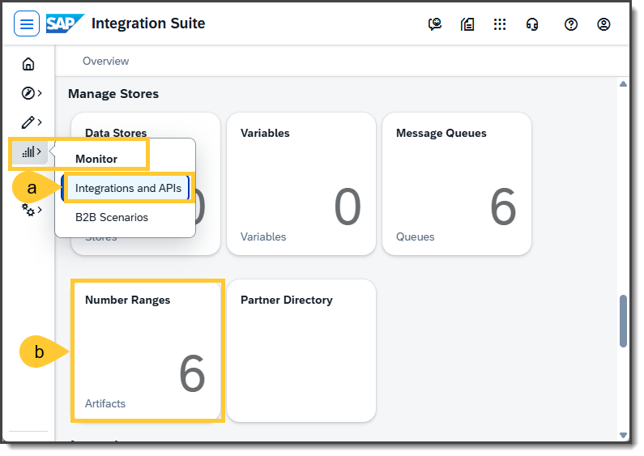

## Step  2 - Create a Number Range object
Create in the new window your number range for the Interchange Control Number (ICN) by following steps:
- (a) Click on **Add**, and a pop-up will open
- (b) Enter the name `ICN_EDIFACT_IN260_XX` (Make sure to replace XX with your UserID.)
- (c) Set the minimum value to `0`.
- (d) Set the maximum value to `99999999999999`.
- (e) Enter the field length `14`.
- (f) Select the checkbox for `Rotate`.
- (g) Click on button **OK**.

Note: The interchange control number is a unique identifier assigned to each interchange of EDI transactions. It is used to track and manage data exchange between trading partners. On the other hand, the group control number is used to identify and manage the individual groups of transactions within an interchange.

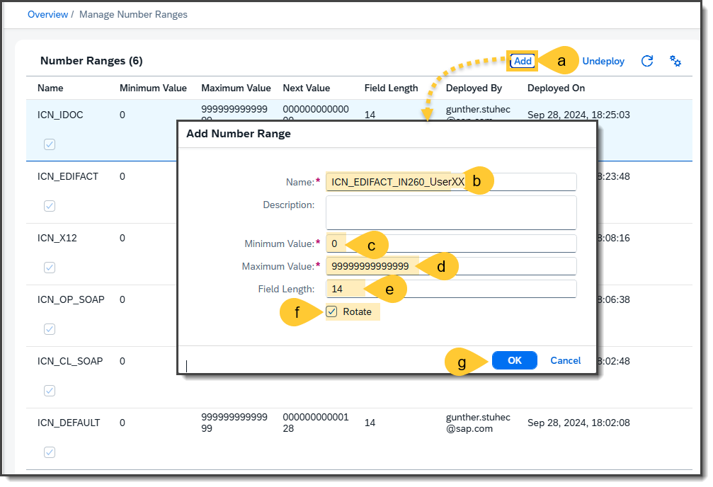

## Step  3 - Create a new Trading Partner Profile
Now, you should start to create your own trading partner profile so that you can create your specific Trading Partner Agreement based on the imported Trading Partner Agreement template.
- (a) Therefore navigate to the B2B Scnearios for displaying the Trading Partner Management (TPM)
- (b) Go to the **Partner Profiles** and
- (c) Create a new trading partner by clicking on Create --> Trading Partner
- (d) In the **Overview** tab for the new trading partner Company Name: `IN260-UserXX` (replace XX with your number), and
- (e) Company Short Name: `IN260-UserXX`
- (f) Click on the button **Save**.

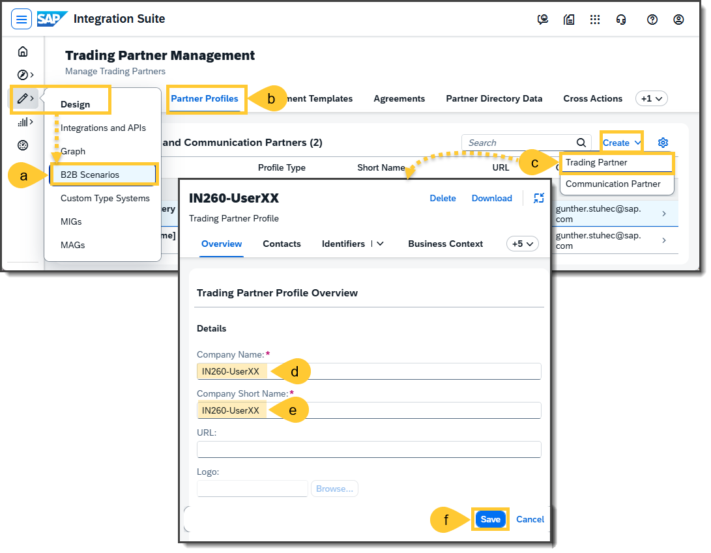

## Step  4 - Create a Single Identifier for UN/EDIFACT
Set first of all single identifiers for the outgoing UN/EDIFACT interchanges. For this purpose
- (a) Stay on the Trading Partner Profile and choose the tab **Identifiers**
- (b) Click on **Create** button, a pop-up will open.
- (c) Enter the identification number `E-XX`, where XX has to be replaced by your 
  UserID. Ensure the identification number is no longer than 14 characters; otherwise, remove leading zeros.
- (d) Enter the Alias: `TP_UNEDIFACT_ID`
- (e) Select the Type System: `UN/EDIFACT`
- (f) Select the Scheme: `Mutually defined` with the value `ZZZ`
- (g) Click on the button **Save**.

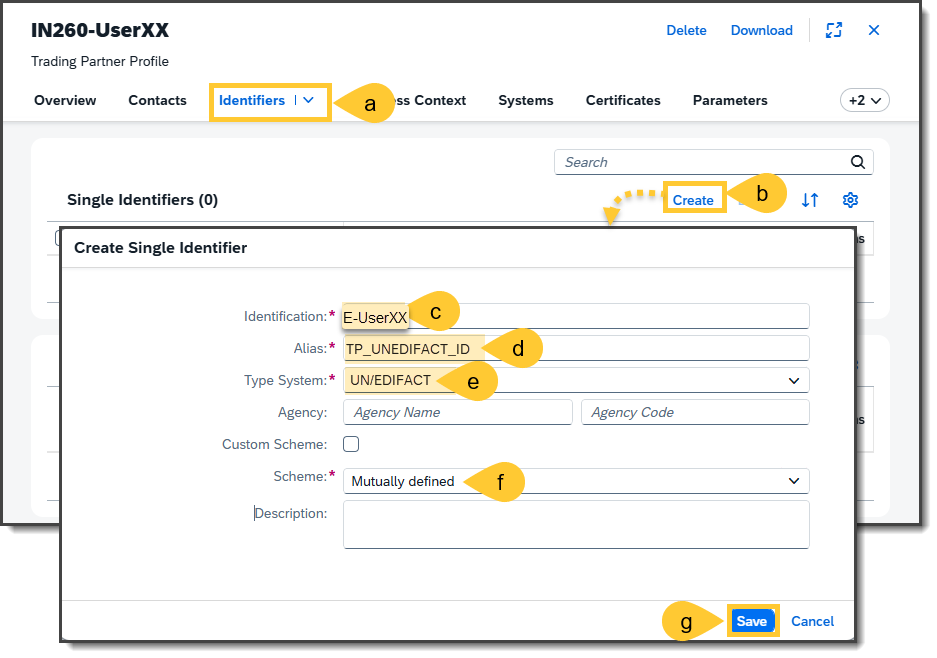

## Step  5 - Create a Single Identifier for SAP IDoc
Enter the further required identifier like step 4 by
- (a) Clicking on button **Create** and entering the following values:
  - Identification: `I-XX` , where XX has to be replaced by your UserID. Ensure the identification number is no longer than 10 characters; otherwise, remove leading zeros.
  - Alias: `TP_IDOC_ID`
  - Type System: `SAP S/4HANA On Premise IDoc`
  - Scheme: `N/A`
- (b) The should be than shown in the list after clicking on **Save** button.

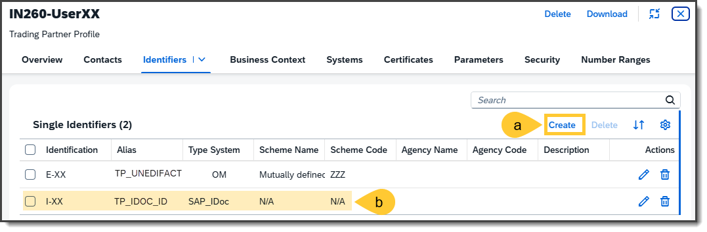

## Step  6 - Create a Group Identifier for UN/EDIFACT
You should now create an Identifier Group for incoming UN/EDIFACT interchanges, which might have different sender identifiers in the UNB segment. For this reason, you should carry out the following steps:
- (a) Scroll down to **Identifier Groups**
- (b) Click on the **Create** button, and a pop-up will open.
- (c) Enter the identification number `GE-XX`, where G standard for the group and where XX has to be replaced by your UserID. Ensure the identification number is no longer than 14 characters; otherwise, remove leading zeros.
- (d) Enter the Alias: `TP_UN/EDIFACT_G`
- (e) Select the Type System: `UN/EDIFACT`
- (f) Select the Scheme: `Mutually defined` with the value `ZZZ`
- (g) Click on the button **Save**.

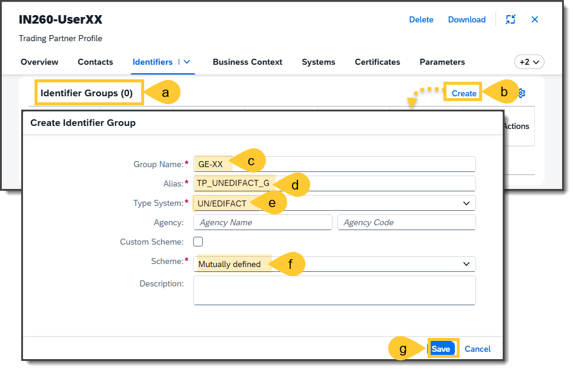

## Step  7 - Add an Identifier to the Group Identifier
You should now see an entry of a new identifier group in where you can add the identifiers itself by
- (a) Click on the **Add** button.
- (b) In the new pop-up, enter in Identification: `E1-XX`, and
- (c) In Sub-Organization Name: `Suborg. E1`.
- (d) Click on **Save** button.

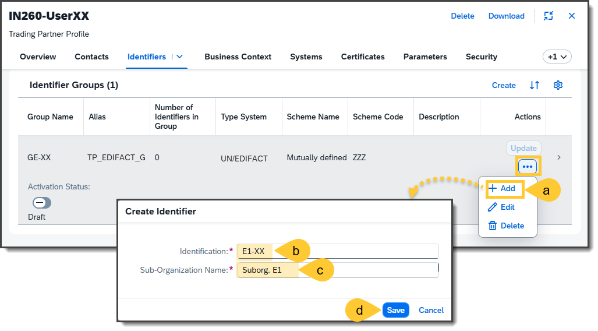

## Step  8 - Add a second Identifier do Group Identifier
Add a second identifier in the same group
- (a) Open the details view of the group identifier
- (b) Click on the **Add** button.
- (c) Enter the values:
  - Identification: `E2-XX`, and
  - Sub-Organization Name: `Suborg. E2`
- (d) Click on the **Save** button.
- (e) Enable the Activation Status so that the identifiers of this group will be recognized at the sender side of incoming UN/EDIFACT interchanges.

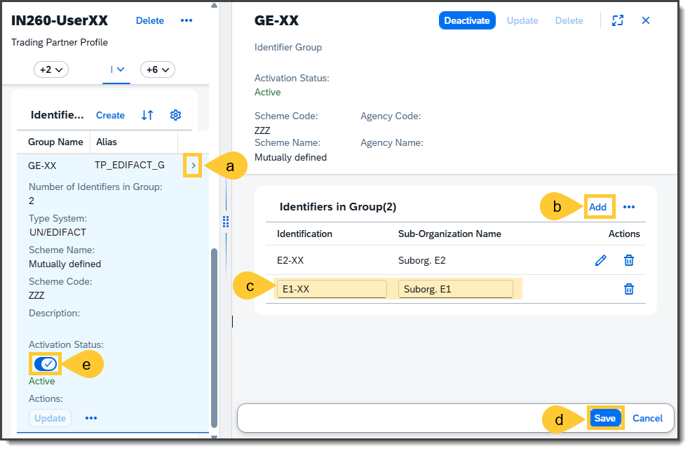

## Step  9 - Create a trading partners B2B System
Add Trading Partner System Details so that you can define the trading partner system-specific configuration, such as the configuration of the communication channels.
To proceed, you’ll need to add the specifics of the trading partner system:
- (a) Navigate to the **Systems** tab.
- (b) Click **Create System** – a pop-up window will appear.
- (c) Enter the System Name `B2B System`
- (d) Enter Alias, `UN-EDIFACT_B2B-System`
- (e) Select the Type: `B2B System`
- (f) Select the Purpose: `Dev`
- (g) Click **Save** to finalize the configuration.

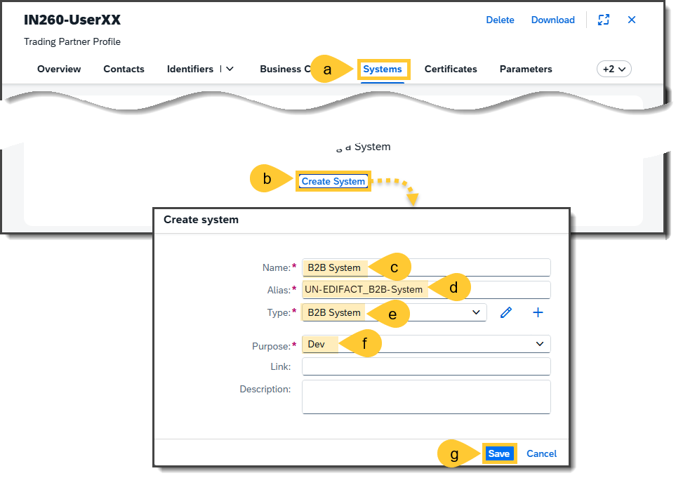

## Step  10 - Create the trading partner's Type System
Go to your newly created System and set the further configuration which belongs to the trading partners system. The following steps are required for it:
- (a) Go to the details of the **System**
- (b) You'll see the details of the tab **Type Systems**, where you should click on the **Create Type System** button. A pop-up will open.
- (c) In the pop-up **Assign Type System Version(s)** choose `UN/EDIFACT` and
- (d) Select version `D.96A S3` using the drop-down boxes.
- (e) Click on **Add**. You will see the newly created type systems.

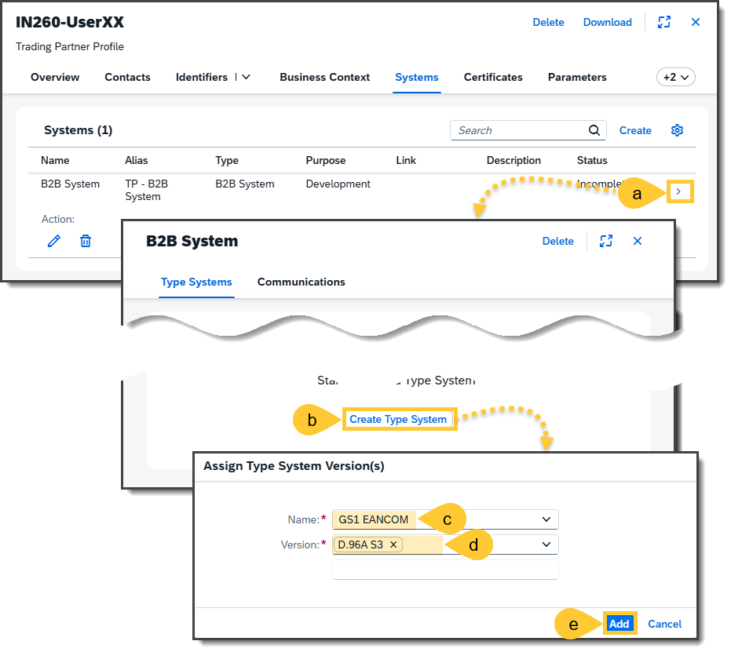

## Step  11 - Create the Receiver Communication Channel
The next step is the setting of the communication channels. Since this session focuses exclusively on interchange payload processing, it is entirely sufficient to create so-called simulation channels. Session INT164 focuses in particular on communication with external systems, such as via the AS2 communication protocol. The communication channels can be added as follows:
- (a) Go to tab **Communications**
- (b) Click on the button **Create Communication** so that you will get a new pop-up window.
- (c) Enter in this new window the Name: `B2B-Simulation.Receiver`
- (d) Enter the Alias: `B2B-Simulation.Receiver`
- (e) Select in Direction the value: `Receiver`
- (f) Select in Adapter the value: `Process_Direct`
- (g) Enter in the connection details the address: `/tpm/b2b-simulation/receiver`
- (h) Click on the **Save** button.

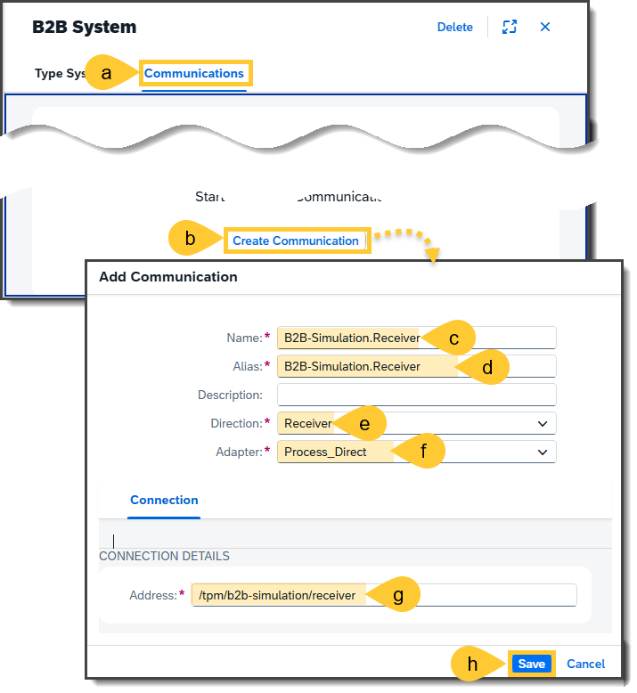

## Step  12 - Create the Sender Communication Channel
You need another communication channel on the receiver side. For this additional channel,
- (a) Click in the tab **Communications** on the **Create** button, and
- (b) Enter the values as follows:
  - Name: `B2B-Simulation.Sender`
  - Alias: `B2B-Simulation.Sender`
  - Direction: `Sender`
  - Adapter: `Process_Direct`

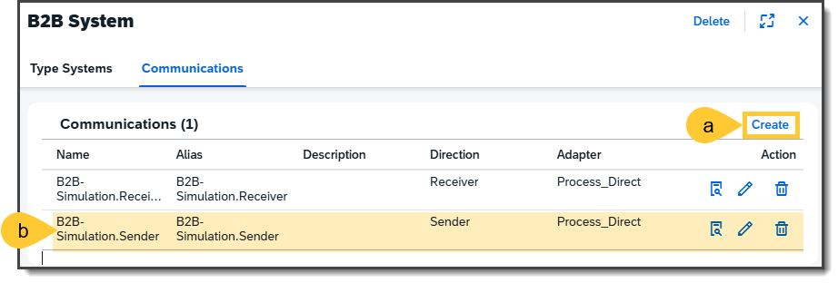

## Step  13 - Create a trading partner related Parameter
Parameters can be used in a wide variety of ways. They can either be used to initialize additional values in the envelope header, to provide further values in the mappings, or they can also be used in pre-/post-processing integration flows or their scripts for further control or processing. It is beneficial to create the parameters in the trading partner profiles if these are trading partner-related, so that the trading partner agreements can dynamically access the trading partner-specific parameters. These trading partner-specific parameters can be created as follows:
- (a) Go to the Trading Partner Profile to the tab **Parameters**
- (b) Click on the button **Create** so that a pop-up window will be opened.
- (c) In the new window, enter in **Parameter Key** the value: `SAP_EDI_REC_Receiver_Routing_Address`
- (d) And enter in **Value**: `ToTestERP`
- (e) Click on the **Save** button.

Remark: This value will be inserted into the UNB interchange header via the assembly step.

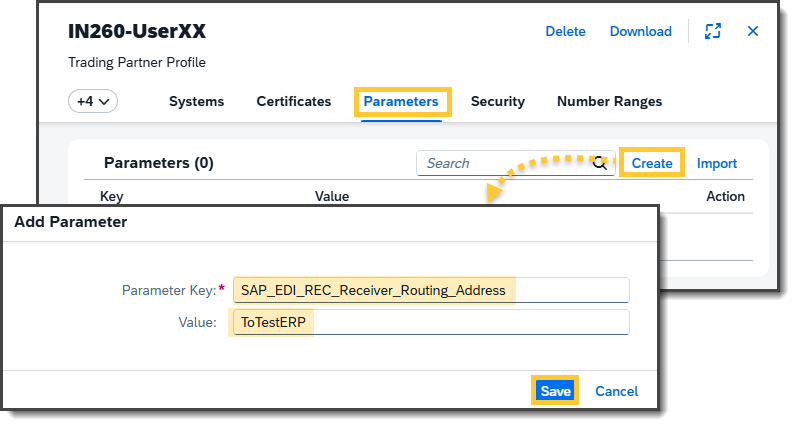

## Step  14 - Create further required Parameters
Enter the further required parameters by
- (a) Clicking on button **Create**
- (b) The parameters should be as shown in the following table.

| Parameter Key | Value | Purpose |
| --- | --- | --- |
| `DESADV_ContractPartyReferenceNumber` | `REF-IN260-XX` | Injection into the MAG |
| `DESADV_KindOfNumberOfTotalPackages` | `CBP` | Injection into a XSLT script at a post-processing flow |
| `SAP_EDI_REC_Sender_System_ID` | `CPIFALLBAC` | Injection into the SAP IDOC EDI_DC40 header segment in incoming transactions |
| `SAP_EDI_REC_Sender_Partner_Function` | `AG` | Injection into the SAP IDOC EDI_DC40 header segment in incoming transactions |
| `SAP_EDI_REC_Sender_Partner_Type`| `KU`| Injection into the SAP IDOC EDI_DC40 header segment in incoming transactions |

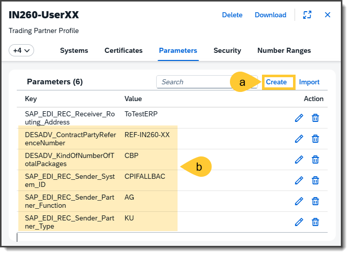

## Step  15 - Assign the created Number Range object
The defined number range from step 2 should now be assigned to the trading partner. This number is relevant for inserting a trading partner-specific interchange control number into the UNB interchange header --> data element 0020 (Interchange Control Reference). The following steps are required for it:
- (a) Switch to the tab **Number Ranges**
- (b) Click on **Add**.
- (c) Select the Number Range `ICN_EDIFACT_IN260_XX` and use the same name for the alias.
- (d) Enter the value in Alias: `ICN_EDIFACT`
- (e) Save it by clicking on **Save** button.

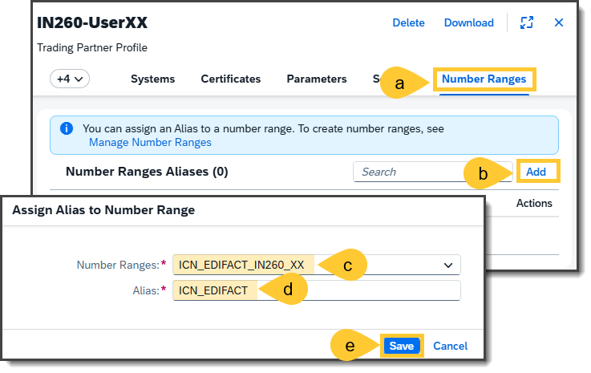

----

Continue with: [Exercise 2](Exercise_02.md)

Please give us feedback to this session **IN260** by scanning the QR-Code:

 
