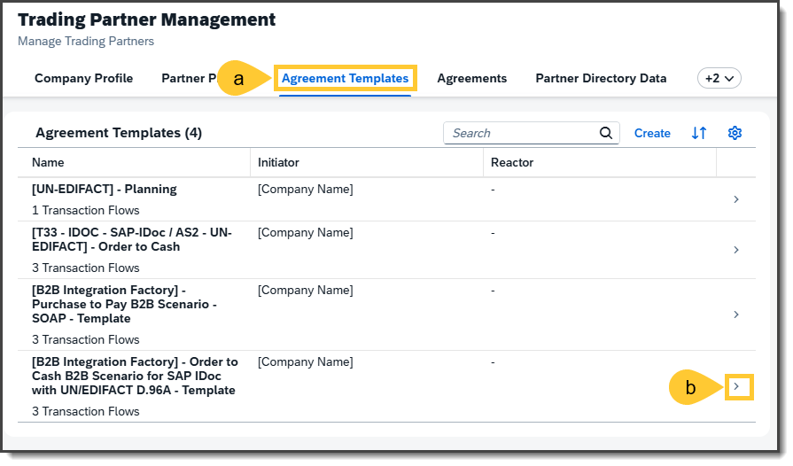
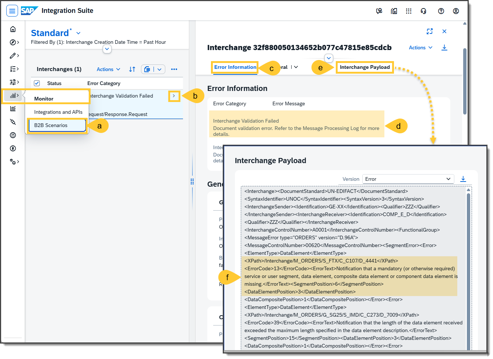
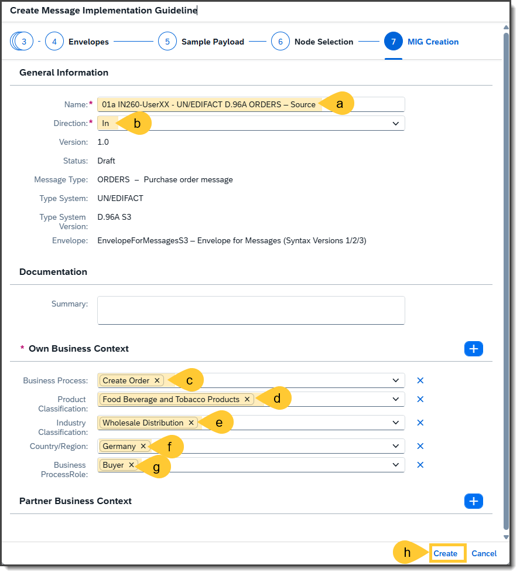
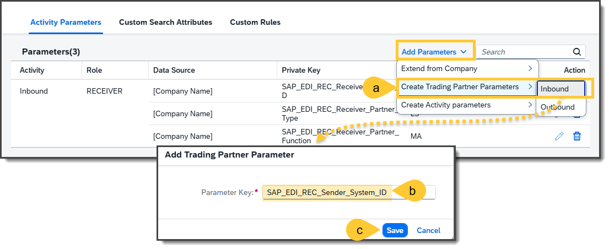
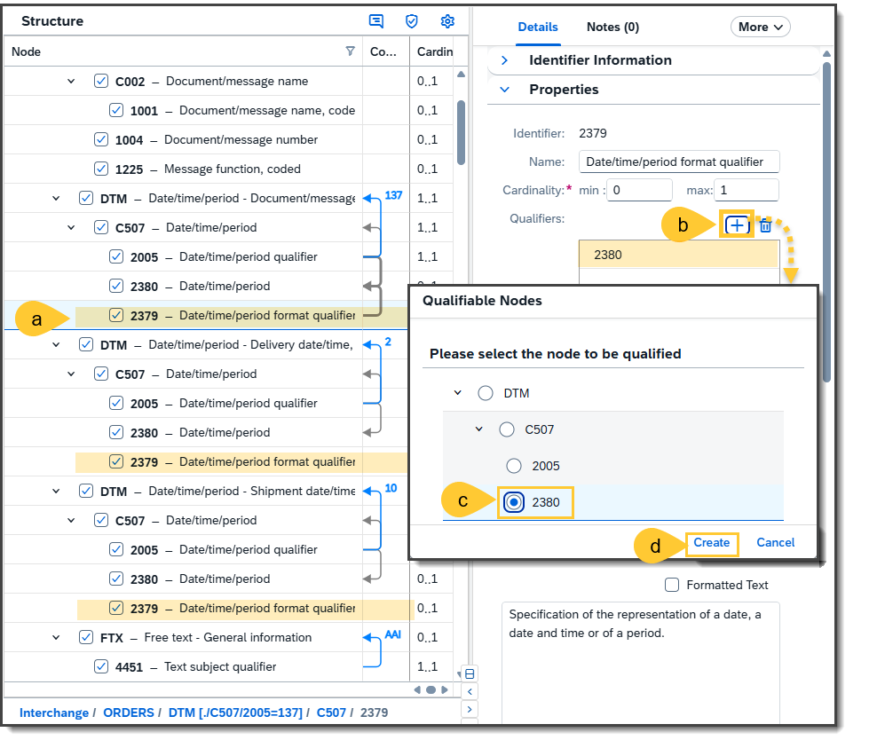
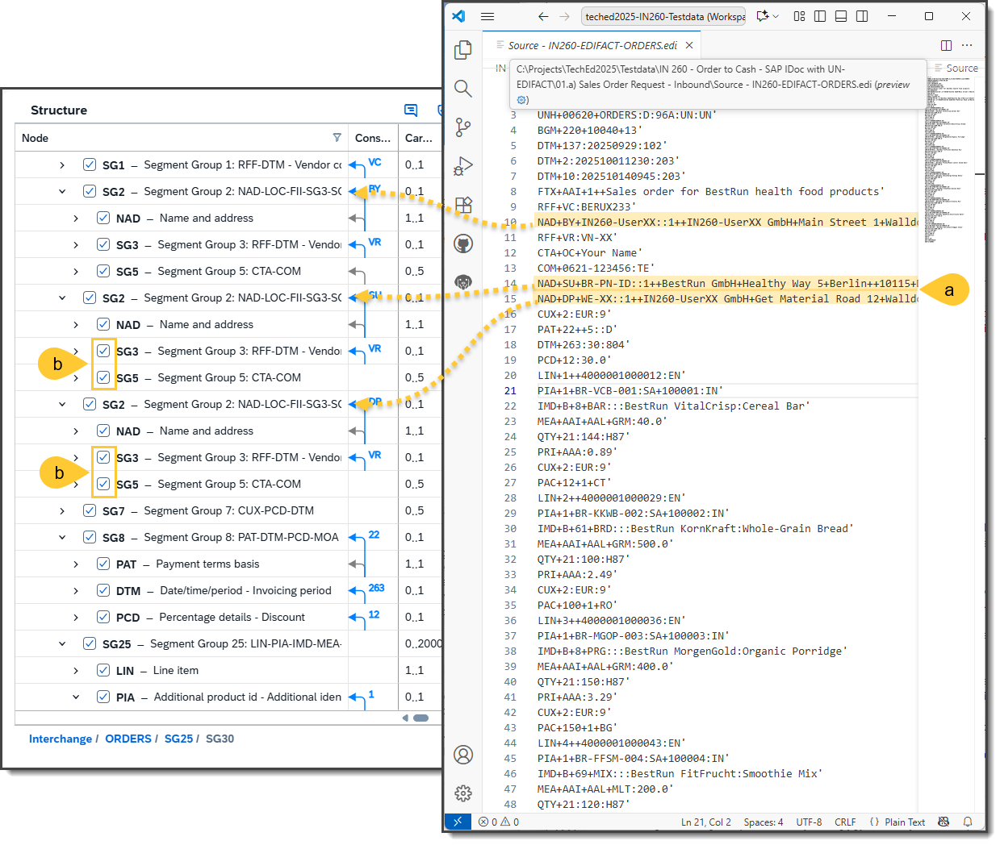
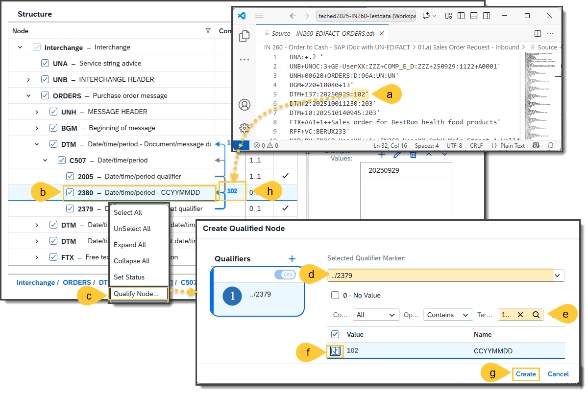
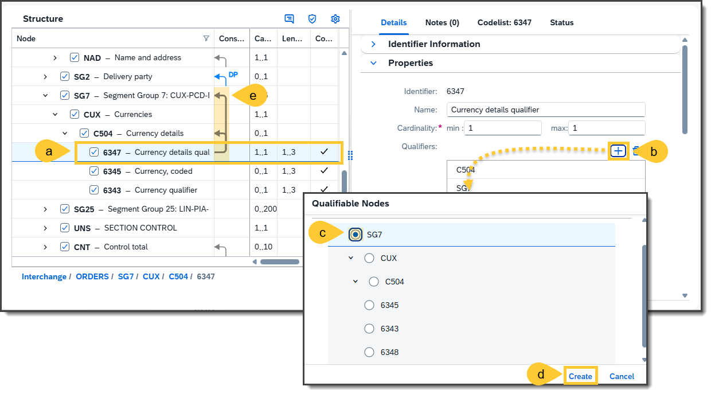

# Exercise 3: Create Trading Partner MIG for Business Transaction Activity: 01. a) Sales Order Request - Inbound

In this exercise, you will complete and test the Business Transaction Activity **01. a) Sales Order Request - Inbound** using the SAP Integration Suite. The goal is to simulate a sales order request, analyze any errors, and refine the configuration to ensure successful processing. You will create and configure a Source MIG (Message Implementation Guideline), generate an Overlay MAG (Mapping Guideline), and update the Trading Partner Agreement (TPA) accordingly.

**What you will do:**
- Trigger the inbound test and analyze the initial syntax error in the B2B Monitor.
- Save the partner’s payload and create a source MIG from it.
- Qualify key segments and refine data types/formatting in the MIG.
- Create an Overlay MAG from the base MAG and align mappings to your MIG.
- Use the proposal service to add non-conflicting mappings and simulate the result.
- Update the TPA to use your Overlay MAG and re-run the end-to-end test.

**Prerequisites:**
- Your TPA is created and activated (from previous exercises).
- You know your sender ID(s) from Exercise 2, Step 8.
- Access to SAP Integration Suite (Cloud Integration), including Design and Monitor.
- Visual Studio Code.

Follow each step carefully to complete the configuration and ensure that the business transaction is processed correctly.

## Step 01 - Create the trading partner's source MIG
The next significant step is to create a source MIG to fit the given payload available in the API testing tool.
- (a) open the **Design --> MIGs**in the navigation panel in SAP Integration Suite.
- (b) In the Message Implementation Guidelines overview list, click the **Create** button.
- (c) You will see a new pop-up window with a wizard for creating a new MIG. You should search the `UN/EDIFACT` type system in the first step.
- (d) Select this type system **UN/EDIFACT**.
- (e) The wizard automatically displays the second step, where you should search for the **Purchase Order Message**.
- (f) Select the listed **ORDERS** mesage type and select in the forth step the version **D.96A**.
- (g) Select the entry **EnvelopeForMessagesS3** in the fourth step.
- (h) Select the payload for uploading from the given folder of the testdata: `.\Testdata\IN 260 - Order to Cash - SAP IDoc with UN-EDIFACT\01.a) Sales Order Request - Inbound` and select the file  `Source -IN260-EDIFACT-ORDERS.edi`. 
- (i) Select the option "Use file content as example values".
- (j) Click the **Next** button.

## Step 02 - Select the nodes for qualification
The qualifier concept is an integral part of the MIGs. It helps you provide the correct business meaning of the used nodes and especially simplifies the mapping later on. The sixth step of the wizard allows you to select these segments that should get different qualified representations. 
- (a) To see which should be qualified, you should open in Visual Studio Code the payload for which you must create a MIG now.
- (b) In this payload, you might recognize that the following nodes need a qualification, which should be selected in **Node Selection**:
- (c) Click on the **Next** button.

The following table displays which segments or segment groups should be selected:

| Node | Name |
| --- | --- |
| `DTM` | Date/time/period |
| `FTX` | Free text |
| `SG1` | Segment Group 1: RFF-DTM |
| `SG2` | Segment Group 2: NAD-LOC-FII-SG3-SG4-SG5 |
| **In SG2** | Segment Group 2: NAD-LOC-FII-SG3-SG4-SG5 |
| `SG3` | Segment Group 3: RFF-DTM |
| **In SG2 --> SG5** | Segment Group 5: CTA-COM |
| `COM` | Communication contact | 
| `SG8` | Segment Group 8: PAT-DTM-PCD-MOA |
| **In SG8** | Segment Group 8: PAT-DTM-PCD-MOA |
| `DTM` | Date/time/period |
| `PCD` | Percentage details |
| **In SG25** | In Line Item Segment Group | 
| `PIA` | Additional product id |
| `QTY` | Quantity |
| **In Summary Part** |  |
| `CNT` | Control total |

  ***Remark:*** 
  - Segments and Groups with disabled check boxes can't be selected.
  - The **MEA – Measurements** in the Segment Group 25 should not be selected, because this will get a compound qualifier. 
- (f) If you finished the selection, click the **Next** button.

## Step 03 - Finalize the Overview Information of the new MIG
In the wizard step (6), you can enter all the information that belongs to the overview of the new MIG. Follow the following steps:
- (a) Enter in **Name** the name of the MIG such as: `01.a) IN260-UserXX - UN/EDIFACT D.96A ORDERS – Source`
- (b) Select the **Direction**: `In` for Inbound. 
- (c) Select in the **Own Business Conext** the valus in the **Own Business Conext** category **Business Procss**: `Create Order`
- (d) **Product Classification**: `Food Beverage and Tobacco Products`
- (e) **Industry Classification**: `Wholesale Distribution`
- (f) **Country/Region**: `Germany`
- (e) **Business Process Role**: `Buyer`
- (h) Click on the **Create** button.

***Remarks:***
- The “Partner Business Context” is not relevant.
- The context currently has just an informative purpose. However, it will be part of the future proposal service, including categorization and searching.

## Step 04 - Initial Representation of the MIG
The MIG will be initially created. After a while, you'll see a pop-up window that the MIG was successfully processed. To work more efficiently with the MIG, follow these steps.
- (a) Click the **Close** button to close the window.
- (b) First, you should hide all the unselected nodes by going to the column header **Node** in the Structure table and clicking on the **right mouse button**.
- (c) You'll see a menu. In here, you should select the menu item **Show Selected Nodes**
- (d) Now, you'll see the selected nodes, which are the ones in which the checkbox is marked. You should now expand the whole structure by selecting the root node **ORDERS** and clicking on the right mouse button, 
- (e) So that you can select in the context menu the item **Expand All**.
- (f) Finally, you should hide several columns by clicking on the **Column Visibility** icon so that
- (g) You see the columns **Cardinality** and **Codelist**. This allows you to expand the other columns, such as **Node**, for improved readability.
- (h) Confirm this new column visibility by the **Apply** button.

## Step 05 - Set further qualifier markers
Unfortunately, the automatic qualifier setting procedure, as described in step 5, when creating a MIG via payload, does not yet recognize all necessary qualifier markers and qualifications. Therefore, some of the qualifier markers have to be manually set via the following steps:  
- (a) Go to the data element (leaf) node that will be used to qualify another leaf node, a segment, or a segment group. In this case, the data element **2379** (Date/time/period format qualifier) should qualify the leaf node **2380** (Date/time/period), which may be used to express different formats of a date/time-based value. 
- (b) In the details panel at **Details** tab go to the section **Properties** and click at **Qualifiers** the **[+]** (Add) button.
- (c) You should now select in the pop-up window **Qualifiable Nodes** the **2380**, which can be qualified by this leaf node **2379**.
- (d) Click on the **Create** button. 

The following table shows which qualifier markers should be additionally set:

| Qualifier Marker | Node |  |  |  |  | Name |
| --- | --- | --- | --- | --- | --- | --- |
|  | DTM | [2005 = “137”] |  |  |  | Date/time/period - Document/message date/time |
|  |  | C507 |  |  |  | Date/time/period |
|  |  |  | 2005 |  |  | Date/time/period qualifier |
| `┌──────>` |  |  | **2380** |  |  | Date/time/period - CCYYMMDD |
| `└───────` |  |  | ***2379*** |  |  | Date/time/period format qualifier |
|  | DTM | [2005 = “2”] |  |  |  | Date/time/period - Delivery date/time, requested |
|  |  | C507 |  |  |  | Date/time/period |
|  |  |  | 2005 |  |  | Date/time/period qualifier |
| `┌──────>` |  |  | **2380** |  |  | Date/time/period |
| `└───────` |  |  | ***2379*** |  |  | Date/time/period format qualifier |
|  | DTM | [2005 = “10”] |  |  |  | Date/time/period - Shipment date/time, requested |
|  |  | C507 |  |  |  | Date/time/period |
|  |  |  | 2005 |  |  | Date/time/period qualifier |
| `┌──────>` |  |  | **2380** |  |  | Date/time/period |
| `└───────` |  |  | ***2379*** |  |  | Date/time/period format qualifier |
|  | SG2 | [3035 = “BY”] |  |  |  | Segment Group 2: NAD-LOC-FII-SG3-SG4-SG5 - Buyer |
|  |  | NAD |  |  |  | Name and address |
| `┌──────>` |  | SG5 |  |  |  | Segment Group 5: CTA-COM |
|  |  |  | **CTA** |  |  | Contact information |
| `└───────` |  |  |  | ***3139*** |  | Contact function, coded |
| `┌──────>` | **SG7** |  |  |  |  | Segment Group 7: CUX-PCD-DTM |
| `│       ` |  | CUX |  |  |  | Currencies |
| `│       ` |  |  | C504 |  |  | Currency details |
| `└───────` |  |  |  | ***6347*** |  | Currency details qualifier |
|  | SG25 |  |  |  |  | Segment Group 25: LIN-PIA-IMD-MEA-QTY-PCD-ALI-DTM-MOA-GIN-GIR-QVR-DOC-PAI-FTX-SG52 |
|  |  | LIN |  |  |  | Line item |
|  |  | PIA | [4347 = “1”] |  |  | Additional product id - Additional identification |
|  |  |  | 4347 |  |  | Product id. function qualifier |
| `┌──────>` |  |  | **C212** |  |  | Item number identification |
| `│       ` |  |  |  | 7140 |  | Item number |
| `└───────` |  |  |  | ***7143*** |  | Item number type, coded |
| `┌──────>` |  |  | **C212** |  |  | Item number identification |
| `│       ` |  |  |  | 7140 |  | Item number |
| `└───────` |  |  |  | ***7143*** |  | Item number type, coded |
| `┌──────>` |  | **IMD** |  |  |  | Item description |
| `└───────` |  |  | ***7077*** |  |  | Item description type, coded |
| `┌──────>` |  | **MEA** |  |  |  | Measurements |
| `│       ` |  |  | 6311 |  |  | Measurement application qualifier |
| `│       ` |  |  | C502 |  |  | Measurement details |
| `└───────` |  |  |  | ***6313*** |  | Measurement dimension, coded |
| `┌──────>` |  | **SG28** |  |  |  | Segment Group 28: PRI-CUX-APR-RNG-DTM |
| `│       ` |  |  | PRI |  |  | Price details |
| `│       ` |  |  |  | C509 |  | Price information |
| `└───────` |  |  |  |  | ***5125*** | Price qualifier |
| `┌──────>` |  |  | **CUX** |  |  | Currencies |
| `│       ` |  |  |  | C504 |  | Currency details |
| `└───────` |  |  |  |  | ***6347*** | Currency details qualifier |
| `┌──────>` |  | **SG30** |  |  |  | Segment Group 30: PAC-MEA-QTY-DTM-SG31-SG32 |
| `│       ` |  |  | PAC |  |  | Package |
| `│       ` |  |  |  | 7224 |  | Number of packages |
| `│       ` |  |  |  | C531 |  | Packaging details |
| `└───────` |  |  |  |  | ***7075*** | Packaging level, coded |

## Step 06 - Deselect Unnecessary Nodes
It is possible that some nodes are still selected, which can be deselected to achieve high precision.
- (a) For example, in the given payload, the **NAD+SU** (Supplier) and **NAD+DP** (Delivery Party) do not have the segments **RFF** (Reference), **CTA** (Contact information), and **COM** (Communication contact). 
- (b) Therefore, you can deselect the **SG3** (Segment Group 3) and **SG5** (Segment Group 5), because these segment groups include the mentioned segments.

## Step 07 - Set Further Simple Qualified Groups and Peers
Now, it is necessary to set the further qualified groups and peers based on the qualifier markers that are set in step 05. The following steps can realize this:
- (a) Check in the given payload, which qualifier values are required. E.g., the first **DTM** segment has for setting the format the value **102**, which qualifies the format of the value that is covered by the node **2380** (Date/time/period)
- (b) Select the node **2380** which should be qualified and click on the right mouse button.
- (c) You'll see a context menu of this selected node, where you should click on **Qualify Node..**
- (d) In the pop-up window **Create Qualified Node** select the qualifier marker: `./2379`.
- (e) Search for the value `102`.
- (f) Select the value `102`in the filtered list.
- (g) Click on the **Create** button.
- (h) You should see that this selected node **2380** is now qualified by the value **102**. This type of qualification is called **Peer qualification**, because it occurs at the same level.

The following table displays where you have to set the further simple qualified peers and groups:

| Qualifier Marker | Node |  |  |  |  | Name |
| --- | --- | --- | --- | --- | --- | --- |
|  | DTM | [2005 = “137”] |  |  |  | Date/time/period - Document/message date/time |
|  |  | C507 |  |  |  | Date/time/period |
|  |  |  | 2005 |  |  | Date/time/period qualifier |
| `┌(102)─>` |  |  | **2380** |  |  | Date/time/period - CCYYMMDD |
| `└───────` |  |  | ***2379*** |  |  | Date/time/period format qualifier |
|  | DTM | [2005 = “2”] |  |  |  | Date/time/period - Delivery date/time, requested |
|  |  | C507 |  |  |  | Date/time/period |
|  |  |  | 2005 |  |  | Date/time/period qualifier |
| `┌(203)─>` |  |  | **2380** |  |  | Date/time/period |
| `└───────` |  |  | ***2379*** |  |  | Date/time/period format qualifier |
|  | DTM | [2005 = “10”] |  |  |  | Date/time/period - Shipment date/time, requested |
|  |  | C507 |  |  |  | Date/time/period |
|  |  |  | 2005 |  |  | Date/time/period qualifier |
| `┌(203)─>` |  |  | **2380** |  |  | Date/time/period |
| `└───────` |  |  | ***2379*** |  |  | Date/time/period format qualifier |
|  | SG2 | [3035 = “BY”] |  |  |  | Segment Group 2: NAD-LOC-FII-SG3-SG4-SG5 - Buyer |
|  |  | NAD |  |  |  | Name and address |
|  |  | SG5 |  |  |  | Segment Group 5: CTA-COM |
| `┌(OC)──>` |  |  | **CTA** |  |  | Contact information |
| `└───────` |  |  |  | ***3139*** |  | Contact function, coded |
| `┌(2)───>` | **SG7** |  |  |  |  | Segment Group 7: CUX-PCD-DTM |
| `│       ` |  | CUX |  |  |  | Currencies |
| `│       ` |  |  | C504 |  |  | Currency details |
| `└───────` |  |  |  | ***6347*** |  | Currency details qualifier |
|  | SG25 |  |  |  |  | Segment Group 25: LIN-PIA-IMD-MEA-QTY-PCD-ALI-DTM-MOA-GIN-GIR-QVR-DOC-PAI-FTX-SG52 |
|  |  | LIN |  |  |  | Line item |
|  |  | PIA | [4347 = “1”] |  |  | Additional product id - Additional identification |
|  |  |  | 4347 |  |  | Product id. function qualifier |
| `┌(SA)──>` |  |  | **C212** |  |  | Item number identification |
| `│       ` |  |  |  | 7140 |  | Item number |
| `└───────` |  |  |  | ***7143*** |  | Item number type, coded |
| `┌(IN)─>` |  |  | **C212** |  |  | Item number identification |
| `│       ` |  |  |  | 7140 |  | Item number |
| `└───────` |  |  |  | ***7143*** |  | Item number type, coded |
| `┌(B)───>` |  | **IMD** |  |  |  | Item description |
| `└───────` |  |  | ***7077*** |  |  | Item description type, coded |
| `┌(AAA)─>` |  | **SG28** |  |  |  | Segment Group 28: PRI-CUX-APR-RNG-DTM |
| `│       ` |  |  | PRI |  |  | Price details |
| `│       ` |  |  |  | C509 |  | Price information |
| `└───────` |  |  |  |  | ***5125*** | Price qualifier |
| `┌(2)───>` |  |  | **CUX** |  |  | Currencies |
| `│       ` |  |  |  | C504 |  | Currency details |
| `└───────` |  |  |  |  | ***6347*** | Currency details qualifier |
| `┌(1)──>` |  | **SG30** |  |  |  | Segment Group 30: PAC-MEA-QTY-DTM-SG31-SG32 |
| `│       ` |  |  | PAC |  |  | Package |
| `│       ` |  |  |  | 7224 |  | Number of packages |
| `│       ` |  |  |  | C531 |  | Packaging details |
| `└───────` |  |  |  |  | ***7075*** | Packaging level, coded |

## Step 08 - Set a Compound Qualification
It is possible to define compound qualifications, which means two qualifiers refine a qualifying node. This is necessary in case of the MEA segment, which will be set accordingly:
- (a) Select the node (segment) **MEA** which should be qualified and click on the right mouse button.
- (b) You'll see a context menu of this selected node, where you should click on **Qualify Node..**
- (c) In the pop-up window **Create Qualified Node** select the qualifier marker: `./6311`.
- (d) Search for the value `AAI`.
- (e) Select the value `AAI`in the filtered list.
- (f) Click on the **+** (Add) for setting a second qualification.
- (g) Select the qualifier marker: `./C502/6313`.
- (h) Search for the value `AAL`.
- (i) Select the value `ALL 'ALL`in the filtered list.
- (j) Click on the **Create** button.
- (k) You should see the compound qualification at the node **MEA** with the two values **AAI** and **AAL**. 

## Step 09 (OPTIONAL) - Refine the MIG
To increase readability and correctness, it is helpful to refine MIG by assigning crisp and meaningful names, as well as setting properties such as formats and lengths. Primarily, the setting of the properties supports the creation of mappings and will be automatically considered during payload validation.
- (a) Click on the group node that you want to refine, for example, the segment node **DTM** with the qualifier **137**
- (b) In the **Details** panel, enter in **Name** a crisp and meaningful name which is short enough but fully describes the whole meaning of the qualified node, such as `Document/message date/time`.
- (c) Go on the leaf node that you want to refine, such as the data element node **2380**, which is qualified with the value **102**
- (d) Go to the details panel to the section **Simple Type Properties**
- (e) Select the **Primitive Type**: `Date`
- (f) Set the min length `8`and (g) max length `8`.
- (h) Select the **Date Time Format**: `CCYYMMDD` 

[IN260 Figure 03.09](assets/IN260_03.09.png)

The following table shows you which of the nodes should be refined:
***Remark:** Nodes not considered are hidden.

| Node |  |  |  | Name | Prim. Type | Length | Date Format |
| --- | --- | --- | --- | --- | --- | --- | --- |
| ORDERS |  |  |  | `Sales order message` |  |  |  |
|  | DTM [2005 = “137”] |  |  | `Document/message date/time` |  |  |  |
|  |  | C507/2380 [2379 = “102”] |  | `Date in format CCYYMMDD` | `Date` | `8 .. 8` | `CCYYMMDD` |
|  | DTM [2005 = “2”] |  |  | `Delivery date/time, requested` |  |  |  |
|  |  | C507/2380 [2379 = “203”] |  | `Date time in format CCYYMMDDHHMM` | `DateTime` | `12 .. 12` | `CCYYMMDDhhmm` |
|  | DTM [2005 = “10”] |  |  | `Shipment date/time, requested` |  |  |  |
|  |  | C507/2380 [2379 = “203”] |  | `Date time in format CCYYMMDDHHMM` | `DateTime` | `12 .. 12` | `CCYYMMDDhhmm` |
|  | FTX [4451 = “AAI”] |  |  | `Free text - General information` |  |  |  |
|  | SG1 [1153 = “VC”] |  |  | `Vendor contract number` |  |  |  |
|  | SG2 [3035 = “BY”] |  |  | `Buyer` |  |  |  |
|  |  | SG3 [1153 = “VR”] |  | `Vendor ID number` |  |  |  |
|  |  | SG5 [3139 = “OC”] |  | `Order contact` |  |  |  |
|  |  |  | COM [3155 = “TE”] | `Telephone` |  |  |  |
|  | SG2 [3035 = “SU”] |  |  | `Supplier` |  |  |  |
|  | SG2 [3035 = “DP”] |  |  | `Delivery party` |  |  |  |
|  | SG7 [6347 = “2”] |  |  | `Reference currency` |  |  |  |
|  | SG8 [4279 = “22”] |  |  | `Discount` |  |  |  |
|  |  | DTM [2005 = “263”] |  | `Invoicing period` |  |  |  |
|  |  | PCD [5245 = “12”] |  | `Discount percentage` |  |  |  |
|  | SG25 |  |  | `Line Items` |  |  |  |
|  |  | PIA [4347 = “1”] |  | `Additional identification` |  |  |  |
|  |  |  | C212 [7143 = “SA”] | `Supplier's article number` |  |  |  |
|  |  |  | C212 [7143 = “IN”] | `Buyer's item number` |  |  |  |
|  |  | MEA [6311 = “AAI”][6313 = “AAL”] |  | `Item net weight` |  |  |  |
|  |  | QTY [6063 = “21”] |  | `Ordered quantity` |  |  |  |
|  |  | SG28 [5125 = “AAA”] |  | `Reference price` |  |  |  |
|  |  |  | CUX [6347 = “2”] | `Currencies - Reference currency` |  |  |  |
|  |  | SG30 [7075 = “1”] |  | `Inner Package` |  |  |  |
|  | CNT [6069 = “2”] |  |  | `Number of line items in message` |  |  |  |

***Remark:*** If you have now successfully saved this Trading Partner MIG, you're finished with this exercise and can proceed with the next exercise, 03.

----

Continue with: [Exercise 4](Exercise_04.md)

Please give us feedback on this session **IN260** by scanning the QR-Code:

 

