# Exercise 4: Finalize the Business Transaction Activity — Sales Order Request (Inbound)
This exercise guides you through creating and finalizing an **Overlay Mapping Guideline (MAG)** for an inbound Sales Order Request. You will clean up mapping inconsistencies between a base guideline and a trading-partner-specific **MIG**, apply proposals, validate the mapping by simulation, update the **Trading Partner Agreement (TPA)**, and verify the end-to-end result by comparing the generated IDoc against an expected target payload.

### What You Will Do
- Create an Overlay MAG from a base MAG and a trading-partner-specific source MIG.
- Resolve mapping errors introduced by structural differences.
- Use the proposal service to add non-conflicting mappings and validate by simulation.
- Update the TPA and the Partner Directory (PD) with your Overlay MAG.
- Test the end-to-end flow and compare the output with a reference payload; then refine the mapping until it matches.

### Prerequisites
- You completed the earlier exercises (at least exercise 1+2) and **created the trading-partner-specific source MIG** (or you copy the solution MIG _
01.a) #IN260-SOLUTION# - UN/EDIFACT D.96A ORDERS - Source_).
- Access to the **MAG editor** and **TPA** in your environment.
- Test files available locally:
  - `IN260-XX-EDIFACT-ORDERS.edi` (source payload)
  - `Expected Target - IN260-XX-IDOC-ORDERS.ORDERS05.xml` (reference)
- Tools: **Bruno API Testing Tool**, **Visual Studio Code** 

## Step 1: Create Overlay MAG
Once your trading-partner-specific source MIG is ready, create an **Overlay MAG** based on the pre-packaged base MAG that you find in your TPA:
- (a) Open **Design → MAGs** to view the MAG list.
- (b) Click **Create** and choose **Overlay MAG** to open the wizard.
- (c) For the base MAG, search for:
  `01.a) #IN260-BASE# - UN/EDIFACT D.96A ORDERS -to- SAP IDOC ORDERS.ORDERS05`
- (d) Select the base MAG to move to the next step.
- (e) In **Source MIG**, switch to **Compatible MIG** and choose the MIG you created previously:
  `01.a) IN260-UserXX - UN/EDIFACT D.96A ORDERS – Source`
- (f) Keep the **Base Target MIG** unchanged (IDoc structure for all partners).
- (g) Use the same **Target MIG** as the base target:
  `01.a) [Company Name] - SAP IDOC ORDERS.ORDERS05 for Customer EDI - Target`
- (h) In step 4, name the Overlay MAG:
  `01.a) IN260-UserXX - UN/EDIFACT D.96A ORDERS –to– SAP IDOC ORDERS.ORDERS05`
- (i) Click **Create**.

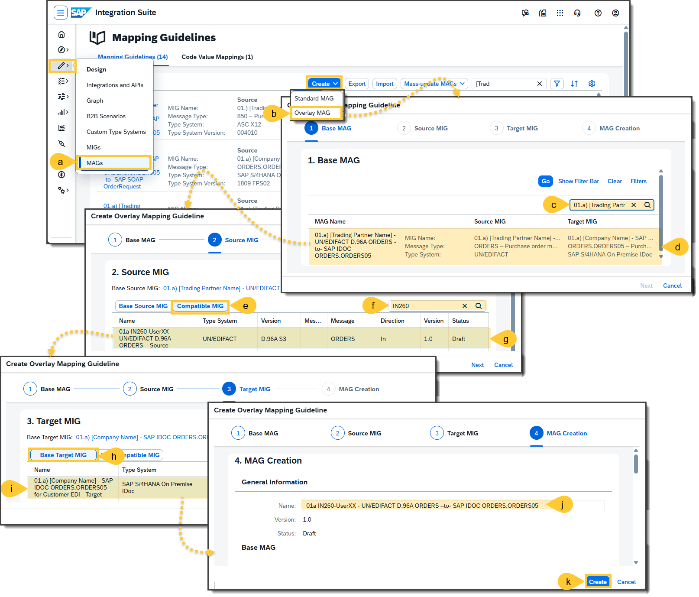

## Step 2: Clean Up Errors
Clean up time! The new Overlay MAG may show errors due to differences between the base source MIG and your trading-partner-specific MIG. Remove mappings that reference nodes not present in your MIG:
- (a) Open the **Mapping List** tab.
- (b) Filter by **Only errors** to see invalid mappings.
- (c) **Delete** all erroneous mapping elements.

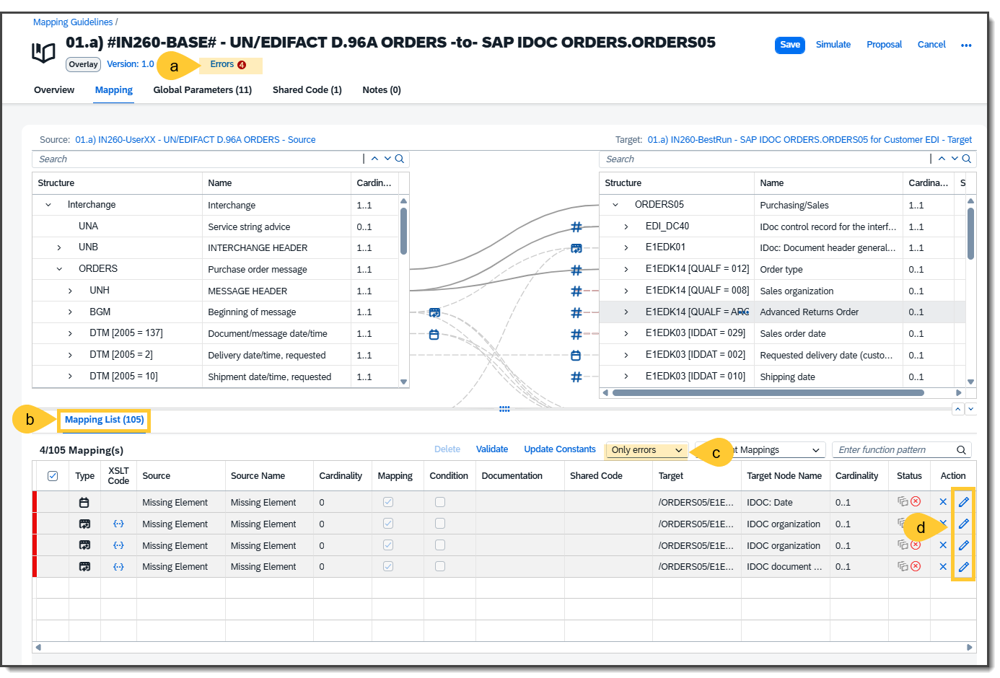

## Step 3: Validate the Overlay MAG
Check your MAG, if this is valid. Therefore, simulate the mapping with a given sample source payload to verify basic correctness:
- (a) Choose **Simulate → Simulate with MIG Example Data**.
- (b) Upload `IN260-XX-EDIFACT-ORDERS.edi`.
- (c) Click **OK**.
- (d) Confirm that the **source values** appear at the correct nodes in the source MIG tree.
- (e) Confirm that **target values** are produced at the mapped nodes in the target MIG.

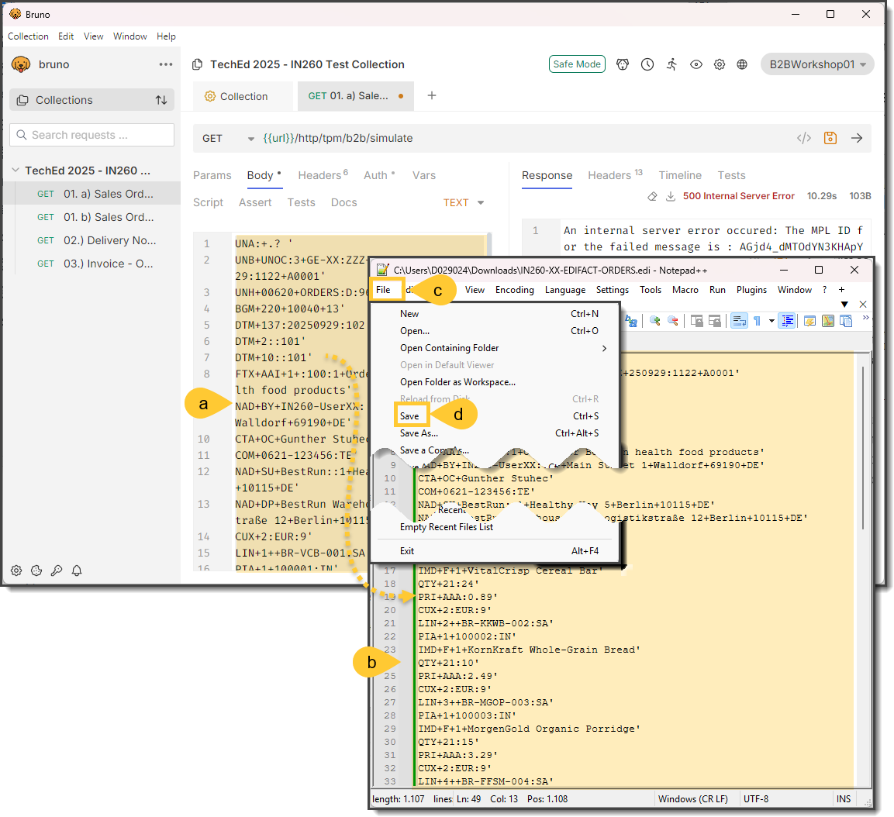

## Step 4: Add Mapping Elements via Proposal Service
Enhance your mapping with smart, conflict-free suggestions from the proposal service. Use the proposal service to extend the mapping with non-conflicting elements:
- (a) Open **Proposal** to start the service (allow ~2 minutes). Proposed mappings appear in the **Mapping List**.
- (b) Display **Nonconflicting proposals** so base mappings remain untouched.
- (c) Click **Select Best Proposal** to preselect high-quality suggestions.
- (d) In the pop-up, choose **Use only valid Mappings** to apply them.

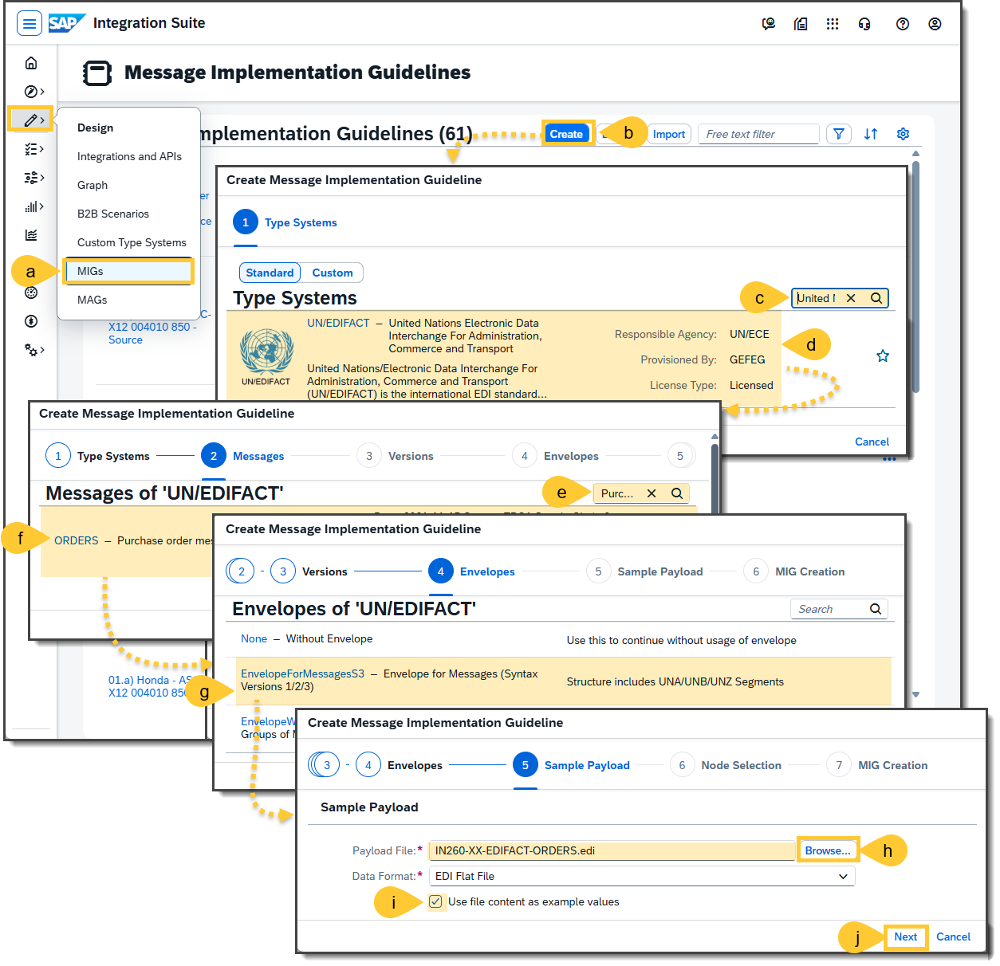

## Step 5: Review and Save Overlay MAG
Review the selected overlay mappings, then clear and save the accepted mappings to persist them in the MAG:
- (a) Added overlay mappings appear in **green**.
- (b) Open **Proposal List**.
- (c) Click **Clear Proposal** to remove the transient list (the accepted mappings remain).
- (d) Click **Save**. **Important:** Saving persists overlay mappings into the MAG.

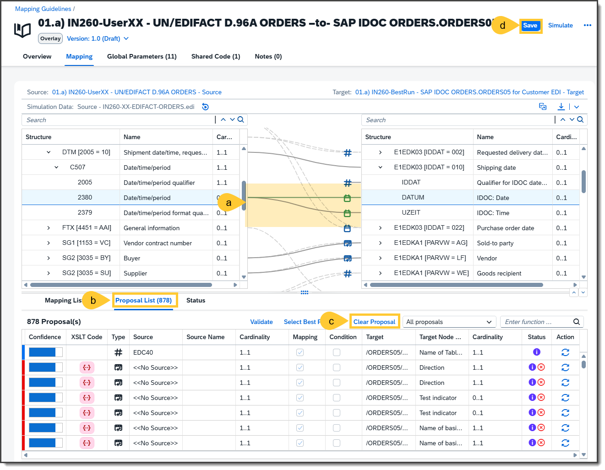

## Step 6: Check Overlay MAG Validity
Perform a technical validation to catch and resolve processing errors. For this purpose, do a further  processing check (not yet a semantic review):
- (a) Click **Simulate** → **Simulate with sample data**.
- (b) Select `Source - IN260-XX-EDIFACT-ORDERS.edi` and click **OK**.
- (c) If you get a processor error (e.g., value `20250929` does not match format `CCYYMMDDhhmm`), 
- (d) locate it in the source payload (segment `DTM+137:20250929:102'`).
- (d) In the source structure go to **DTM[2005 = 137] → C507 → 2380**. You may see two mappings on this node.
- (e) The source child node 2380 in the qualified group `DTM[2380 = 137]` has to mapping element lines
- (f) One mapping element to the target leaf node `UZEIT` may attempt a time transformation for `CCYYMMDDhhmm` inserted by the proposal service. 
- (g) If not needed, **delete** this mapping: right-click the mapping line → **Delete**.

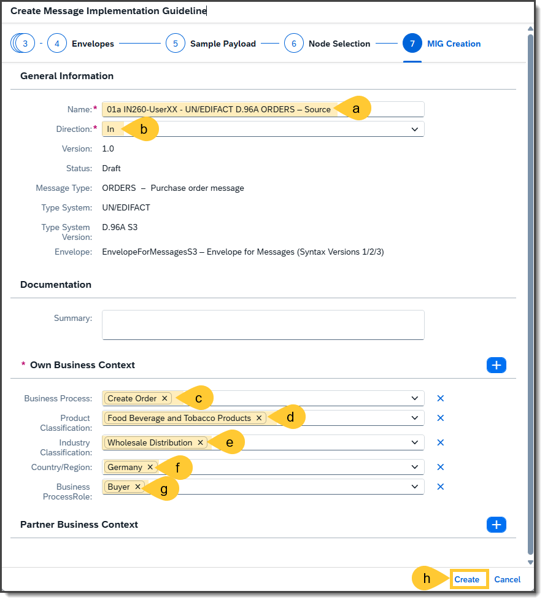

## Step 7: Display & Simulate Overlaid Mappings
Verify the accuracy of mappings added by the proposal service and focus on the overlay mapping element:
- (a) Set filters to **All mappings** and 
- (b) **Overlaid Mappings**.
- (c) You'll see the list of the overlaid mappings, which were inserted by the proposal service.
- (d) Review the list and select an example mapping such as:
  - *Source:* `/Interchange/ORDERS/DTM [2005 = 10]/C507/2380 [2379 = 203]` (Date/time/period - CCYYMMDDHHMM) to
  - *Target:* `/ORDERS05/E1EDK03 [IDDAT = 010]/DATUM` (IDoc Date)
- (e) You see the select mapping element in the mapping list also highlighted in the mapping view
- (f) Inspect its details and re-run **Simulate** to 
- (g) see source and transformed target values in context.
-  **Save** your MAG if you have not already.

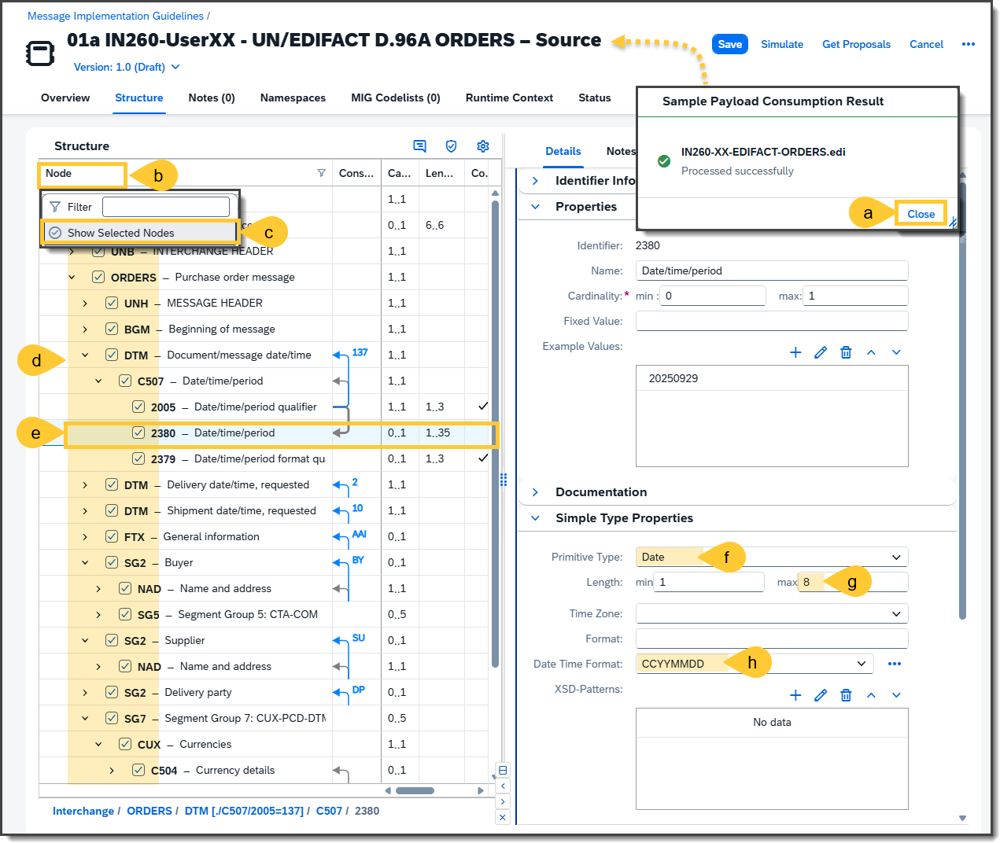

## Step 8: Use the Overlay MAG in the TPA
Assign the Overlay MAG to the inbound Sales Order business transaction in your TPA:
- (a) Open the TPA and go to **B2B Scenarios**.
- (b) Click **Edit**.
- (c) In **01) Sales Order Request/Response**, select the **Mapping** activity.
- (d) In the **Mapping** panel, open the value help for **Mapping Guidelines (MAG)**.
- (e) Click in the pop window on **Reset**
- (f) Set the filter to **Contains**, and 
- (g) Enter e.g., `01.a) IN260-UserXX`.
- (h) Click **Go**, 
- (i) Select your Overlay MAG, then 
- (j) Click on button **Choose**.
- (g) **Save** the TPA.

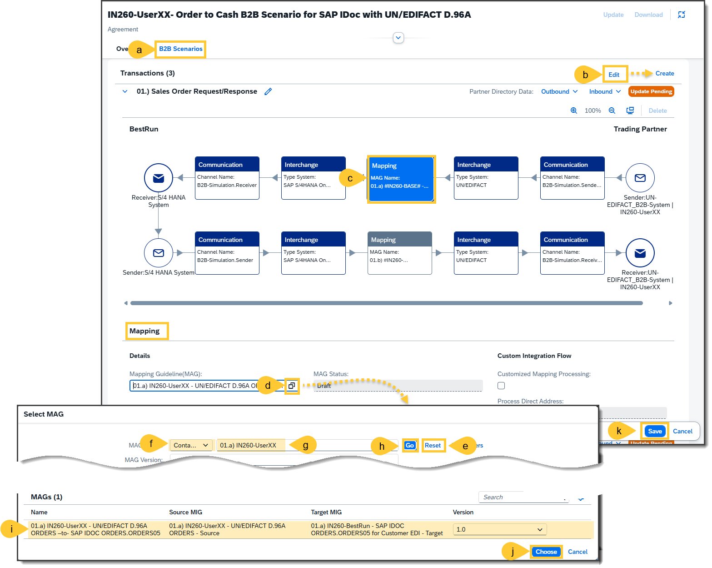

## Step 9: Select Business Transaction for PD Update
Update the Partner Directory (PD) so runtime can pick up the configuration:
- (a) Click **Update** in the TPA.
- (b) In **Update Agreement**, click **OK**.
- (c) In **Select Transactions…**, choose `01) Sales Order Request/Response` (changes are limited to this transaction).
- (d) Click **Update**. If **Update** is disabled, use the buttons **Deactivate** → **Activate** as a workaround.


## Step 10: Update in the Partner Directory
Ensure the Partner Directory update was successful and the TPA is active:
- (a) Watch the progress status.
- (b) Verify the status is **Active** after a short time.

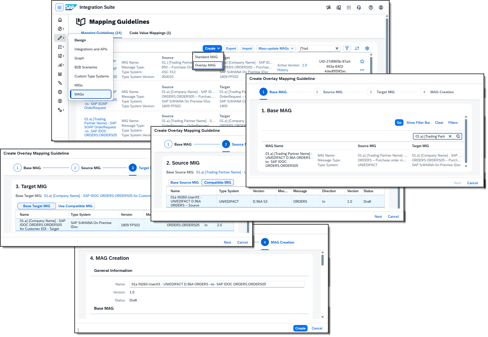

## Step 11: Test the Updated Business Transaction
Trigger the inbound test via **Bruno** and save the result:
- (a) In Bruno, open test entry `01.a) Sales Order Request - Inbound`.
- (b) Click **Send** and 
- (c) Review the **Response** (the transformed target interchange).
- (d) Click **Download** to save the result payload.
- (e) Save to your `Downloads` folder as 
- (f) File name `IDOC_ORDERS.ORDERS05_Result.xml`.
- (g) Click on **Save** button.

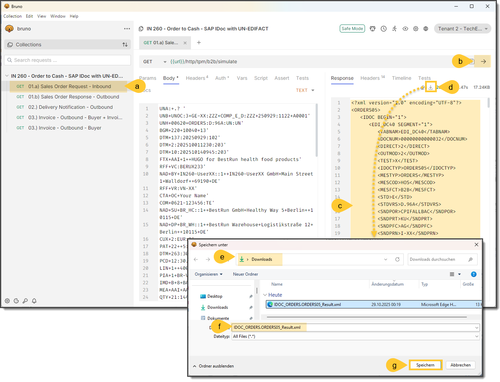

## Step 12: Compare with the Reference Result
Use Visual Studio Code  to compare your result with the expected target:
- (a) In VS Code, **File → Open File…** and 
- (b) Open the files so that you see these in **OPEN EDITORS**
  - `Downloads/IDOC_ORDERS.ORDERS05_Result.xml` (your result)
  - `Expected Target - IN260-XX-IDOC-ORDERS.ORDERS05.xml` (reference)
- (c) Do a selection of both files via holding Ctrl/Strg key and do a right-click and select in the context menu **Compare Selected**.
- (d) A side-by-side diff opens (left: your result, right: expected). Keep this window open; it auto-refreshes if you overwrite the same filename in `Downloads`.
- Use the diff to decide which mappings to **ignore**, **delete**, or **add**:
- (e) **Ignore**: Header segment `EDI_DC40` fields like `DOCNUM`, `CREDAT`, `CRETIM`, `SERIAL` (they change each run).
- (f) **Delete** (header segment present in your result but not in the expected):

```xml
<E1EDK14 SEGMENT="1">
  <QUALF>008</QUALF>
  <ORGID>ES11</ORGID>
</E1EDK14>
```
- (g) **Add** (header segments missing in your result but present in the expected):

```xml
<E1EDK18 SEGMENT="1">
  <QUALF>001</QUALF>
  <TAGE>30</TAGE>
  <PRZNT>30.0</PRZNT>
  <ZTERM_TXT>D</ZTERM_TXT>
</E1EDK18>
<E1EDKT1 SEGMENT="1">
  <TDID>007</TDID>
  <TSSPRAS>E</TSSPRAS>
  <E1EDKT2 SEGMENT="1">
    <TDLINE>Sales order for BestRun health food products</TDLINE>
  </E1EDKT2>
</E1EDKT1>
```
 - (h) **Delete** (item-level segment present in your result but not expected):

```xml
<E1EDPA1 SEGMENT="1">
  <PARVW>WE</PARVW>
  <NAME1>IN260-UserXX GmbH</NAME1>
  <STRAS>Get Material Road 12</STRAS>
  <ORT01>Walldorf</ORT01>
</E1EDPA1>
```

- (i) **Add** (item-level text segment missing in your result but present in the expected):

```xml
<E1EDPT1 SEGMENT="1">
  <TDID>004</TDID>
  <TSSPRAS>E</TSSPRAS>
  <E1EDPT2 SEGMENT="1">
    <TDLINE>BestRun VitalCrisp - Cereal Bar</TDLINE>
  </E1EDPT2>
</E1EDPT1>
```

- (j) **Add** (missing simple field at header totals segment): Add `MATKL` in segment `E1EDC01`.

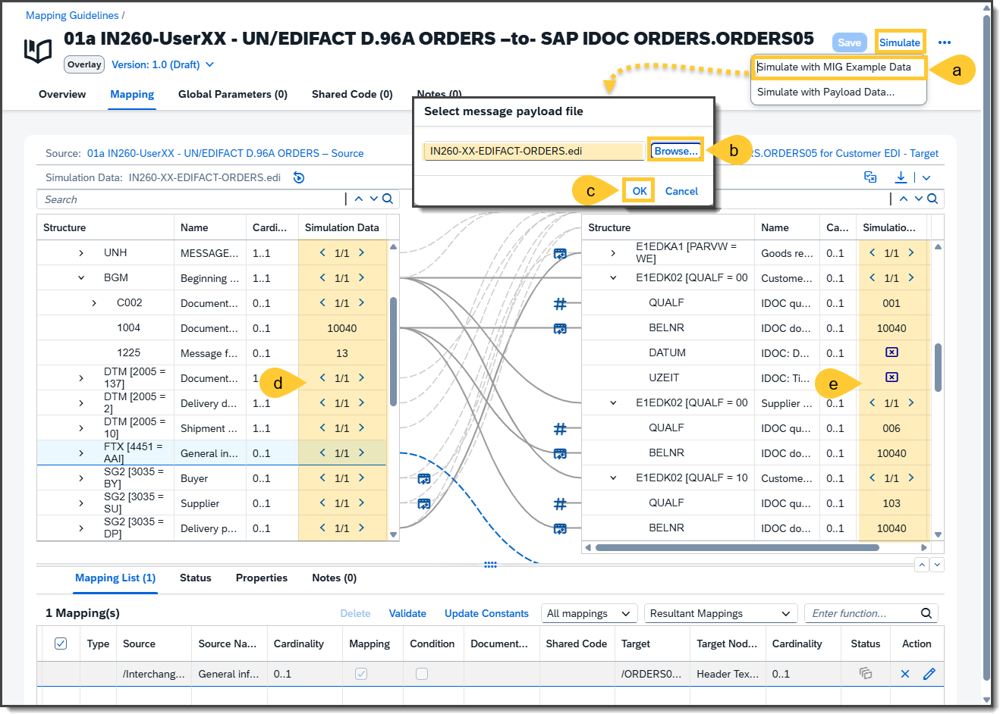

## Step 13: Delete Unneeded Mapping Elements
Apply the deletions identified in Step 12 directly in the MAG (ensure you are in **edit mode**):
- (a) **From Step 12.f (Delete header)**: Search for `E1EDK14`.
- (b) At target node `/ORDERS05/E1EDK14 [QUALF = 008]`, right-click the mapping line
- (c) Click on **Delete** in the context menu. 
  *Note:* Deleting the group-level mapping is sufficient when children have no additional mappings (the group will no longer be created).
- (d) **From Step 12.h (Delete item-level address)**: Search for `E1EDPA1` and 
- (e) Remove the following mapping elements:
  - Source `/Interchange/ORDERS/SG2 [3035 = DP]/NAD/C080/3036` → Target `/ORDERS05/E1EDP01/E1EDPA1 [PARVW = WE]/E1EDPA1/NAME1`
  - Source `/Interchange/ORDERS/SG2 [3035 = DP]/NAD/C059/3042` → Target `/ORDERS05/E1EDP01/E1EDPA1 [PARVW = WE]/E1EDPA1/STRAS`
  - Source `/Interchange/ORDERS/SG2 [3035 = DP]/NAD/3164` → Target `/ORDERS05/E1EDP01/E1EDPA1 [PARVW = WE]/E1EDPA1/ORT01`

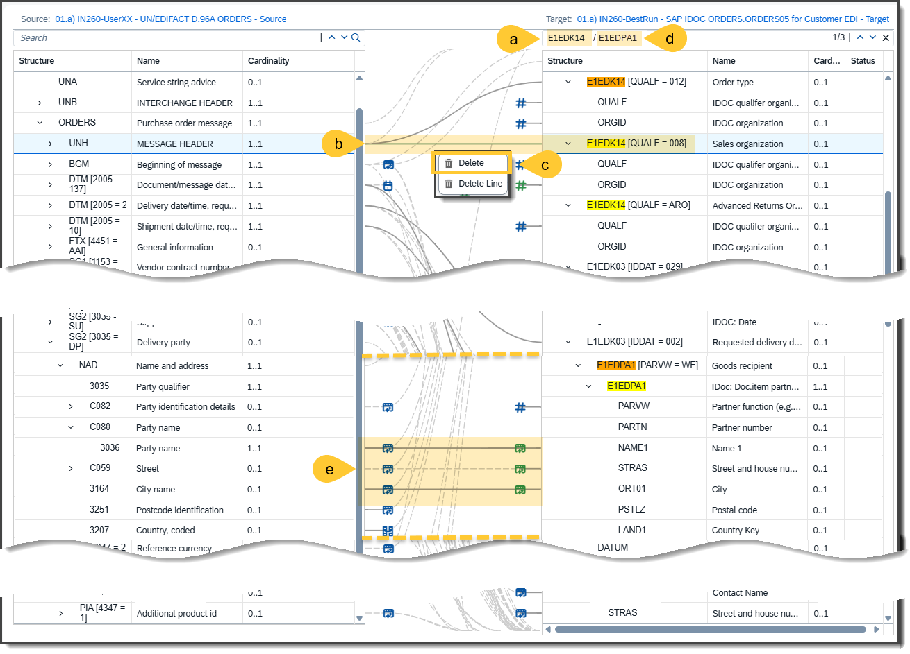

## Step 14: Add Missing Header/Text Mappings
Add the simple mappings required by **Step 12.g** and re-run the simulation for quick feedback:
- (a) Click **Repeat Simulate** to bring the source values back into the editor.
- Map the following source→target pairs (drag & drop), based on matching business meaning:
  - (b) `30` days → `/ORDERS05/E1EDK18 [QUALF = 001]/TAGE` from `/Interchange/ORDERS/SG8 [4279 = 22]/DTM [2005 = 263]/C507/2380` (source name: *Date/time/period*).
  - (c) `30.0` percent → `/ORDERS05/E1EDK18 [QUALF = 001]/PRZNT` from `/Interchange/ORDERS/SG8 [4279 = 22]/PCD [5245 = 12]/C501/5482` (source name: *Percentage*).
  - (d) `D` (period type) → `/ORDERS05/E1EDK18 [QUALF = 001]/ZTERM_TXT` from `/Interchange/ORDERS/SG8 [4279 = 22]/PAT/C112/2151` (source name: *Type of period, coded*).
  - (e) `Sales order for BestRun health food products` header free text → `/ORDERS05/E1EDKT1 [TDID = 007]/E1EDKT2/TDLINE` from `/Interchange/ORDERS/FTX [4451 = AAI]/C108/4440` (source name: *Free text*).

**Notes**
1. A group-to-group mapping is not required when both sides have maxOccurs = 1; creating a leaf mapping will instantiate the group automatically.
2. Repeat **Simulate** to verify the values appear at the target nodes.

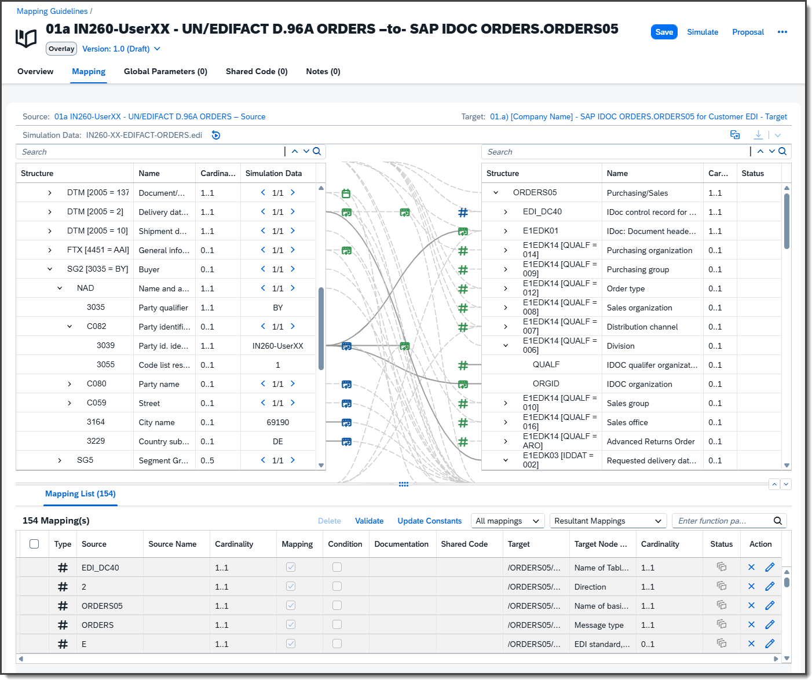

## Step 15: Add a Concatenation Mapping Function
The expected item text `TDLINE` concatenates two source nodes (**Step 12. i**). Create an n:1 mapping with a function:
- (a) Click **Repeat** to refresh the simulation context.
- (b) Locate the two values (e.g., search for `BestRun VitalCrisp` and `Cereal Bar`). 
- (c) They live in leaf nodes `7008[1]` and `7008[2]`. You can search for them via the general source search box.
- (d) Drag **both** source nodes to target `TDLINE` to create an n:1 mapping. 
- (e) In the function editor, you will see variables like `$nodes_in/D_7008` and `$nodes_in/D_7008_2`.
- (f) Define the function validate:

```xslt
<xsl:sequence select="concat($nodes_in/D_7008, " - ", $nodes_in/D_7008_2)"/>
```

- (g) Click **Validate** to ensure the function is (h) **Valid**.
- (i) Re-run **Simulate** and confirm the 
- (j) Target value is `BestRun VitalCrisp - Cereal Bar`.

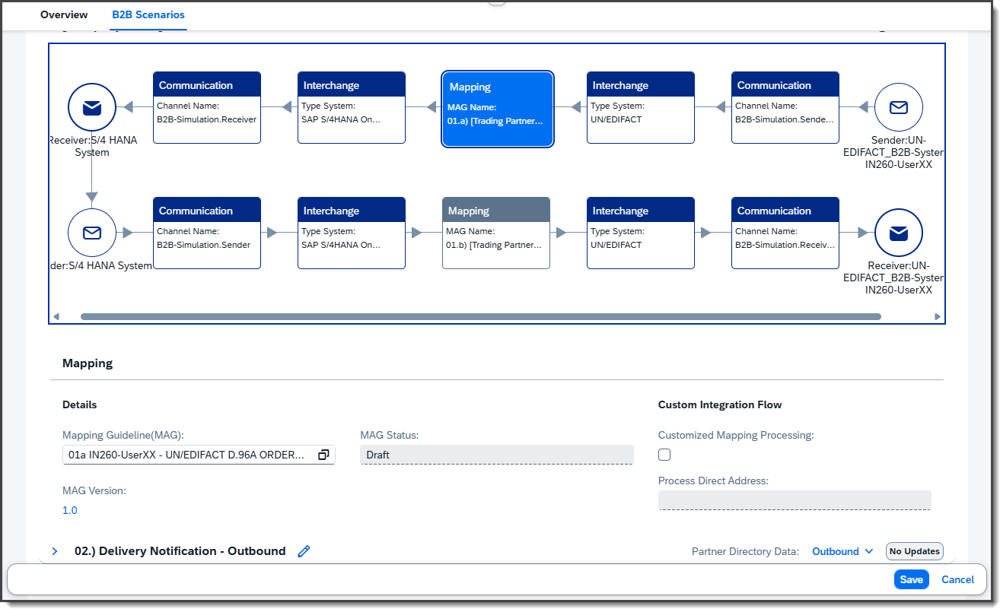

## Step 16: Add a Simple Field Mapping (MATKL)
Add the missing simple mapping identified in **Step 12.j**:
- (a) Search for source value `CT` corresponding to target element `MATKL`.
- (b) Confirm the business meaning (e.g., source name *Type of packages…* vs. target *Package material*) and **drag & drop** the mapping to `E1EDC01/MATKL`.
- (c) The default copy function `<xsl:sequence select="$nodes_in/*"/>` is sufficient; no change needed.
- **Save** the MAG and, if desired, click **Cancel** to leave edit mode.

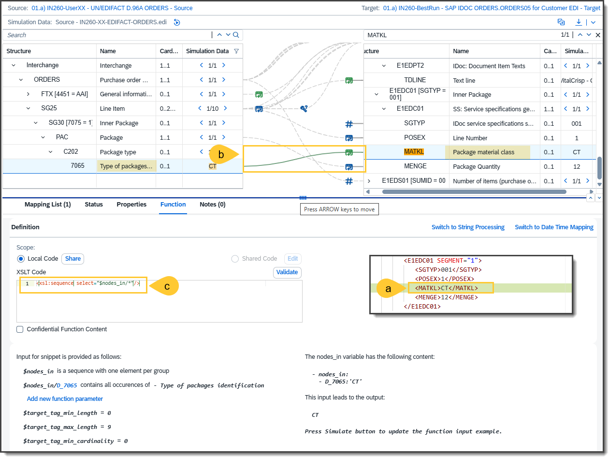

## Step 17: Refresh & Update MAG in the TPA
Apply your MAG changes to the TPA and PD:
- (a) Cick **Refresh MIGs/MAGs**in the appropriate BTA (Business Transaction Activiy) of your TPA.
- (b) Click **Update**; 
- (c) Select `01) Sales Order Request/Response` in the dialog and (d) click **Update**.

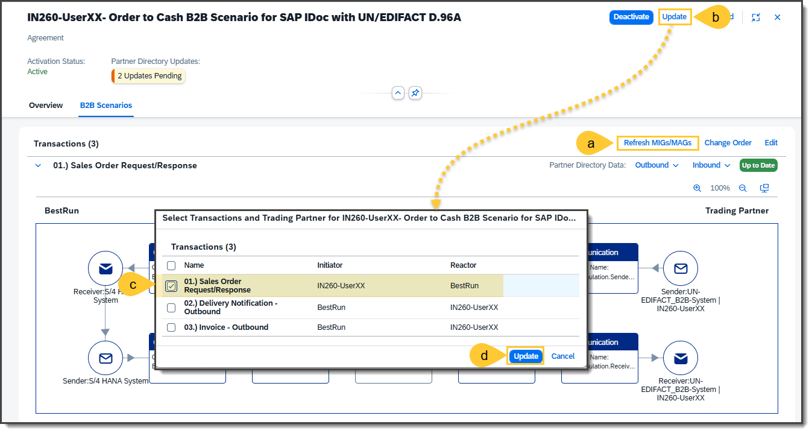

## Step 18: Final End-to-End Simulation & Review
Rerun the end-to-end test (Steps 11–12). The diff should show **no differences** between:
- `IDOC_ORDERS.ORDERS05_Result.xml` (generated)
- `Expected Target - IN260-XX-IDOC-ORDERS.ORDERS05.xml` (reference)
…except for the changing header fields in `EDI_DC40`.

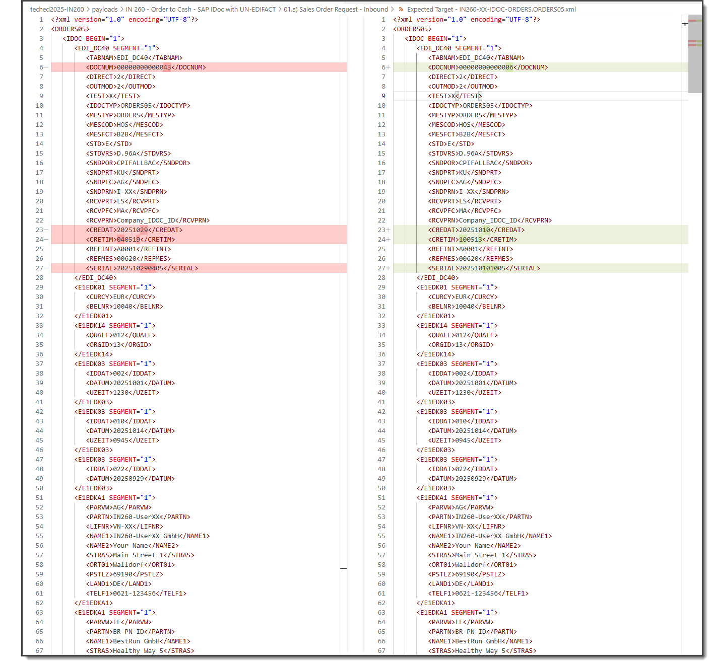

**You have completed Exercise 4** continue with Exercises 5–7 if time allows.

----

Continue with: [Exercise 5](Exercise_05.md)

Please give us feedback to this session **IN260** by scanning the QR-Code:

 
