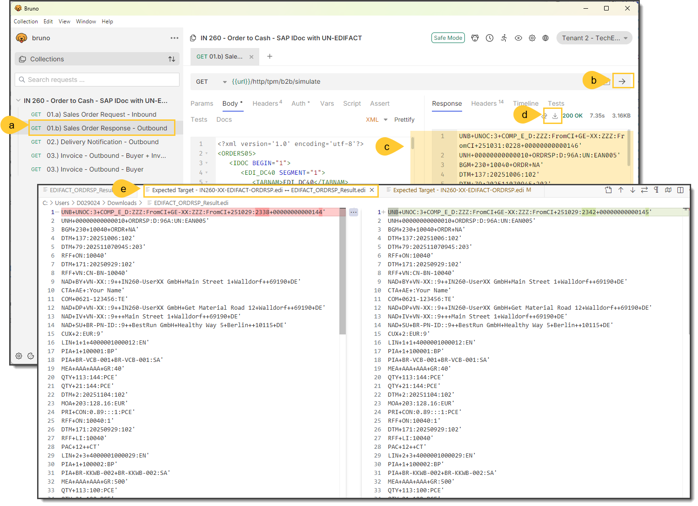

# Exercise 5: Finalize the Business Transaction Activity Order Response
This exercise guides you through the finalization of a Business Transaction Activity (BTA) for a Sales Order Response scenario. The goal is to ensure that all relevant code lists are properly created, customized, assigned, and mapped within the specifically created Overlay MAG **01.b) IN260-UserXX - SAP IDOC ORDRSP.ORDERS05 -to- UN/EDIFACT D.96A ORDRSP**. By completing this exercise, you will gain hands-on experience in managing code lists and mappings in a B2B integration context using MIGs (Message Implementation Guidelines) and MAGs (Mapping Guidelines).

### What You Will Do

In this exercise, you will:

- Create and customize global and local code lists.
- Assign code lists to MIG elements and refine them.
- Create and apply code value mappings in an Overlay MAG.
- Simulate and test the mapping results.
- Update the TPA (Trading Partner Agreement) to use the new Overlay MAG.
- Perform a final test to validate the integration setup.

### Prerequisites

Before starting this exercise, ensure you have:

- The required CSV file (`CL_UserXX_7065_PackageType.csv`) is available in the designated folder.
- Example source and expected target payload files for simulation and validation.

## Step 01 - Define Global Code List
Before creating the B2B integration content for sales order response processing, you should first create the required customized code lists based on standard code lists that can be used across MIGs and MAGs. For this purpose, you should:
- (a) Open in the navigation pane the **Design** part.
- (d) Select the section **Custom Type Systems**.
- (c) Select **Custom Codelists**, which are the collection of all the reusable customized codelists in your tenant.
- (d) Click on the **Add** button for creating a new custom codelist.
- (e) In the new pop-up window, enter in **ID**: `CL_UserXX_6411_MEA_Units`.
- (f) Give a name, which code is: `Measure Unit Code List`.
- (g) This codelist represents a specific type of measure units, but it is mainly a subset of the UN/CEFACT Recommendation 20 codelist, therefore enable **Copy code values from Codelist**..
- (h) Select the **Type System**: `GS1 EANCOM`.
- (i) Select the **Codelist**: `Rec_20`.
- (j) Select the latest **version**, which is `2016`.
- (k) Search for the code values listed in the table below and (l) select them.
- (m) Once you're finished with the selection, click on the **Create** button.

| Code Value | Name | Definition |
| --- | --- | --- |
| **GRM** | gram |  | 
| **KGM** | kilogram | A unit of mass equal to one thousand grams. |
| **LTR** | litre | |
| **MLT** | millilitre | |
 

## Step 02 - Add Quantity Code List
The same kind of codelists can be shaped for different purposes. This is especially required for the Trading Partner MIG for the Sales Order Response. Therefore, do the same procedure as follows:
- (a) Before you start with creation, you can see your already created codelists, if you expand them (`CL_UserXX_6411_MEA_Units`) and click on the version `1.0`.
- (b) Click for creation of the second unit code list on the **Add** button and follow the steps (01.d) to (01.k) with the following parameters and code values:
  - **ID**: `CL_UserXX_6411_QTY_Units`.
  - **Name**: `Measure Unit Code List`.
  - Enable **Copy code values from Codelist**..
  - **Type System**: `UN/CEFACT`.
  - **Codelist**: `6411`.
  - **Version**: `1997_S3_Edition_2001`.
  - Code Values, see table below.

  | Code Value | Name | Definition |
  | --- | --- | --- |
  | **NAR** | number of articles |  |
  | **NRL** | number of rolls |  |
  | **PA** | packet |  |
  | **PCE** | Piece (EAN Code) |   |
  | **PTN** | Portion (EAN Code) | The identification of the number of portions (doses in medical terms)  into which a complete product may be broken into for serving purposes,  e.g., a pie with six portions,  a liquid medicine with 20 doses. |

## Step 03 - Copy Trading Partner MIG
Due to time constraints, you can now create a copy of an already prepared Trading Partner MIG, where you can refine the remaining parts relevant to the codelists tasks. For this purpose, do the following steps:
- (a) Go in the navigation pane to **Design --> MIGs**.
- (b) Search for the prepared **Trading Partner MIG**: `01.b) #IN260-OVERLAY# - UN/EDIFACT D.96A ORDRSP - Target`
***Caution:*** !!! Please never delete or modify this prepared Trading Partner MIG.
- (c) Click on the choice of **Actions**
- (d) Select **Copy**
- (e) In the new window of the copied Trading Partner MIG, click on tab **Overview**.
- (f) Enter your name of the MIG, which is `01.b) IN260-UserXX - UN/EDIFACT D.96A ORDRSP - Target`
- (g) Click on the **Save** button.

## Step 04 - Insert Local Code List
You can also add code lists in this Trading Partner MIG, which are then valid and usable for this MIG only. For this reason, do the following steps if the Trading Partner MIG is in **Edit** mode:
- (a) Go to tab **MIG Codelists**
- (b) Click on the **Create** button.
- (c) Enter in the new entry for the latest code list the **Identifier:** `CL_UserXX_7065_PackageType`.
- (d) Enter the **Name:** `package type code list`.
- (e) Click in the area where the label **CodeValues** is.
- (f) A new details panel will be shown at the bottom, where you should go to the tab **Code Values**.
- (g) Navigate to **Upload --> Add from CSV File** and (h) upload the csv file `CL_UserXX_7065_PackageType.csv` from the agreed folder.
- (i) After a successful upload, you should see all the values in the code list.

## Step 05 - Refine MIG Code Lists
You can now start with the assignment and refinement of codelists within your Trading Partner MIG. Codelists should be assigned and refined for four purposes:
- Documentatory reasons to know which kinds of codes are supported and what the meaning behind them is.
- To provide the supported source or target code values in the code value mapping of a MAG.
- To automatically provide just the supported code values in the validation rules, which will be considered once the payload validation is enabled.
- Set the qualifier values for qualifying groups and qualifying peers, but this will happen automatically.

The following steps are required for it:
- (a) Go to your trading partner's MIG to the tab **Structure**.
- (b) May filter the unnecessary columns in the structure view so that you see at least the codelist column and filter so that you will see just the leaf **Nodes with codelist**.
- (c) Click on the first required leaf node with a code list **1001 - Document/message name, coded**.
- (d) You should see now the details panel of this node, where you should go to the tab **Codelist: 1001**.
- (e) Within the section **Code Values** you should now deselect the option **Use all code values of the codelist**, because only a view code values are supported.
- (f) Search for the code values in **ID** such as `230` and (g) select this code value. Do the same with the code value `231`.
- (h) Do the same procedure for the leaf node **1225 - Message function, coded** in where you also don't need (i) all code values. The following code values should be selected:

| Code Value | Name | Definition |
| --- | --- | --- |
| **1** | Cancellation | Message cancelling a previous transmission for a given transaction. |
| **11** | Response | Message responding to a previous message or document. |
| **13** | Request | Self explanatory. |
| **3** | Deletion | Message containing items (e.g., line items, goods items, Customs items, equipment items) to be deleted from a previously sent message. |
| **4** | Change | Message containing items (e.g., line items, goods items, Customs items, equipment items) to be changed in a previously sent message. |
| **6** | Confirmation | Message confirming the details of a previous transmission where such confirmation is required or recommended under the terms of a trading partner agreement. |

## Step 06 - Customize Action Codes
Further codelists can be individually customized per leaf node, such as the Action Request/Notification Code List, which may provide different code values per line item. For this purpose, you should follow the same procedure as before:
- (a) Click on the leaf node **1229 - Action request/notification, coded** so that you can see the details panel of this leaf node.
- (b) Go to tab **Codelist**.
- (c) Deselect the option **Use all code values of the codelist**
- (d) Select the following code values:

| Code Value | Name | Definition |
| --- | --- | --- |
| **1** | Added | This line item is added to the referenced message. |
| **2** | Deleted | This line item is deleted from the referenced message. |
| **21** | No delivery | Code indicating that no delivery will be required. |
| **3** | Changed | This line item is changed in the referenced message. |

## Step 07 - Assign Global Code Lists
Suppose you need the same customization across several nodes. In that case, it is better to do the customization in a Custom Codelist, as described in Step 01, and assign them as defined via the following steps:

- (a) Click on the first leaf node where a custom code list should be assigned, which is **6411 - Measure unit qualifier** within the mea segment with qualifier **AAA** (line item measurement).
- (b) Click on tab **Codelist: ...**
***Remark:*** The name of this tab in the screenshot does not match the original name. This name appears after the code list has been changed.
- (c) You see the line below called **Selected Codelist**, where you should cancel the originally assigned codelist.
- (d) Click on **+ (Add)** button for adding another codelist.
- (e) Click in the pop-up window on **From Custom Type System**
- (f) Select `Custom Codelists` and (g) search for your code lists starting with `CL_UserXX`.
- (h) Expand the fist codelist **CL_UserXX_6411_MEA_Units** and click on **Version 1.0** so this codelist will get assigned.
- (i)to (k): Repeat the steps (07.b) to (07.h)  with the code list `CL_UserXX_6411_QTY_Units` in leaf node **6411 - Measure unit qualifier** within the
  - (i) QTY segment with qualifier **113** (quantity to be delivered).
  - (j) QTY segment with qualifier **21** (ordered quantity).
  - (k) Segment group 30 with qualifier **AAA** (calculation net).

## Step 08 - Use MIG Code List
According to the same principle, you can also refer to general MIG code lists via the following steps:
- (a) Click on the leaf node where you would like to assign the MIG code list, which is **7065 - Type of packages identification** within the segment group 32  (package).
- (b) Click on tab **Codelist: ...**
***Remark:*** The name of this tab in the screenshot does not match the original name. This name appears after the code list has been changed.
- (c) You see the line below called **Selected Codelist**, where you should cancel the originally assigned codelist.
- (d) Click on **+ (Add)** button for adding another codelist.
- (e) Default is **MIG Codelists** in where  you can select the available codelist `**CL_UserXX_7065_PackageType**.
- Finally, save the MIG via the **Save** button and release the edit mode via the **Cancel** button.

## Step 09 - Build Overlay MAG (Mapping Guideline)
You're now ready with all the customizations and assignments in the Trading Partner MIG. It is now necessary to create the code value mappings accordingly. Therefore, you should create the Overlay MAG for the second BTA (Business Transaction Activity) **01.b) Sales Order Response - Outbound** according to the following steps:
- (a) Open **Design → MAGs** to view the MAG list and click **Create** and choose **Overlay MAG** to open the wizard.
- (b) For the base MAG, search for:
  `01.b) #IN260-BASE# - SAP IDOC ORDRSP.ORDERS05 -to- UN/EDIFACT D.96A ORDRSP` and select this base MAG to move to the next step.
- (c) Keep the **Base Source MIG** unchanged (idoc structure for all partners).
- (d) In **Target MIG**, switch to **Compatible MIG** and search as well as (e) select the MIG you adjusted previously: `01.b) #IN260-OVERLAY# - UN/EDIFACT D.96A ORDRSP - Target`.
- (f) In step 4, name the Overlay MAG:
  `01.b) IN260-UserXX - SAP IDOC ORDRSP.ORDERS05 -to- UN/EDIFACT D.96A ORDRSP`
- (g) Click **Create**.

## Step 10 - Create Pass-through Mapping
Both the source and target code lists should be mapped. A pass-through is enough. The following steps are required for it:

- (a) Drag and drop a mapping element from
  - *Source:* `/ORDERS05/E1EDK01/CURCY` (Currency) to
  - *Target:* `Interchange/ORDRSP/SG8 [6347 = 2]/CUX/C504/6345` (Currency, coded)
- (b) You will then see a tab **Code Value Mapping**, click on it.
- (c) In the details of the **Code Value Mapping**, you see the **Default Value**, which is already set to **(pass-through source value)**.
 

## Step 11 - Replace with Code Mapping
Base MAG mapping elements can be modified to cover a code value mapping. The following steps can realize this:
- (a) Select mapping element
  - *Source:* `/ORDERS05/E1EDK01/BSART `(Document Type) to
  - *Target:* `Interchange/ORDRSP/BGM/C002/1001` (Document/message name, coded)
- (b) Click in the **Function** details view on the button **Create Editable Copy**.
- (c) You'll see now an editable **Function** in which you should click on the button **Switch to Code Value Mapping**.
- (d) Details view should be changed to **Code Value Mapping** in where you should select the **Default Value:** `230 -- purchase order change request`
- (e) Click on **Add → All remaining source values**
- (f) You will see now the complete list of the customized code values at the source side (see table below)
- (g) Set the corresponding code values at the target side as shown in the table below.

| Source Code Value | Target Code Value |
| --- | --- |
| `RSP -- Response` | `231 -- Purchase order response` |
| `CNC -- Cancellation` | `231 -- Purchase order response` |
| `DEL -- Deletion` | `231 -- Purchase order response` |
| `CHG -- Change` | `231 -- Purchase order response` |
| `RFD -- Request for Deletion` | `230 -- Purchase order change request` |
| `CNF -- Confirmation` | `231 -- Purchase order response` |
| `NPR -- Not Processed` | `231 -- Purchase order response` |
| `REQ -- Request for Update` | `230 -- Purchase order change request` |

## Step 12 - Add Extra Code Mapping
You can set multiple mappings from the same source node by following these steps:
- (a) Select mapping element
  - *Source:* `/ORDERS05/E1EDK01/BSART `(Document Type) to
  - *Target:* `Interchange/ORDRSP/BGM/C002/1001` (Document/message name, coded)
- (b) In the details tab **Code Value Mapping** click on **Add → All remaining source values**
- (c) You will see now the complete list of the customized code values at the source side (see table below)
- (d) Set the corresponding code values at the target side as shown in the table below.

| Source Code Value | Target Code Value |
| --- | --- |
| `CHG -- Change` | `4 -- Change` |
| `CNC -- Cancellation` | `1 -- Cancellation` |
| `CNF -- Confirmation` | `6 -- Confirmation` |
| `DEL -- Deletion` | `3 -- Deletion` |
| `NPR -- Not Processed` | `11 -- Response` |
| `REQ -- Request for Update` | `13 -- Request` |
| `RFD -- Request for Deletion` | `13 -- Request` |
| `RSP -- Response` | `11 -- Response` |

## Step 13 - Map Repeating Line Items
It makes no difference; code values can also be the same by following the same steps with repeatable groups, such as from ***E1EDP01 (Line Items)*** to ***SG26 (individual ordered items)***.
- (a) Select mapping element
  - *Source:* `/ORDERS05/E1EDP01/E1EDP01/ACTION`(Action code for the item) to
  - *Target:* `/Interchange/ORDRSP/SG26/LIN/1229` (Action request/no)
- (b) In the details tab **Code Value Mapping** (c) click on **Add → All remaining source values**
- (d) You will see now the complete list of the customized code values at the source side (see table below)
- (e) Set the corresponding code values at the target side, as shown in the table below.

| Source Code Value | Target Code Value |
| --- | --- |
| `001 -- Item added` | `1 -- Added` |
| `002 -- Item changed` | `3 -- Changed` |
| `003 -- Item cancelled` | `21 -- No delivery` |
| `004 -- Item not changed` | `1 -- Added` |
| `005 -- Item locked` | `2 -- Deleted` |

## Step 14 - Update Base MAG Mappings
Additionally, the base MAG, given mapping elements with code value mappings, can be substituted with trading partner-specific code value mappings. The following steps can realize this:
- (a) Select mapping element
  - *Source:* `/ORDERS05/E1EDP01/E1EDP01/GEWEI`(Weight unit) to
  - *Target:* `/Interchange/ORDRSP/SG26/MEA [6311 = AAA]/C174/6411` (Measure unit qualifier)
- (b) Click in the **Code Value Mapping** details view on the button **Create Editable Copy**.
- (c) The code values from the Trading Partner MIG should be loaded so that you can map via clicking on **Add → All remaining source values**
- (d) You will see now the complete list of the customized code values at the source side (see table below)
- (e) Set the corresponding code values at the target side, as shown in the table below.

| Source Code Value | Target Code Value |
| --- | --- |
| `GRM -- Gram` | `GRM -- gram` |
| `LIT -- Litre` | `LTR -- litre` |
| `MLI -- Millilitre` | `MLT -- millilitre` |
| `KIL -- Kilogram` | `KGM -- kilogram` |

## Step 15 - Create Global Mapping
Reusable code value mappings can be stored as a global code value mapping directly from the Overlay MAG via the following steps:
- (a) Create the mapping element
  - *Source:* `/ORDERS05/E1EDP01/E1EDP01/MENEE`(Unit of measure) to
  - *Target:* `/Interchange/ORDRSP/SG26/QTY [6063 = 113]/C186/6411` (Measure unit qualifier)
- (b) Click on **Add** for creating the following code value mapping:

  | Source Code Value | Target Code Value |
  | --- | --- |
  | `PCE -- Piece` | `PCE -- Piece (EAN Code)` |
  | `ART -- Article` | `PCE -- Piece (EAN Code)` |
  | `ROL -- Roll` | `NRL -- number of rolls` |
  | `PAK -- Packet` | `PA -- packet` |
  | `POR -- Portion` | `PTN -- Portion (EAN Code)` |

- (c) Click on the button **Create Global Mapping**
- (d) In the pop-window, enter the **Name** `UserXX - BestRun_UoM to CL_UserXX_6411_QTY_Units`
- (e) Click on the **Create** button.
- (f) And you'll see in a new window the new global code value mapping.
  

## Step 16 - Apply Global Mapping
You can assign a global code value mapping to other mapping elements where the source and target nodes exactly have the same code lists. This can be realized by following the steps:
- (a) Create the mapping element
  - *Source:* `/ORDERS05/E1EDP01/E1EDP01/MENEE`(Unit of measure) to
  - *Target:* `/Interchange/ORDRSP/SG26/QTY [6063 = 21]/C186/6411` (Measure unit qualifier)
- (b) Click on the button **Assign Global Mapping**.
- (c) Select in the pop-up window the **global code value mapping:** `UserXX - BestRun_UoM to CL_UserXX_6411_QTY_Units`.
- (d) Click on the **OK** button.
- (e) In the details tab **Code Value Mapping** you'll see that the code value mapping `UserXX - BestRun_UoM to CL_UserXX_6411_QTY_Units` is used now.
  

## Step 17 - Overwrite Base with Global
An own global code value mapping can also overwrite the given code value mappings from the Base MAG via the following steps:
- (a) Select the mapping element
  - *Source:* `/ORDERS05/E1EDP01/E1EDP01/MENEE`(Unit of measure) to
  - *Target:* `/Interchange/ORDRSP/SG26/SG30 [5125 = AAA]/PRI/C509/6411` (Measure unit qualifier)
- (b) Click in the **Code Value Mapping** details panel on **Create Editable Copy**.
- (c) This edit mode allows the changes in where you should click on the button **Assign Global Mapping**.
- (d) Select in the pop-up window the **Global Code Value Mapping:** `UserXX - BestRun_UoM to CL_UserXX_6411_QTY_Units`.
- (e) Click on the **OK** button.
- (f) In the details tab, **Code Value Mapping**, you'll see that the code value mapping `UserXX - BestRun_UoM to CL_UserXX_6411_QTY_Units` is used now.

## Step 18 - Build Compound Mappings
It is also possible to create compound code value mappings, where a combination of code values from different source nodes maps to a target code value, which is then written to the target node. This is possible by the following steps:
- (a) Create a first mapping element **:** ``
  - *Source:* `/ORDERS05/E1EDP01/E1EDP01/PSTYV`(Sales document item category) to
  - *Target:* `/Interchange/ORDRSP/SG26/SG32/PAC/C202/7065` Type of packages identification
- (b) Drag and drop to the target leaf node a mapping line from the *source:* `/orders05/e1edp01/e1edc01 [sgtyp = 001]/e1edc01/matkl` (idoc material class).
- (c) Go now to the details tab **Code Value Mapping**, where you can then see an empty table with three columns.
- (d) Select as **Default Value:** `CT -- Carton`.
- (e) Add each entry via the selection of **Add** and (f) **One source value**
- (g) To (i) select by entry in each column the following values:

  | Source Code Values: PSTYV | Source Code Values: MATKL | Target Code Values |
  | --- | --- | --- |
  | `BD -- Bread` | `BG -- Bag` | `5H -- "Bag, woven plastic"` |
  | `BD -- Bread` | `RO -- Roll` | `RO -- Roll` |
  | `BI -- Bites` | `PK -- Package` | `IG -- "Package, paper wrapped"` |
  | `BI -- Bites` | `BG -- Bag` | `PK -- Package` |
  | `BR -- Bar` | `CA -- Carton` | `CT -- Carton` |
  | `BR -- Bar` | `PK -- Package` | `PK -- Package` |
  | `MX -- Mix` | `BX -- Box` | `4H -- "Box, plastic"` |
  | `PG -- Porridge` | `BG -- Bag` | `5M -- "Bag, paper"` |
  | `WT -- Water` | `BX -- Box` | `4C -- "Box, natural wood"` |

## Step 19 - Simulate MAG
You can directly check the changes via the MAG-related simulation.
- (a) Choose **Simulate → Simulate with MIG example data** and select the test file `Source - IN260-XX-IDOC-ORDRSP.ORDERS05.xml` that is stored in the folder `01.b) sales order response - outbound`.
- (b) Go to the source side of the repeatable group **E1EDP01 -- Line Items**, you can then navigate between the different occurrences of line items.
- (c) This is also possible at the repeatable group **SG26 - Individual ordered line items**.
- (d) To (f), depending on the mapping elements with their code value mappings, you can then see how the code values will be mapped accordingly.

## Step 20: Change in the TPA to the Overlay MAG
Change the MAG in the Business Transaction Activity **01.b) Sales Order Response - Outbound** with your created Overlay MAG and apply these changes PD via the following steps:
- (a) Go to your TPA and change it into edit mode.
- (b) Select in the business transaction activity **01.b) Sales Order Response - Outbound** the step **Mapping**
- (c) Change the given MAG with your MAG: `01.b) IN260-UserXX - SAP IDOC ORDRSP.ORDERS05 -to- UN/EDIFACT D.96A ORDRSP` and (d) click on **Save**.
- (e) Click **Update**;
- (f) Select `01.) Sales Order Request/Response` in the dialog and (g) click **Update**.

## Step 21 - Run Final Test
Do a test run and compare the results with the expected payloads. If you don't see any mismatches, then all the creations and changes you made in your Overlay MAG seem to be correct. For this purpose, you have to do the following steps:
- (a) In Bruno select the test case **01.b) Sales Order Response - Outbound**, and do (b) a test run so that you'll (c) see the result at the response side.
- (d) Click on **Download** button and save the payload in the **Downloads** folder.
- (e) Do a comparison with the given expected target file `Expected Target - IN260-XX-EDIFACT-ORDRSP.edi` that is stored in the folder `01.b) Sales Order Response - Outbound`, and if you don't see any mismatches in the values in the header segment, then you did all correctly. Congratulations.

**Remark:** This is the end of the exercise. If you still have some time, you can go ahead with the other open Exercises.

----

Continue with: [Excercise 6](Exercise_06.md)

Please give us also feedback to this session **IN260** by scanning the QR-Code:

 