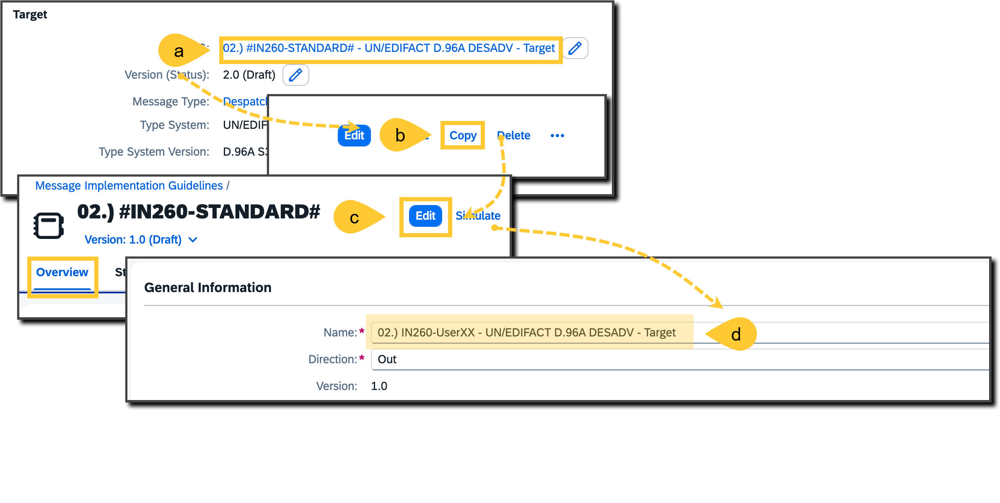
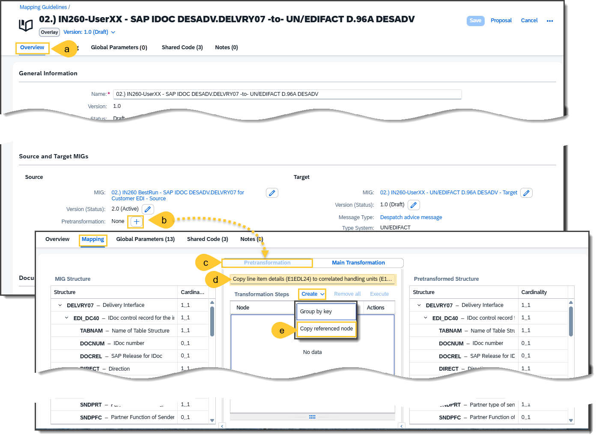
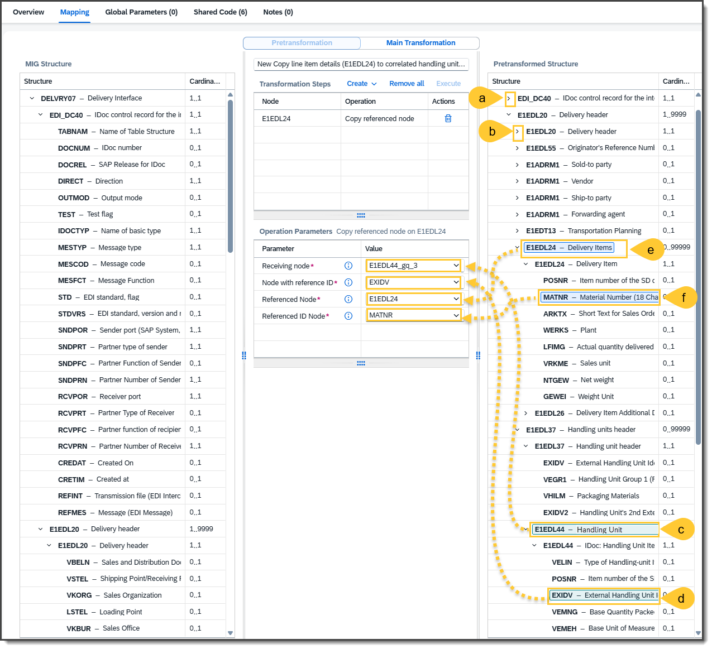
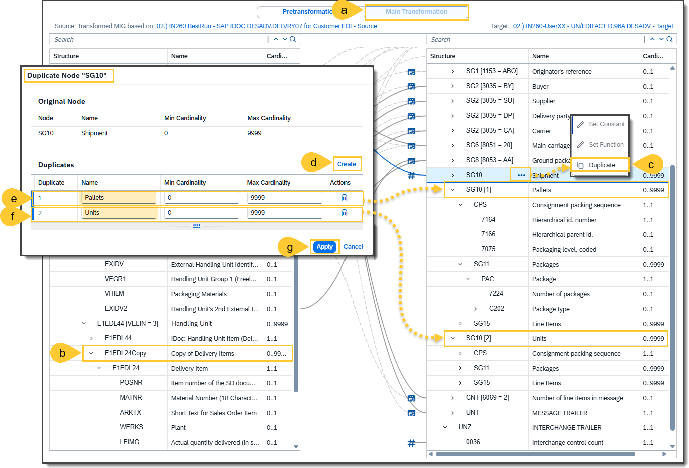
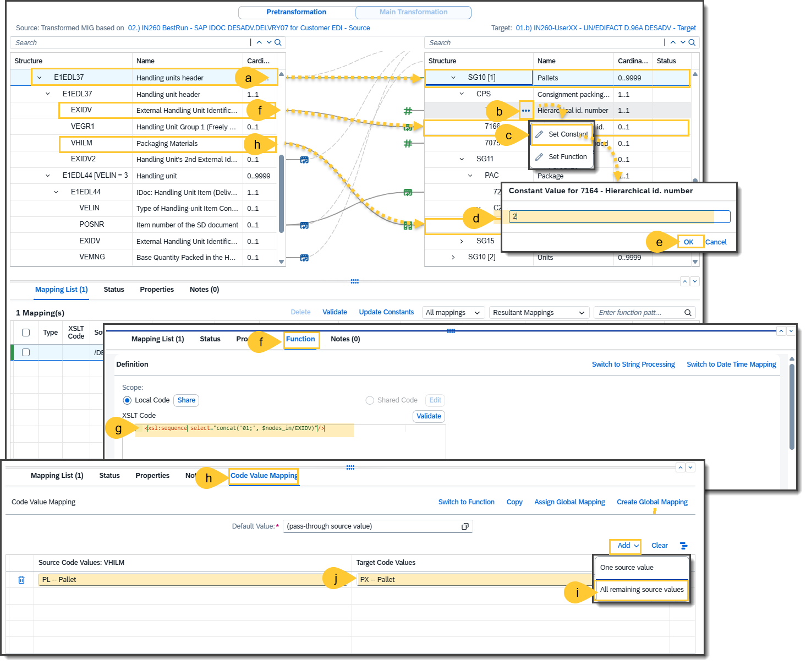
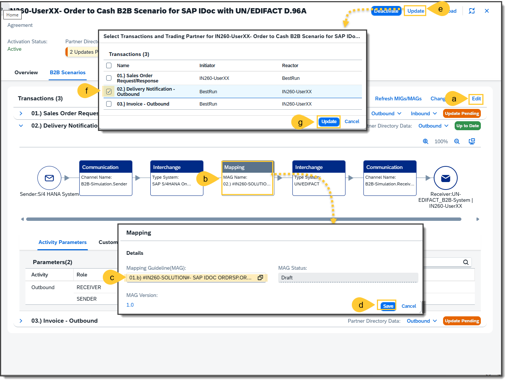
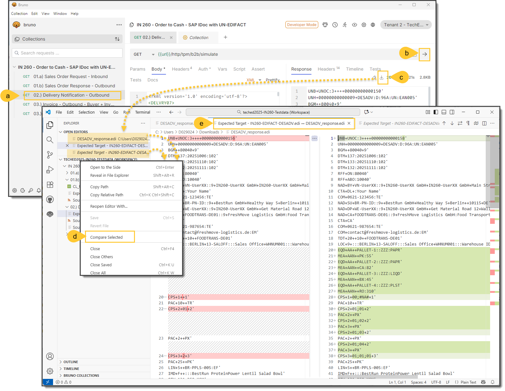
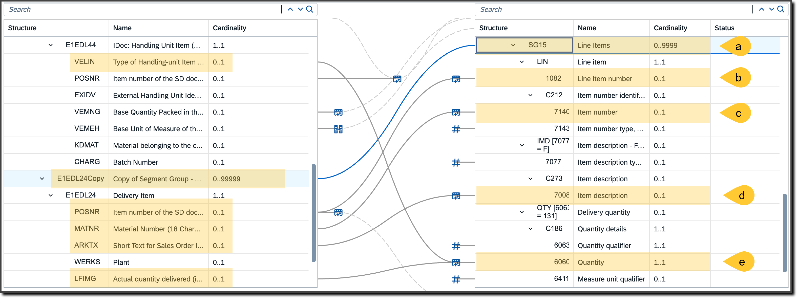
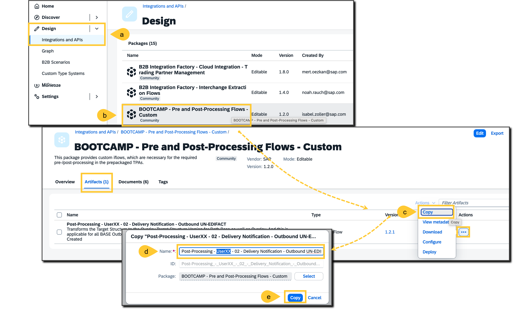
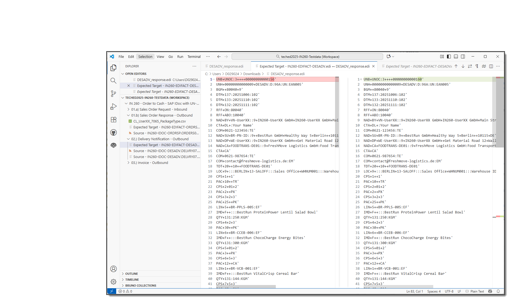

# Exercise 6: Finalize the Business Transaction Activity Delivery Notification **02.) Delivery Notification - Outbound**
In this exercise, you will configure and enhance the Business Transaction Activity 02.) Delivery Notification - Outbound
using the SAP Integration Suite. The objective is to define partner-specific parameters, duplicate and adjust the Trading Partner Agreement (TPA), and customize the Mapping Guideline (MAG) and Message Implementation Guideline (MIG) to support extended invoice processing.
What you will do:

Add custom parameters to the Trading Partner Profile.
Copy and rename the existing Trading Partner Agreement.
Extend the invoice transaction with the defined parameters.
Duplicate and rename the MAG and MIG used in the transaction.
Update the MAG to reference the new MIG.
Link the updated MAG to the TPA to complete the configuration.

## Step 01 - Copy Trading Partner MIG
Due to time constraints, you can now create a copy of an already prepared Trading Partner MIG, which you need for the creation of the delivery notification mapping. For this purpose, do the following steps:
- (a) Go in the navigation pane to **Design --> MIGs** and search for the prepared **Trading Partner MIG**: `02.) #IN260-OVERLAY# - UN/EDIFACT D.96A DESADV - Target`
    ***Caution:*** !!! Please never delete or modify this prepared Trading Partner MIG.
- (b) Click on the **Actions → Copy** menu item.
- (c) In the new window of the copied Trading Partner MIG, enable edit mode and click on tab **Overview**.
- (d) Enter your name of the MIG, which is `02.) IN260-UserXX - UN/EDIFACT D.96A DESADV - Target` and (e) click on the **Save** button.

 
## Step 02 - Create the Overlay Mapping Guideline (MAG)
It is now necessary to create an Overlay MAG so that the specific delivery notification can be mapped from SAP IDoc DESADV to the trading partner specific UN/EDIFACT DESADV. In order to get the sorted representation a number of related parts such as pre-transformation and indexing for sorting should be incorporated. Therefore, you should make the Overlay MAG for the second BTA (Business Transaction Activity) **02.) Delivery Notification - Outbound** according to the following steps:
- (a) Open **Design → MAGs** to view the MAG list and click **Create → Overlay MAG** to open the wizard.
- (b) For the base MAG, search for: `02.) #IN260-BASE# - SAP IDOC DESADV.DELVRY07 -to- UN/EDIFACT D.96A DESADV` and select this base MAG to move to the next step.
- (c) Keep the **Base Source MIG** unchanged (idoc structure for all partners).
- (d) In **Target MIG**, switch to **Use Compatible MIG** and search as well as (e) select the MIG you created previously: `02.) IN260-UserXX - UN/EDIFACT D.96A DESADV - Target`.
- (f) In step 4, enter the name of the Overlay MAG:
  `02.) IN260-UserXX - SAP IDOC DESADV.DELVRY07 -to- UN/EDIFACT D.96A DESADV`
- (g) Click on button **Create**.

## Step 03 - Create new Pretransformation Rules
In order to do a correct sorting according the finally requested sorted stucture that is required by the trading partner in its UN/EDIFACT DESADV interchange payload, you should have to copy the details of the order line items underneath the correltated packages that are used for the delivery. For this purpose, you have to create a Pretransformation within your Overlay-MAG according the following steps: 
- (a) Go in the opened Overlay MAG in edit mode to the **Overlay** tab and 
- (b) Click on the add **+** button at **Pretransformation**.
- (c) You'll see in tab **Mapping** a new view, the so called **Pretransformation** in where you should 
- (d) Enter a meaningful sorting rule name such as `Copy line item details (E1EDL24) to correlated handling units (E1EDL37)` and 
- (e) Create the new transformation rule by clicking on **Create --> Copy referenced node**

## Step 04 - Copy references of Line Items to Handling Unit
Define the rule for copying the line item details of E1EDL24 to each corresponding handling units E1EDL44 with qualifier VELIN = "3" via the following steps:
- (a) Collapse the whole structure starting from root node **DELVRY07** (Delivery Interface) and expand it so that you just see the direct child group nodes **EDI_DC40** and **E1EDL20**.
- (b) Expand the group node **E1EDL20** (Delivery header) so that you can see the child group nodes of this group.
- (c) Expand the group node **E1EDL44** with qualifier VELIN = "3" (Handling unit) within **E1EDL37** (Handling units header) so that you can see all descendants, and drag and drop this group node to **Receiving node**.
- (d) Drag and drop the child leaf node **EXIDV** (External Handling Unit Identification) to **Node with reference ID**.
- (c) Expand the group node **E1EDL24** (Delivery Items) so that you can see all descendants and drag and drop this group node to **Referenced node**.
- (d) Drag and drop the child leaf node **MATNR** (Material Number (18 Characters)) to **Referenced ID Node**.

***Remark:** If you like, you can save this interim step.

## Step 05 - Duplicate the Handling Units at Target Side
Initially, just the Delivery Header parts are mapped to a UN/EDIFACT segment group SG10, which covers in this case the packaging details of the shipment. You also need further packaging details for pallets that are within the shipment and further handling units that are on the pallets. For this purpose, you can do a duplicate by the following steps:
- (a) Change to tab **Main Transformation**.
- (b) You should now see the additional group **E1EDL24Copy** which was created bvy step (04). But the required data from this group are not mapped yet.
- (c) For this purpose, you need further target groups, which can be added by clickin on **SG 10 ... --> Duplicate**.
- (d) In the pop-up window **Duplicate Node "SG10** clik on button **Create** for
- (e) Adding the new duplicated group in where you should enter the name `Pallets`.
- (f) Repeat it for getting another duplicated group in where you should enter the name `Units`.
- (g) Once you clicked on the button **Apply**, you should see these duplicated groups at the target structure side.

## Step 06 - Add Constants and Mapping Elements
Once you're ready with the duplicates, you can now add the following constants and mapping elements in the Overlay MAG according the following steps:
- (a) **Group Mapping Elements** and **Pass-Through Mapping Elements**: Drag and drop the line from source node to the required target node (see below).
  ***Remark:** Group Mapping Elements are just required, if the source and the corresponding target group node have a max. occurence higher than 1.
- (b) **Constants**: Click on action button at the target leaf node (see below), (c) select the action button **[...]** and (d) select **Set Constant**.
- (e) **Mapping Elements with Mapping Functions:** Drag and drop the line from source node to the required target node, and (f) enter in tab **Functions** the given mapping function as shown below.
- (g) **Leaf Mapping Elements with Code Value Mappings:** Drag and drop the line from source node to the required target node, (g) select **Add --> All remain source values**, and (i) select all the corresponding target code values as shown in the list below. 

| Type | Source Node | Source Node Name | To or Function or Code Value Mapping | Target Node | Target Node Name |
| --- | --- | --- | --- | --- | --- |
| **Group** | `/DELVRY07/E1EDL20/E1EDL37` | Handling units header | --> |  `/Interchange/DESADV/SG10 [1]` | Pallets |
| **Constant** | `2` |  | --> |  `/Interchange/DESADV/SG10 [1]/CPS/7164` | Hierarchical id. number |
| **Function** | `/DELVRY07/E1EDL20/E1EDL37/E1EDL37/EXIDV` | External Handling Unit Identification | `<xsl:sequence select="concat('01;', $nodes_in/EXIDV)"/>` |  `/Interchange/DESADV/SG10 [1]/CPS/7166` | Hierarchical parent id. |
| **Constant** | `2` |  | --> |  `/Interchange/DESADV/SG10 [1]/CPS/7075` | Packaging level, coded |
| **Code Value Mapping** | `/DELVRY07/E1EDL20/E1EDL37/E1EDL37/VHILM` | Packaging Materials | See **Code Value Mapping VHILM to 7065** below |  `/Interchange/DESADV/SG10 [1]/SG11/PAC/C202/7065` | Type of packages identification |
| **Group** | `/DELVRY07/E1EDL20/E1EDL37/E1EDL44 [VELIN = 3]` | Handling unit | --> |  `/Interchange/DESADV/SG10 [2]` | Units |
| **Constant** | `3` |  | --> |  `/Interchange/DESADV/SG10 [2]/CPS/7164` | Hierarchical id. number |
| **Function** | `/DELVRY07/E1EDL20/E1EDL37/E1EDL37/EXIDV + /DELVRY07/E1EDL20/E1EDL37/E1EDL44 [VELIN = 3]/E1EDL44/EXIDV` | External Handling Unit Identification | `<xsl:sequence select="concat('01;', $nodes_in/EXIDV[1], ';', $nodes_in/POSNR[1])"/>` |  `/Interchange/DESADV/SG10 [2]/CPS/7166` | Hierarchical parent id. |
| **Constant** | `3` | | --> |  `/Interchange/DESADV/SG10 [2]/CPS/7075` | Packaging level, coded |
| **Pass-Through** | `/DELVRY07/E1EDL20/E1EDL37/E1EDL44 [VELIN = 3]/E1EDL44/VEMNG` | Base Quantity Packed in the Handling Unit Item | --> |  `/Interchange/DESADV/SG10 [2]/SG11/PAC/7224` | Number of packages |
| **Function** | `/DELVRY07/E1EDL20/E1EDL37/E1EDL44 [VELIN = 3]/E1EDL44/POSNR` | Item number of the SD document | `<xsl:sequence select="count($nodes_in/POSNR)"/>` |  `/Interchange/DESADV/SG10 [1]/SG11/PAC/7224` | Number of packages |
| **Code Value Mapping** | `/DELVRY07/E1EDL20/E1EDL37/E1EDL44 [VELIN = 3]/E1EDL44/VEMEH` | Base Unit of Measure of the Quantity to be Packed (VEMNG) | See **Code Value Mapping VEMEH to 7065** below |  `/Interchange/DESADV/SG10 [2]/SG11/PAC/C202/7065` | Type of packages identification |
| **Group** | `/DELVRY07/E1EDL20/E1EDL37/E1EDL44 [VELIN = 3]/E1EDL24Copy` | Copy of Delivery Items | --> |  `/Interchange/DESADV/SG10 [2]/SG15` | Line Items |
| **Pass-Through** | `/DELVRY07/E1EDL20/E1EDL37/E1EDL44 [VELIN = 3]/E1EDL24Copy/E1EDL24/POSNR` | Item number of the SD document | --> |  `/Interchange/DESADV/SG10 [2]/SG15/LIN/1082` | Line item number |
| **Pass-Through** | `/DELVRY07/E1EDL20/E1EDL37/E1EDL44 [VELIN = 3]/E1EDL24Copy/E1EDL24/MATNR` | Material Number (18 Characters) | --> |  `/Interchange/DESADV/SG10 [2]/SG15/LIN/C212/7140` | Item number |
| **Constant** | `EF` |  | --> |  `/Interchange/DESADV/SG10 [2]/SG15/LIN/C212/7143` | Item number type, coded |
| **Constant** | `F` |  | --> |  `/Interchange/DESADV/SG10 [2]/SG15/IMD [7077 = F]/7077` | Item description type, coded |
| **Pass-Through** | `/DELVRY07/E1EDL20/E1EDL37/E1EDL44 [VELIN = 3]/E1EDL24Copy/E1EDL24/ARKTX` | Short Text for Sales Order Item | --> |  `/Interchange/DESADV/SG10 [2]/SG15/IMD [7077 = F]/C273/7008` | Item description |
| **Constant** | `131` |  | --> |  `/Interchange/DESADV/SG10 [2]/SG15/QTY [6063 = 131]/C186/6063` | Quantity qualifier |
| **Function** | `/DELVRY07/E1EDL20/E1EDL37/E1EDL44 [VELIN = 3]/E1EDL44/VELIN + /DELVRY07/E1EDL20/E1EDL37/E1EDL44 [VELIN = 3]/E1EDL24Copy/E1EDL24/LFIMG` | Type of Handling-unit Item Content + Actual quantity delivered (in sales units)  | `<xsl:sequence select="xs:integer($nodes_in/LFIMG div count($nodes_in/VELIN))"/>` |  `/Interchange/DESADV/SG10 [2]/SG15/QTY [6063 = 131]/C186/6060` | Quantity |
| **Code Value Mapping** | `/DELVRY07/E1EDL20/E1EDL37/E1EDL44 [VELIN = 3]/E1EDL24Copy/E1EDL24/GEWEI` | Weight Unit | See **Code Value Mapping GEWEI to 6411** below  |  `/Interchange/DESADV/SG10 [2]/SG15/QTY [6063 = 131]/C186/6411` | Measure unit qualifier |

**Code Value Mapping VHILM to 7065** 

- **Default Value**: (pass-through source value)

| Source Code Value | Target Code Value |
| --- | --- |
| `PL -- Pallet` | `231 -- Purchase order response` |

Default Value:
(pass-through source value)

PX -- Pallet

**Code Value Mapping VEMEH to 7065**

- **Default Value**: (pass-through source value)

| Source Code Value | Target Code Value |
| --- | --- |
|  |   |

**Code Value Mapping GEWEI to 6411**

- **Default Value:** (pass-through source value)

| Source Code Value | Target Code Value |
| --- | --- |
| `PCE -- Piece` | `PCE -- Piece (EAN Code) `|
| `GRM -- Gram` | `GRM -- gram `|
| `LIT -- Litre` | `LTR -- litre `|
| `MLI -- Millilitre` | `MLT -- millilitre `|
| `KIL -- Kilogram` | `KGM -- kilogram `|

## Step 07 - Change in the TPA to the Overlay MAG
Change the MAG in the Business Transaction Activity **02.) Delivery Notification - Outbound** with your created Overlay MAG and apply these changes PD via the following steps:
- (a) Go to your TPA and change it into edit mode.
- (b) Select in the business transaction activity **02.) Delivery Notification - Outbound** the step **Mapping**
- (c) Change the given MAG with your MAG: `01.b) IN260-UserXX -  - SAP IDOC DESADV.DELVRY07 -to- UN/EDIFACT D.96A DESADV` and (d) click on **Save**.
- (e) Click **Update**;
- (f) Select `02.) Delivery Notification - Outbound` in the dialog and (g) click **Update**.

***Remark:*** If you like, you can do a simulate in the MAG before you go ahead with the next stepp.

## Step 08 - Run Comparison Test
Do a test run and compare the results with the expected payloads. There will be mismatches, because the target payload is not sorted to the expected structure.
The comparison test can be realized by the following steps:
- (a) In Bruno select the test case **02.) Delivery Notification - Outbound**, and do (b) a test run so that you'll see the result at the response side.
- (c) Click on **Download** button and save the payload in the **Downloads** folder.
- (d) Do a comparison with the given expected target file `Expected Target - IN260-XX-EDIFACT-ORDRSP.edi` that is stored in the folder `01.b) Sales Order Response - Outbound`, and
- (e) You'll see in a separate window the comparison result with the mismatches.

## Step 09 - Copy the Post-Processing iFlow
In order to get a correct order at the target payload side, you need the post-processing flow with the specific target sorting script, which is already prepared in the given Integration Package: **TechEd 2025 - IN260 - Post Processing Flows**. In order to get it, you should to the following steps: 
- (a) Go in the navigation pane into **Design → Integration and APIs** and open the integration package **TechEd 2025 - IN260 - Post Processing Flows**.
- (b) In the **Actions** menu at the integration flow  **Post-Processing - TEMPLATE - 02 - Delivery Notification - Outbound UN-EDIFACT**, select the **Copy** feature. to
- (c) Enter in the pop-window the **Name:** `Post-Processing - UserXX - 02 - Delivery Notification - Outbound UN-EDIFACT`, and (d) click on  button **Copy**.
- (e) You'll see the copied integration flow in where you should (f) select action item **Configure**, 
- (g) Change in the pop-up window the **UserID** the value **XX** in the name to your ID and (h) click on button **Deploy**. 
  

## Step 10 - Add the Customized Post-Processing in the TPA
You have to add the Customized Post-Processing to the BTA **02.) Delivery Notification – Outbound** by the following steps: 
- (a) Go to your TPA and change it into edit mode and elect in the business transaction activity **02.) Delivery Notification - Outbound** the step **Target Interchange**
- (b) Click on the target **Interchange** step at receiver side.
- (c) In the details panel, enable the **Customized Post-Processing**.
- (d) Add in thefield **Process Direct Adress** the address: 
  `tpm/post-processing/UserXX/02-delivery-notification-outbound/un-edifact` 
- (e) Click **Save**. 
- (d) Do an update as described in step 07.

## Step 11 - Run Final Test
Do the same test run like described in step 08 and compare the results with the expected payloads. If you don't see any mismatches, then all the creations and changes you made in your Overlay MAG seem to be correct, as well as the post-processing is running sufficiently.

**Remark:** This is the end of the exercise. If you still have some time, you can go ahead with the other open Exercises.

