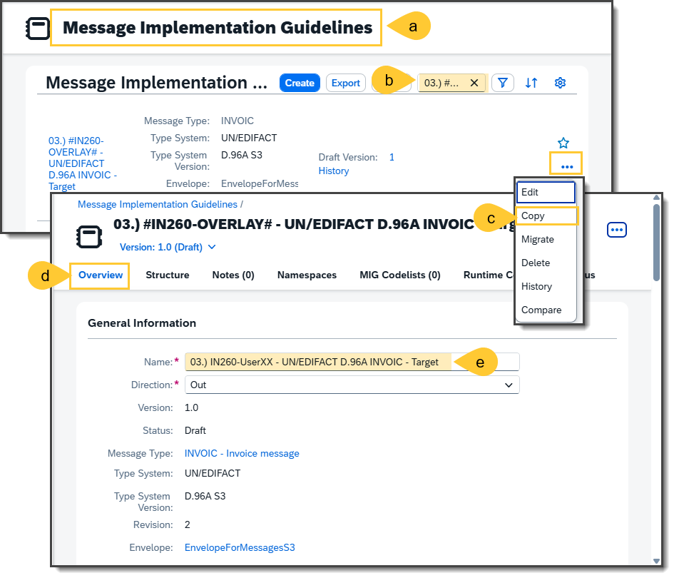
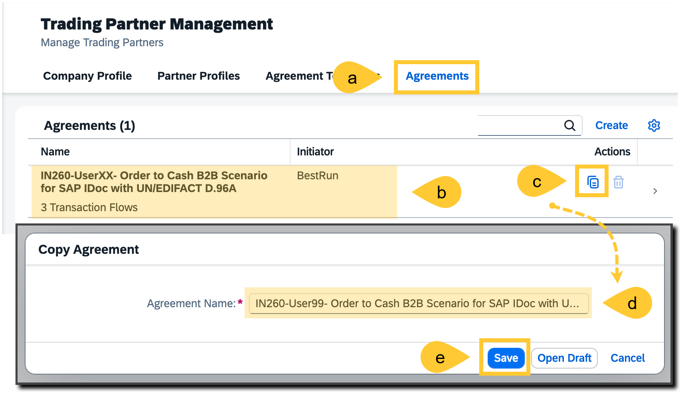
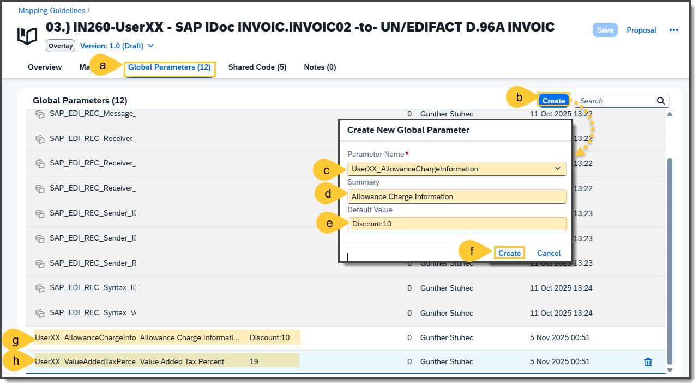
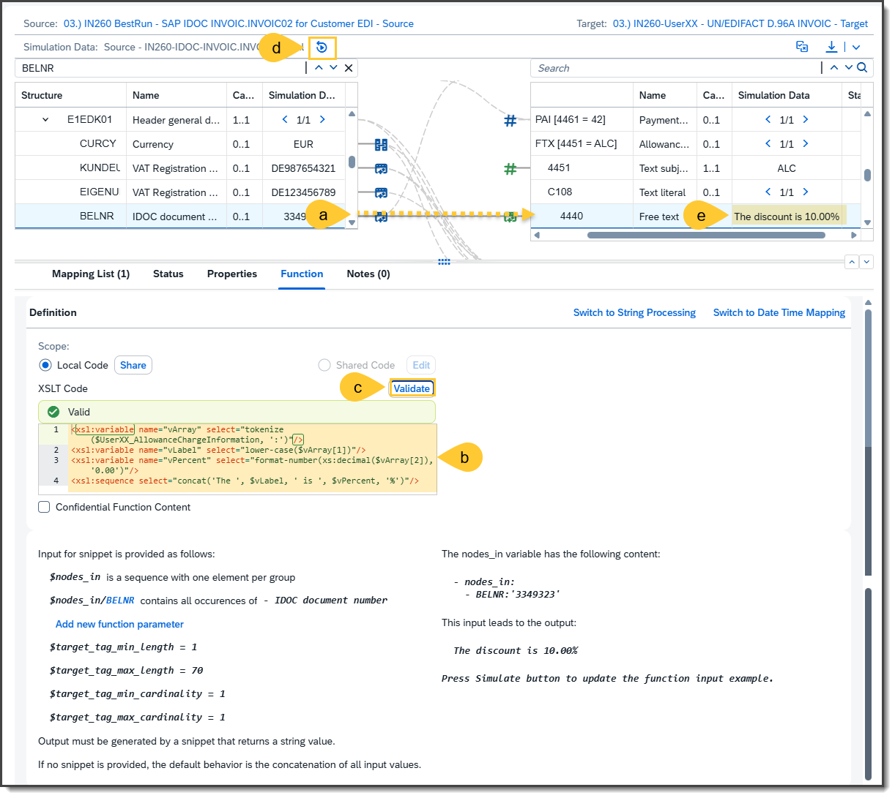
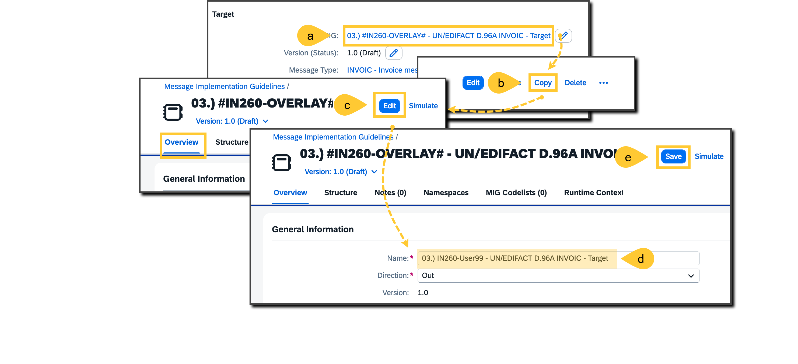
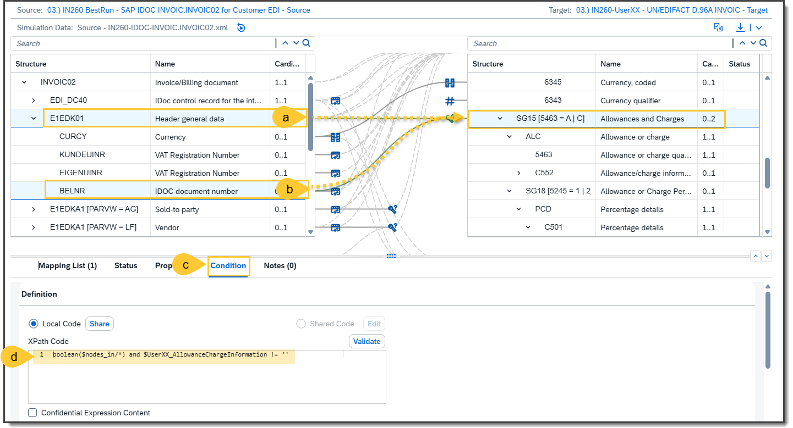

# Exercise 7: Finalize the Business Transaction Activity **03.) Invoice – Outbound**
In this exercise, you will configure and enhance the Business Transaction Activity 03.) Invoice – Outbound using the SAP Integration Suite. The objective is to define partner-specific parameters, duplicate and adjust the Trading Partner Agreement (TPA), and customize the Mapping Guideline (MAG) and Message Implementation Guideline (MIG) to support extended invoice processing.
What you will do:

Add custom parameters to the Trading Partner Profile.
Copy and rename the existing Trading Partner Agreement.
Extend the invoice transaction with the defined parameters.
Duplicate and rename the MAG and MIG used in the transaction.
Update the MAG to reference the new MIG.
Link the updated MAG to the TPA to complete the configuration.

## Step 1 - Add Parameters to the Trading Partner Profile

To begin, access your Trading Partner Profile (TPP):

- (a) Log in to your SAP Integration Suite tenant and open the **Trading Partner Management** application from the launchpad.
- (b) In the navigation panel, go to **Partner Profiles** to view the list of configured trading partners.
- (c) Identify and select the trading partner labeled `Bootcamp-UserXX`.
- (d) Within the partner profile, open the **Parameters** section to manage custom attributes.
- (e) Define a new parameter by specifying the following:

    - Name: `UserXX_AllowanceChangeInformation`
    - Value: `Discount:10`

- (f) Confirm and save the newly added parameter to persist the changes.
- (g) Repeat the process to create a second parameter with the following details:

    - Name: `UserXX_ValueAddedTaxPercent`
    - Value: `19`

## Step 2 - Assign Parameters to the BTA 03.) Invoice - Outbound
Now, associate the parameters created in Step 1 with the outbound invoice transaction:
- (a) Within the newly copied TPA, open the **B2B Scenarios** section to view the configured transactions.
- (b) Enable editing mode to modify the scenario configuration.
- (b) Locate and open the transaction labeled **03.) Invoice – Outbound**. 
- (c) Extend the transaction by selecting the option to **Add Parameters** and choosing **Extend** from TP, which allows you to inherit parameters from the trading partner profile.
- (d) Select the relevant parameters from the list and confirm the selection.
- (e) Save the updated transaction configuration within the TPA. 
- (f) Apply the changes by selecting the **Update** action twice to ensure all modifications are committed. 

## Step 3 - Copy the Mapping Guidline (MAG)

Create a copy of the Mapping Guideline (MAG) used in the invoice transaction:
- (a) Open the **MAGs** overview by navigating to **Design → MAGs** in the left-hand panel.
- (b) Identify the Overlay MAG titled **03.) #Bootcamp-OVERLAY# – SAP IDOC INVOIC.INVOIC02 – to – UN/EDIFACT D.96A INVOIC**. Initiate the copy process and choose the option to copy only the MAG structure.
- (c) Access the **Overview** tab of the copied MAG and enable editing mode.
- (d) Rename the MAG to: `03.) Bootcamp-UserXX – SAP IDOC INVOIC.INVOIC02 – to – UN/EDIFACT D.96A INVOIC`.
- (e) Save the MAG to preserve the updated configuration.

## Step 4 - Copy the Message Implementation Guideline (MIG)

Next, duplicate the target Message Implementation Guideline (MIG) referenced in the MAG:
- (a)	Within the copied MAG, locate the **Target MIG** and open its details.
- (b)   Use the copy function to create a new instance of the MIG.
- (c)	Navigate to the **Overview** tab of the copied MIG and activate editing mode.
- (d)	Rename the MIG to: `03.) Bootcamp-UserXX – UN/EDIFACT D.96A INVOIC – Target`.
- (e)   Save the MIG to complete the duplication process.

## Step 5 - Update the Target MIG Reference in the MAG

Replace the reference to the original target MIG with the newly created one:
- (a)	Open the copied MAG and go to the **Overview** tab. In the **Target MIG** section, initiate the edit function.
- (b)   Select the MIG created in Step 5 from the available list.
- (c)   Confirm the change to update the reference.
- (d)	Save the MAG to apply the new configuration.

## Step 6 - Update the MAG in the Trading Partner Agreement

Finally, link the updated MAG to the invoice transaction in your Trading Partner Agreement:
- (a)	Return to the Trading Partner Agreement and open the `03.) Invoice – Outbound transaction`.
- (b)	Enable editing mode to modify the transaction settings.
- (c)   In the **Mapping** section, open the Mapping Guideline configuration.
- (d)   Search for the updated MAG created in Step 4 and select it.
- (e)   Save the transaction and perform a final Update of the TPA to ensure all changes are applied.

Please give us also feedback to this session **IN260** by scanning the QR-Code:
 
