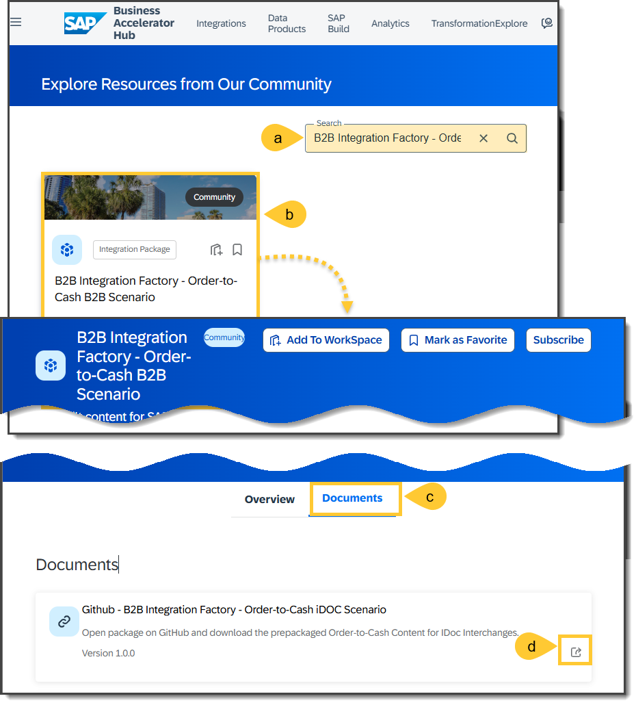
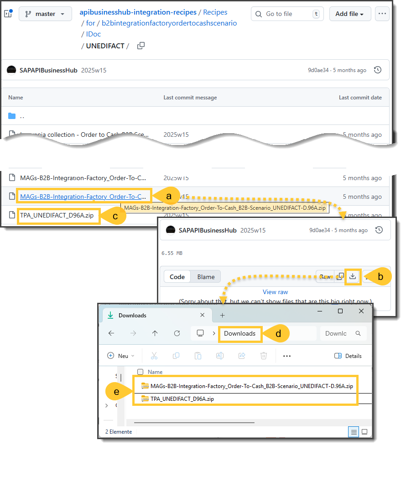
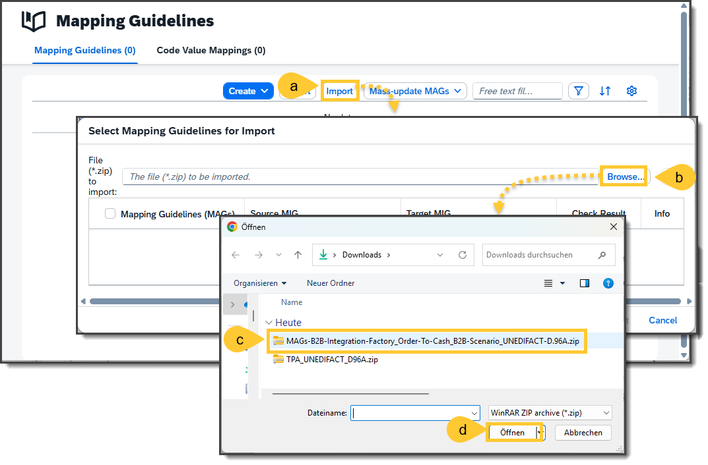
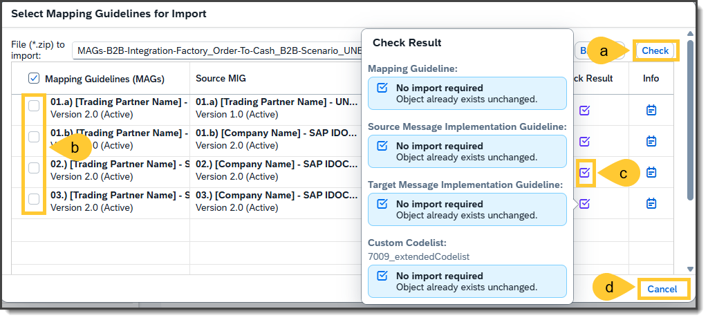
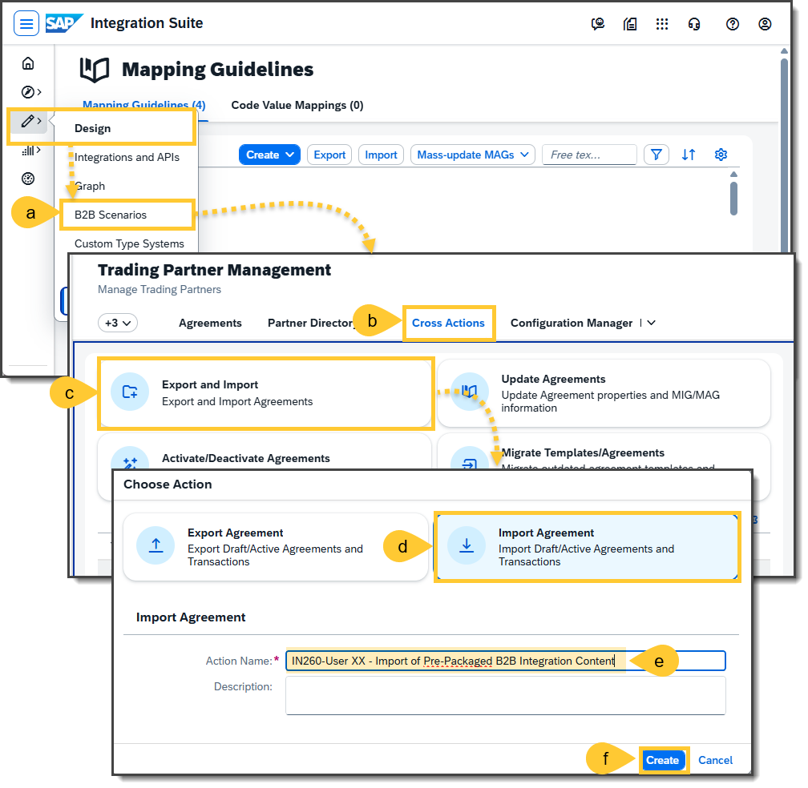
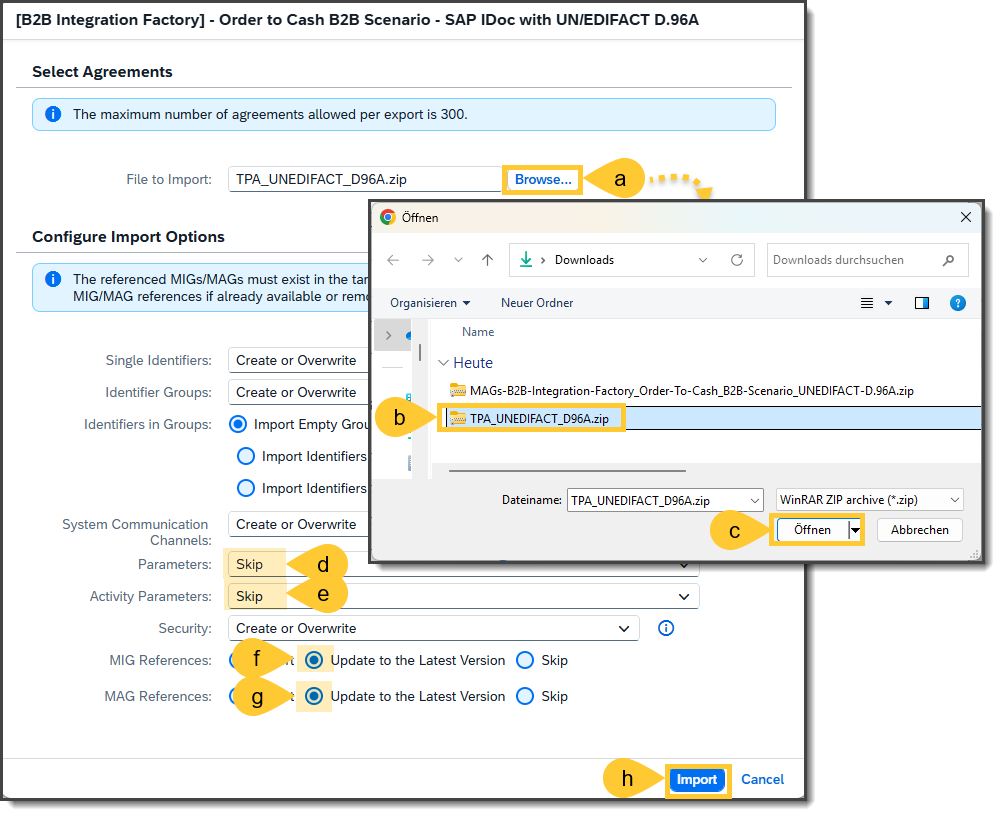
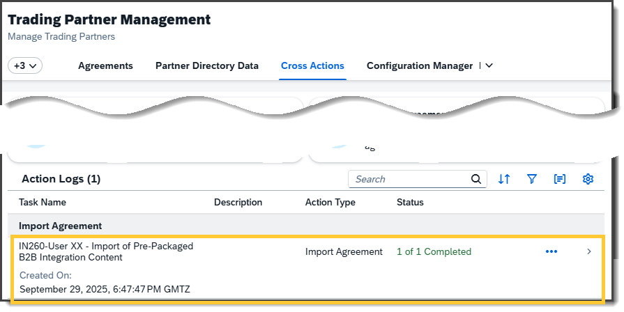

Pre-Packaged B2B Integration Content: Informative Guide
This chapter provides a comprehensive guide on obtaining and importing Pre-Packaged B2B Integration Content into your SAP Integration Suite, explicitly focusing on Trading Partner Management (TPM) and Integration Advisor (IA). The steps outlined below will help you understand the process and leverage SAP’s pre-built B2B content to streamline integration scenarios and manage trading partner configurations effectively.

⚠️ ***Important:*** Please do NOT perform the steps described in this document during the TechEd session. Executing these steps may overwrite the prepared TechEd content. This document is intended for informational purposes only.

# Part 1 -  Get Pre-Packaged B2B Integration Content
- Download and explore the **B2B Integration Factory - Order-to-Cash B2B Scenario** content from the SAP Business Accelerator Hub.
- Retrieve essential artifacts such as Trading Partner Agreements (TPAs), Message Implementation Guidelines (MIGs), and Mapping Guidelines (MAGs).
- Simulate importing MAGs into the SAP Integration Advisor to understand how content consistency is validated.
- Simulate importing a TPA template and example into the Trading Partner Management (TPM) system to see how pre-packaged agreements are integrated.
## Section 1 - Get to the Community Section
First, you should download the prepackaged B2B integration content **B2B Integration Factory - Order-to-Cash B2B Scenario** in the form of TPA, MIGs, and MAGs from the Business Accelerator Hub. Therefore, go to http://api.sap.com and do the following steps:
- (a) Click on **More** so that you will see the **Community** section.
- (b) Select **Community** in where you can search for the B2B Integration Content packages.
- (c) In the **Community** section, click on **View All**.

## Section 2 - Search for the B2B Integration packages
Now search for the appropriate pre-packaged B2B integration content and select it via the following steps:
- (a) Enter in the **Search** filed the value: `B2B Integration Factory - Order-to-Cash`
- (b) Click on the tile **B2B Integration Factory—Order-to-Cash B2B Scenario** to see the details of this package.
- (c) In the details, click on the tab **Documents** to see the available packages.
- (d) Select the package **Github - B2B Integration Factory - Order-to-Cash iDOC Scenario**

## Section 3 - Download the package files
You will be redirected to the GitHub window, in which you should then follow the steps below to download the content:
- (a) Select the file: `MAGs-B2B-Integration-Factory_Order-To-Cash_B2B-Scenario_UNEDIFACT-D.01B.zip` for downloading the required MIGs and MAGs, and
- (b) Click on the downloads button, and repeat the same actions with
- (c) TPA_UNEDIFACT_D96A.zip for downloading the required TPA template
- (d) So that you can finally see in the **Downloads** folder the
- (e) Two files:
- `MAGs-B2B-Integration-Factory_Order-To-Cash_B2B-Scenario_UNEDIFACT-D.01B.zip`
- `TPA_UNEDIFACT_D96A.zip`

# Part 2 -  Upload Packaged B2B Integration Content
Part 2 provides an overview of how to upload the packaged B2B Integration Content into your SAP Integration Suite. This section will help you understand the process conceptually and should not be executed during the TechEd session.

## Section 1 - Log in to Integration Suite and go to MAGs
Go now into the Integration Suite by the following steps:
- (a) Log in to the tenant. Your trainers will provide the URL.
- You will receive the password from your trainers.
- (b) Click on the **Logon** button.
- (c) Once you log in, you should see the landing page of the SAP Integration Suite. In this landing page, go to the left-hand navigation to **Design --> B2B Scenarios**.

## Section 2 - Upload the prepackaged MAGs
These and the next step are optional and should give you an idea of how to import the exported MAGs into the SAP Integration Advisor. You can simulate the uploading because of the consistency checks of the already imported MAGs. If you are on the overview page of the MAGs (Mapping Guidelines), you can import the downloaded MAGs by following these steps:
- (a) Click on the **Import** button.
- (b) In the opened window **Select Mapping Guidelines for Import**, click on the button **Browse**.
- (c) Select from the downloads folder the exported archive with the file name `MAGs-B2B-Integration-Factory_Order-To-Cash_B2B-Scenario_UNEDIFACT-D.96A.zip`, and
- (d) Click on the button **Open** to upload.
Please note that the corresponding MIGs do not need to be imported, as they will be implicitly uploaded along with them.

## Section 3  - Check the to be uploaded MAGs
If you are interested anyway and have already selected the archive file, you should follow the following steps.
- (a) Click on the button **Check**. The Integration Advisor will check if the MAGs have already been imported.
- (b) After a short while, you'll get the checking result, which shows in this case that the MAGs can't be imported
- (c) You will get the reason for the details once you click on the status icon. In this case, the MAG already exists unchanged.
Please consider: If it is possible to import the MAG, the icon will be green, and the check box will be enabled.
- (d) Please click on the **Cancel** button.

## Section 4 - Go to the upload section for TPAs
Now it is about importing the provided TPA template and sample TPA. This step is also optional, because the corresponding TPA template is already available. This step only intends to simulate how the pre-packaged content should be imported into the TPM system. For this purpose, do the following steps:
- (a) Open the Trading Partner Management (TPM) by selecting **Design --> B2B Scenarios**in the left navigation panel.
- (b) In the TPM, go to the tab **Cross Actions**
- (c) Click on the tile **Export and Import**.
- (d) In the opened window, **Choose Action** select **Import Agreement** and
- (e) Enter in **Action Name** a name such as `IN260-User XX - Import of Pre-Packaged B2B Integration Content`  (Whereby XX should be changed with your number).
- (f) Click on the create button.

## Section 5 - Upload the prepackaged TPA and TPA template
You'll get a new window **IN260-User XX - Import of Pre-Packaged B2B Integration Content**
where you can select the archive file you want to import and make any further configurations, such as when and how matching data should be overwritten. Please do the following steps:
- (a) Click on the button **Browse**.
- (b) Pick the file that starts with  `TPA...` from your downloads folder.
- (c) Click on the button **Open**.
- (d) Select at Parameters: **Skip**
- (e) Select at Activity Parameters: **Skip**
- (f) Select at MIG References: **Update to the Latest Version** so that the MIGs will be automatically updated to the latest version.
- (g) Select at MAG References: **Update to the Latest Version** so that the MAGs will be automatically updated to the latest version.
- (h) Keep all other configurations as they are and click the **Import** button.

## Section 6  - Display the uploaded result
After a short time, you should see in the action logs list that the TPA package has been imported correctly.

